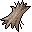

# { .sprite } Animal hair

*Ordinary animal part.*

<div class="infobox" markdown>

<p class="ib-img">{ .sprite }</p>

| | |
|---|---|
| **Item ID** | `hair` |
| **Category** | Animal part |
| **Rarity** | Ordinary |
| **Base value** | 2 gold |
| **Introduced** | v0.7.0 or earlier |

</div>

## How to get it

### Dropped by

| Monster | Chance | Qty | Found in |
|---|---|---|---|
| [Korvan the leader of the wolves](../monsters/wolf_leader.md) | 100% | 1 | Crossroads Guardhouse |
| [Feygard scout](../monsters/feygard_scout.md#v-ortholion_guard2) | 100% | 1-10 | Prim |
| [Rabid boar](../monsters/rabid_boar.md) | 30% | 1 | Blackwater Mountain, Crossroads Guardhouse, Crossglen |
| [Wild boar](../monsters/wild_boar.md) | 30% | 1 | Flagstone Prison, Blackwater Mountain, Fallhaven |
| [Anklebiter](../monsters/anklebiter.md) | 30% | 1 | Crossroads Guardhouse, Flagstone Prison, Guynmart Castle |
| [Pack leader](../monsters/pack_leader.md) | 30% | 1 | Clearing level 2 |
| [Pack hunter](../monsters/pack_hunter.md) | 30% | 1 | Clearing level 2 |
| [Rabid wolf](../monsters/rabid_wolf.md) | 30% | 1 | Fallhaven |
| [Fledgling wolf](../monsters/fledgling_wolf.md) | 30% | 1 | Fallhaven |
| [Young wolf](../monsters/young_wolf.md) | 30% | 1 | Fallhaven |
| [Hunting dog](../monsters/hunting_dog.md) | 30% | 1 | Fallhaven |
| [Cave dwelling boar](../monsters/cave_dwelling_boar.md) | 30% | 1 | Foaming Flask Tavern |
| [Vicious hound](../monsters/vicious_hound.md) | 30% | 1 | Foaming Flask Tavern, Stoutford, Prim |
| [Mountain wolf pup](../monsters/mwolf_1.md) | 30% | 1 | Lake Laeroth, Remgard |
| [Young mountain wolf](../monsters/mwolf_2.md) | 30% | 1 | Lake Laeroth, Remgard |
| [Young mountain fox](../monsters/mwolf_3.md) | 30% | 1 | Lake Laeroth, Remgard |
| [Mountain fox](../monsters/mwolf_4.md) | 30% | 1 | Lake Laeroth, Remgard |
| [Ferocious mountain fox](../monsters/mwolf_5.md) | 30% | 1 | Lake Laeroth, Remgard |
| [Rabid mountain wolf](../monsters/mwolf_6.md) | 30% | 1 | Lake Laeroth, Remgard |
| [Strong mountain wolf](../monsters/mwolf_7.md) | 30% | 1 | Mountainlake 10, Mountainlake 11, Waytolake 10 |
| [Ferocious mountain wolf](../monsters/mwolf_8.md) | 30% | 1 | Mountainlake 10, Mountainlake 11, Waytolake 10 |
| [Young forest fox](../monsters/forestfox2.md) | 30% | 1 | Fallhaven, Foaming Flask Tavern |
| [Forest fox](../monsters/forestfox3.md) | 30% | 1 | Fallhaven, Foaming Flask Tavern |
| [Small horned anklebiter](../monsters/anklebiter2.md) | 30% | 1 | Loneford |
| [Young horned anklebiter](../monsters/anklebiter3.md) | 30% | 1 | Loneford |
| [Fast horned anklebiter](../monsters/anklebiter4.md) | 30% | 1 | Lodar 15, Lodar 17, Lodar 19 |
| [Tough horned anklebiter](../monsters/anklebiter5.md) | 30% | 1 | Lodar 15, Lodar 17, Lodar 19 |
| [Strong horned anklebiter](../monsters/anklebiter6.md) | 30% | 1 | Lodar 15, Lodar 17, Lodar 19 |
| [Steelhide horned anklebiter](../monsters/anklebiter7.md) | 30% | 1 | Lodar 15, Lodar 17, Lodar 21 |
| [Ancient wolf](../monsters/lonely_wolf.md) | 20% | 1 | Foaming Flask Tavern |
| [Young gornaud](../monsters/young_gornaud.md) | 10% | 1 | Stoutford, Blackwater Mountain, Prim |
| [Gornaud](../monsters/gornaud.md) | 10% | 1 | Blackwater Mountain |
| [Strong gornaud](../monsters/strong_gornaud.md) | 10% | 1 | Blackwater Mountain |
| [Fearless mountain brute](../monsters/mbrute_11.md) | 10% | 1 | Mountainlake 8, Mountainlake 8 cave |
| [Enraged mountain brute](../monsters/mbrute_12.md) | 10% | 1 | Mountainlake 8, Mountainlake 8 cave |
| [Maonit troll](../monsters/maonit_1.md) | 10% | 1 | Lake Laeroth |
| [Giant maonit troll](../monsters/maonit_2.md) | 10% | 1 | Lake Laeroth |
| [Strong maonit troll](../monsters/maonit_3.md) | 10% | 1 | Lake Laeroth |
| [Maonit brute](../monsters/maonit_4.md) | 10% | 1 | Lake Laeroth |
| [Tough maonit brute](../monsters/maonit_5.md) | 10% | 1 | Lake Laeroth |

*…and 10 more.*

### Sold by

- [Alynndir](../monsters/alynndir.md) (Road 5 house)
- [Feygard scout](../monsters/feygard_scout.md#v-ortholion_guard6) (Prim)


<p class="verified">Verified against v0.8.18 item, loot, map and dialogue data.</p>

## Uses

Where the game checks for this item in dialogue:

| With | Quest | What happens to it | Option |
|---|---|---|---|
| [Talion](../monsters/talion.md) | [I have it in me](../quests/maggots.md#stage-41) | handed over (2×) | “Here you go.” |
| [Potion merchant](../monsters/potion_merchant.md) ([Fallhaven potions](../maps/fallhaven_potions.md)) | [Taste is everything](../quests/antifoodp.md#stage-30) | handed over (2×) | “I have those ingredients for you.” |
| [Potion merchant](../monsters/potion_merchant.md) ([Fallhaven potions](../maps/fallhaven_potions.md)) | [Taste is everything](../quests/antifoodp.md#stage-35) | handed over (2×) | “I have those ingredients for you.” |
| [Potion merchant](../monsters/potion_merchant.md) ([Fallhaven potions](../maps/fallhaven_potions.md)) | [Taste is everything](../quests/antifoodp.md#stage-20) | handed over (10×) | “Here, I have enough of those ingredients for five potions.” |
| [Potion merchant](../monsters/potion_merchant.md) ([Fallhaven potions](../maps/fallhaven_potions.md)) | [Taste is everything](../quests/antifoodp.md#stage-20) | handed over (20×) | “Here, I have enough of those ingredients for ten potions.” |
| [Halvor](../monsters/halvor.md) ([Blackwater mountain 4](../maps/blackwater_mountain4.md)) | [Surprise?](../quests/halvor_surprise.md#stage-75) | handed over (4×) | “I already have them right here. Take them.” |
| [Halvor](../monsters/halvor.md) ([Blackwater mountain 4](../maps/blackwater_mountain4.md)) | [Surprise?](../quests/halvor_surprise.md#stage-75) | handed over (4×) | “Here. Take these.” |
| [Halvor](../monsters/halvor.md) ([Blackwater mountain 4](../maps/blackwater_mountain4.md)) | [Surprise?](../quests/halvor_surprise.md#stage-80) | handed over (3×) | “I have these with me. Take them.” |
| [Halvor](../monsters/halvor.md) ([Blackwater mountain 4](../maps/blackwater_mountain4.md)) | – | handed over (3×) | “I think so. Here's what I found.” |
| [Halvor](../monsters/halvor.md) ([Blackwater mountain 4](../maps/blackwater_mountain4.md)) | [Surprise?](../quests/halvor_surprise.md#stage-125) | handed over (3×) | “I happen to have some here. Take them.” |
| [Halvor](../monsters/halvor.md) ([Blackwater mountain 4](../maps/blackwater_mountain4.md)) | [Surprise?](../quests/halvor_surprise.md#stage-125) | handed over (3×) | “I think I do. Look at these.” |
| stepping on a trigger on [Loneford 13](../maps/loneford13.md) | – | handed over (1×) | “[Throw a piece of animal hair?]” |

<p class="verified">Verified against v0.8.18 dialogue data.</p>


## Version history

| Version | Change |
|---|---|
| [v0.7.0](../versions/0.7.0.md) | Present in v0.7.0 (earliest release tracked) |

<p class="verified">Verified against v0.8.18 and every earlier release back to v0.7.0 (game data compared release by release).</p>


## Community notes

<small>Written by players, not generated from game data. **Strategy**: how and when to use it · **Lore**: the in-world story · **Trivia**: real-world facts, references, development history · **Theory / speculation**: unconfirmed ideas; may just be unfinished content</small>

### Strategy

*No notes yet. Contributions are welcome: [add a note](https://github.com/asdfghjkl628/Andor-s-Trail-Wikiiii/new/main/notes/items?filename=hair.md&value=%23%23%20Strategy%0A%0A%3C%21--%20how%20and%20when%20to%20use%20it%20--%3E%0A%0A%23%23%20Lore%0A%0A%3C%21--%20the%20in-world%20story%20--%3E%0A%0A%23%23%20Trivia%0A%0A%3C%21--%20real-world%20facts%2C%20references%2C%20development%20history%20--%3E%0A%0A%23%23%20Theory%20/%20speculation%0A%0A%3C%21--%20unconfirmed%20ideas%3B%20may%20just%20be%20unfinished%20content%20--%3E%0A).*

### Lore

*No notes yet. Contributions are welcome: [add a note](https://github.com/asdfghjkl628/Andor-s-Trail-Wikiiii/new/main/notes/items?filename=hair.md&value=%23%23%20Strategy%0A%0A%3C%21--%20how%20and%20when%20to%20use%20it%20--%3E%0A%0A%23%23%20Lore%0A%0A%3C%21--%20the%20in-world%20story%20--%3E%0A%0A%23%23%20Trivia%0A%0A%3C%21--%20real-world%20facts%2C%20references%2C%20development%20history%20--%3E%0A%0A%23%23%20Theory%20/%20speculation%0A%0A%3C%21--%20unconfirmed%20ideas%3B%20may%20just%20be%20unfinished%20content%20--%3E%0A).*

### Trivia

*No notes yet. Contributions are welcome: [add a note](https://github.com/asdfghjkl628/Andor-s-Trail-Wikiiii/new/main/notes/items?filename=hair.md&value=%23%23%20Strategy%0A%0A%3C%21--%20how%20and%20when%20to%20use%20it%20--%3E%0A%0A%23%23%20Lore%0A%0A%3C%21--%20the%20in-world%20story%20--%3E%0A%0A%23%23%20Trivia%0A%0A%3C%21--%20real-world%20facts%2C%20references%2C%20development%20history%20--%3E%0A%0A%23%23%20Theory%20/%20speculation%0A%0A%3C%21--%20unconfirmed%20ideas%3B%20may%20just%20be%20unfinished%20content%20--%3E%0A).*

### Theory / speculation

*No notes yet. Contributions are welcome: [add a note](https://github.com/asdfghjkl628/Andor-s-Trail-Wikiiii/new/main/notes/items?filename=hair.md&value=%23%23%20Strategy%0A%0A%3C%21--%20how%20and%20when%20to%20use%20it%20--%3E%0A%0A%23%23%20Lore%0A%0A%3C%21--%20the%20in-world%20story%20--%3E%0A%0A%23%23%20Trivia%0A%0A%3C%21--%20real-world%20facts%2C%20references%2C%20development%20history%20--%3E%0A%0A%23%23%20Theory%20/%20speculation%0A%0A%3C%21--%20unconfirmed%20ideas%3B%20may%20just%20be%20unfinished%20content%20--%3E%0A).*


??? info "Technical information"

    | | |
    |---|---|
    | Item ID | `hair` |
    | Category ID | `animal` |
    | Icon | `items_misc:48` |
    | Defined in | `res/raw/itemlist_animal.json` |
    | Loot tables containing it | `canineboss`, `pack_boss`, `pack1`, `pack2`, `canine2`, `pack3`, `gornaud_1`, `gornaud_2`, `gornaud_3`, `shop_alynndir`, `mwolf`, `mwolf_b`, `arulir`, `maonit`, `mbrute_b`, `anklebiter`, `jakrar_axe_drop`, `arulirskin`, `arulir_gornaud`, `lonely_wolf`, `ortholion_guard2` |

    Raw data:

    ```json
    {
     "id": "hair",
     "iconID": "items_misc:48",
     "name": "Animal hair",
     "hasManualPrice": 1,
     "baseMarketCost": 2,
     "category": "animal"
    }
    ```


<small>Data from v0.8.18</small>
