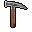

# { .sprite } Carpenter's hammer
*Ordinary* · Club · value 0 gold

> When all you have is a hammer, every monster looks like a nail.

**Slot:** weapon · **Size:** std

## When equipped

| Stat | Value |
|---|---|
| Attack damage | 1 |
| Attack cost | +4 |
| Attack chance | +2 |
| Block chance | +1 |
| setNonWeaponDamageModifier | +94 |

## Sold by

- [Lamberta](../monsters/sullengard_lamberta.md)

Verified against v0.8.18 item data.

## Version history

| Version | Change |
|---|---|
| [v0.7.11](../versions/0.7.11.md) | Added |

Verified against v0.8.18 and every earlier release back to v0.7.0 (game data compared release by release).

<small>Item ID: `hammer_carpenter` · Data from v0.8.18</small>
