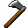

# { .sprite } Sharpened hatchet
*Ordinary* · Axe · value 0 gold

**Slot:** weapon · **Size:** std

## When equipped

| Stat | Value |
|---|---|
| Attack damage | 3 to 5 |
| Max HP | +2 |
| Attack cost | +6 |
| Attack chance | +10 |
| Critical skill | +7 |
| Block chance | -5 |
| Critical multiplier | 1.5 |
| setNonWeaponDamageModifier | +175 |

## Sold by

- [Lleglaris](../monsters/lleglaris.md)

Verified against v0.8.18 item data.

## Version history

| Version | Change |
|---|---|
| [v0.7.0](../versions/0.7.0.md) | Present in v0.7.0 (earliest release tracked) |
| [v0.7.2](../versions/0.7.2.md) | equipEffect: {"increaseAttackChance": 10, "increaseA… → {"increaseAttackChance": 10, "increaseA… |
| [v0.7.10](../versions/0.7.10.md) | equipEffect: {"increaseAttackChance": 10, "increaseA… → {"increaseAttackChance": 10, "increaseA… |

Verified against v0.8.18 and every earlier release back to v0.7.0 (game data compared release by release).

<small>Item ID: `hatchet_sharp` · Data from v0.8.18</small>
