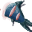

# { .sprite } Headless fish

*Ordinary food.*

<div class="infobox" markdown>

<p class="ib-img">{ .sprite }</p>

| | |
|---|---|
| **Item ID** | `headless_fish` |
| **Category** | Food |
| **Rarity** | Ordinary |
| **Base value** | 22 gold |
| **Introduced** | [v0.8.14](../versions/0.8.14.md) |

</div>

> Partially eaten by a scavenger.

## Statistics

### When used

| Stat | Value |
|---|---|
| Heal HP | 0 to 2 |
| On self | Food-poisoning (magnitude 3, 8 rounds, 50% chance); Sustenance (magnitude 1, 10 rounds, 50% chance) |

<p class="verified">Verified against v0.8.18 item data.</p>

## How to get it

### Dropped by

| Monster | Chance | Qty | Found in |
|---|---|---|---|
| [Aroughcun](../monsters/aroughcun.md) | 25% | 1 | Mt. Galmore |
| [Agile aroughcun](../monsters/aroughcun_agile.md) | 22% | 1 | Mt. Galmore |
| [Sow aroughcun](../monsters/aroughcun_sow.md) | 20% | 1 | Mt. Galmore |


<p class="verified">Verified against v0.8.18 item, loot, map and dialogue data.</p>


## Version history

| Version | Change |
|---|---|
| [v0.8.14](../versions/0.8.14.md) | Added |

<p class="verified">Verified against v0.8.18 and every earlier release back to v0.7.0 (game data compared release by release).</p>


## Community notes

<small>Written by players, not generated from game data. **Strategy**: how and when to use it · **Lore**: the in-world story · **Trivia**: real-world facts, references, development history · **Theory / speculation**: unconfirmed ideas; may just be unfinished content</small>

### Strategy

*No notes yet. Contributions are welcome: [add a note](https://github.com/asdfghjkl628/Andor-s-Trail-Wikiiii/new/main/notes/items?filename=headless_fish.md&value=%23%23%20Strategy%0A%0A%3C%21--%20how%20and%20when%20to%20use%20it%20--%3E%0A%0A%23%23%20Lore%0A%0A%3C%21--%20the%20in-world%20story%20--%3E%0A%0A%23%23%20Trivia%0A%0A%3C%21--%20real-world%20facts%2C%20references%2C%20development%20history%20--%3E%0A%0A%23%23%20Theory%20/%20speculation%0A%0A%3C%21--%20unconfirmed%20ideas%3B%20may%20just%20be%20unfinished%20content%20--%3E%0A).*

### Lore

*No notes yet. Contributions are welcome: [add a note](https://github.com/asdfghjkl628/Andor-s-Trail-Wikiiii/new/main/notes/items?filename=headless_fish.md&value=%23%23%20Strategy%0A%0A%3C%21--%20how%20and%20when%20to%20use%20it%20--%3E%0A%0A%23%23%20Lore%0A%0A%3C%21--%20the%20in-world%20story%20--%3E%0A%0A%23%23%20Trivia%0A%0A%3C%21--%20real-world%20facts%2C%20references%2C%20development%20history%20--%3E%0A%0A%23%23%20Theory%20/%20speculation%0A%0A%3C%21--%20unconfirmed%20ideas%3B%20may%20just%20be%20unfinished%20content%20--%3E%0A).*

### Trivia

*No notes yet. Contributions are welcome: [add a note](https://github.com/asdfghjkl628/Andor-s-Trail-Wikiiii/new/main/notes/items?filename=headless_fish.md&value=%23%23%20Strategy%0A%0A%3C%21--%20how%20and%20when%20to%20use%20it%20--%3E%0A%0A%23%23%20Lore%0A%0A%3C%21--%20the%20in-world%20story%20--%3E%0A%0A%23%23%20Trivia%0A%0A%3C%21--%20real-world%20facts%2C%20references%2C%20development%20history%20--%3E%0A%0A%23%23%20Theory%20/%20speculation%0A%0A%3C%21--%20unconfirmed%20ideas%3B%20may%20just%20be%20unfinished%20content%20--%3E%0A).*

### Theory / speculation

*No notes yet. Contributions are welcome: [add a note](https://github.com/asdfghjkl628/Andor-s-Trail-Wikiiii/new/main/notes/items?filename=headless_fish.md&value=%23%23%20Strategy%0A%0A%3C%21--%20how%20and%20when%20to%20use%20it%20--%3E%0A%0A%23%23%20Lore%0A%0A%3C%21--%20the%20in-world%20story%20--%3E%0A%0A%23%23%20Trivia%0A%0A%3C%21--%20real-world%20facts%2C%20references%2C%20development%20history%20--%3E%0A%0A%23%23%20Theory%20/%20speculation%0A%0A%3C%21--%20unconfirmed%20ideas%3B%20may%20just%20be%20unfinished%20content%20--%3E%0A).*


??? info "Technical information"

    | | |
    |---|---|
    | Item ID | `headless_fish` |
    | Category ID | `food` |
    | Icon | `items_newb:784` |
    | Defined in | `res/raw/itemlist_mt_galmore2.json` |
    | Loot tables containing it | `aroughcun_sow_dl`, `aroughcun_agile_dl`, `aroughcun_dl` |

    Raw data:

    ```json
    {
     "id": "headless_fish",
     "iconID": "items_newb:784",
     "name": "Headless fish",
     "displaytype": "ordinary",
     "hasManualPrice": 1,
     "baseMarketCost": 22,
     "category": "food",
     "description": "Partially eaten by a scavenger.",
     "useEffect": {
      "increaseCurrentHP": {
       "min": 0,
       "max": 2
      },
      "conditionsSource": [
       {
        "condition": "foodp",
        "magnitude": 3,
        "duration": 8,
        "chance": "50"
       },
       {
        "condition": "food",
        "magnitude": 1,
        "duration": 10,
        "chance": "50"
       }
      ]
     }
    }
    ```


<small>Data from v0.8.18</small>
