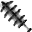

# { .sprite } Heartsteel blade breaker

*Legendary parrying weapon.*

<div class="infobox" markdown>

<p class="ib-img">{ .sprite }</p>

| | |
|---|---|
| **Item ID** | `heartstone_blade_breaker` |
| **Category** | Parrying weapon |
| **Slot** | shield |
| **Proficiency** | [Shield proficiency](../skills/armorProficiencyShield.md) |
| **Rarity** | Legendary |
| **Base value** | 0 gold |
| **Introduced** | [v0.8.18](../versions/0.8.18.md) |

</div>

> Born of Heartstone torn from forgotten depths, this heartsteel was tempered in dragonfire and shaped by a master smith whose craft survives only in silence.

## Statistics

### When equipped

| Stat | Value |
|---|---|
| Attack damage | 4 |
| Attack cost | 0 |
| Attack chance | +5 |
| Block chance | +13 |
| Damage resistance | +2 |
| setNonWeaponDamageModifier | +103 |

### When hit

| Stat | Value |
|---|---|
| On self | [Heartstone poisoning](../conditions/heartstone_poisoning.md) (magnitude 2, 2 rounds, 5% chance) |

<p class="verified">Verified against v0.8.18 item data.</p>

## How to get it

### Sold by

- [Nocmar](../monsters/nocmar.md)

### Quest & dialogue rewards

- From [Nocmar](../monsters/nocmar.md) during [Lost treasures](../quests/nocmar.md#stage-200) (1×)


<p class="verified">Verified against v0.8.18 item, loot, map and dialogue data.</p>


## Version history

| Version | Change |
|---|---|
| [v0.8.18](../versions/0.8.18.md) | Added |

<p class="verified">Verified against v0.8.18 and every earlier release back to v0.7.0 (game data compared release by release).</p>


## Community notes

<small>Written by players, not generated from game data. **Strategy**: how and when to use it · **Lore**: the in-world story · **Trivia**: real-world facts, references, development history · **Theory / speculation**: unconfirmed ideas; may just be unfinished content</small>

### Strategy

*No notes yet. Contributions are welcome: [add a note](https://github.com/asdfghjkl628/Andor-s-Trail-Wikiiii/new/main/notes/items?filename=heartstone_blade_breaker.md&value=%23%23%20Strategy%0A%0A%3C%21--%20how%20and%20when%20to%20use%20it%20--%3E%0A%0A%23%23%20Lore%0A%0A%3C%21--%20the%20in-world%20story%20--%3E%0A%0A%23%23%20Trivia%0A%0A%3C%21--%20real-world%20facts%2C%20references%2C%20development%20history%20--%3E%0A%0A%23%23%20Theory%20/%20speculation%0A%0A%3C%21--%20unconfirmed%20ideas%3B%20may%20just%20be%20unfinished%20content%20--%3E%0A).*

### Lore

*No notes yet. Contributions are welcome: [add a note](https://github.com/asdfghjkl628/Andor-s-Trail-Wikiiii/new/main/notes/items?filename=heartstone_blade_breaker.md&value=%23%23%20Strategy%0A%0A%3C%21--%20how%20and%20when%20to%20use%20it%20--%3E%0A%0A%23%23%20Lore%0A%0A%3C%21--%20the%20in-world%20story%20--%3E%0A%0A%23%23%20Trivia%0A%0A%3C%21--%20real-world%20facts%2C%20references%2C%20development%20history%20--%3E%0A%0A%23%23%20Theory%20/%20speculation%0A%0A%3C%21--%20unconfirmed%20ideas%3B%20may%20just%20be%20unfinished%20content%20--%3E%0A).*

### Trivia

*No notes yet. Contributions are welcome: [add a note](https://github.com/asdfghjkl628/Andor-s-Trail-Wikiiii/new/main/notes/items?filename=heartstone_blade_breaker.md&value=%23%23%20Strategy%0A%0A%3C%21--%20how%20and%20when%20to%20use%20it%20--%3E%0A%0A%23%23%20Lore%0A%0A%3C%21--%20the%20in-world%20story%20--%3E%0A%0A%23%23%20Trivia%0A%0A%3C%21--%20real-world%20facts%2C%20references%2C%20development%20history%20--%3E%0A%0A%23%23%20Theory%20/%20speculation%0A%0A%3C%21--%20unconfirmed%20ideas%3B%20may%20just%20be%20unfinished%20content%20--%3E%0A).*

### Theory / speculation

*No notes yet. Contributions are welcome: [add a note](https://github.com/asdfghjkl628/Andor-s-Trail-Wikiiii/new/main/notes/items?filename=heartstone_blade_breaker.md&value=%23%23%20Strategy%0A%0A%3C%21--%20how%20and%20when%20to%20use%20it%20--%3E%0A%0A%23%23%20Lore%0A%0A%3C%21--%20the%20in-world%20story%20--%3E%0A%0A%23%23%20Trivia%0A%0A%3C%21--%20real-world%20facts%2C%20references%2C%20development%20history%20--%3E%0A%0A%23%23%20Theory%20/%20speculation%0A%0A%3C%21--%20unconfirmed%20ideas%3B%20may%20just%20be%20unfinished%20content%20--%3E%0A).*


??? info "Technical information"

    | | |
    |---|---|
    | Item ID | `heartstone_blade_breaker` |
    | Category ID | `weapon_blocking` |
    | Icon | `items_newb:371` |
    | Defined in | `res/raw/itemlist_undertell.json` |
    | Loot tables containing it | `nocmar` |

    Raw data:

    ```json
    {
     "id": "heartstone_blade_breaker",
     "iconID": "items_newb:371",
     "name": "Heartsteel blade breaker",
     "displaytype": "legendary",
     "hasManualPrice": 1,
     "baseMarketCost": 0,
     "category": "weapon_blocking",
     "description": "Born of Heartstone torn from forgotten depths, this heartsteel was tempered in dragonfire and shaped by a master smith whose craft survives only in silence.",
     "equipEffect": {
      "increaseAttackDamage": {
       "min": 4,
       "max": 4
      },
      "increaseAttackCost": 0,
      "increaseAttackChance": 5,
      "increaseBlockChance": 13,
      "increaseDamageResistance": 2,
      "setNonWeaponDamageModifier": 103
     },
     "hitReceivedEffect": {
      "conditionsSource": [
       {
        "condition": "heartstone_poisoning",
        "magnitude": 2,
        "duration": 2,
        "chance": "5"
       }
      ]
     },
     "missEffect": {},
     "missReceivedEffect": {
      "conditionsTarget": [
       {
        "condition": "feebleness",
        "magnitude": 3,
        "duration": 3,
        "chance": "8"
       }
      ]
     },
     "killEffect": {}
    }
    ```


<small>Data from v0.8.18</small>
