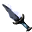

# { .sprite } Heartsteel dagger

*Legendary dagger.*

<div class="infobox" markdown>

<p class="ib-img">{ .sprite }</p>

| | |
|---|---|
| **Item ID** | `heartstone_dagger` |
| **Category** | Dagger |
| **Slot** | weapon |
| **Hands** | One-handed |
| **Proficiency** | Dagger |
| **Rarity** | Legendary |
| **Base value** | 0 gold |
| **Introduced** | [v0.8.18](../versions/0.8.18.md) |

</div>

> Born of Heartstone torn from forgotten depths, this heartsteel was tempered in dragonfire and shaped by a master smith whose craft survives only in silence.

## Statistics

### When equipped

| Stat | Value |
|---|---|
| Attack damage | 4 to 7 |
| Attack cost | +4 |
| Attack chance | +28 |
| Critical skill | +19 |
| Damage resistance | -3 |
| Critical multiplier | 3.0 |
| setNonWeaponDamageModifier | +100 |

### On hit

| Stat | Value |
|---|---|
| On target | Heartstone poisoning (magnitude 4, 2 rounds, 10% chance); Vital piercing (magnitude 4, 3 rounds, 5% chance) |

### On kill

| Stat | Value |
|---|---|
| On self | Heartstone poisoning (magnitude 3, 2 rounds, 5% chance) |

<p class="verified">Verified against v0.8.18 item data.</p>

## How to get it

### Sold by

- [Nocmar](../monsters/nocmar.md)

### Quest & dialogue rewards

- From [Nocmar](../monsters/nocmar.md) during [Lost treasures](../quests/nocmar.md#stage-200) (1×)


<p class="verified">Verified against v0.8.18 item, loot, map and dialogue data.</p>


## Version history

| Version | Change |
|---|---|
| [v0.8.18](../versions/0.8.18.md) | Added |

<p class="verified">Verified against v0.8.18 and every earlier release back to v0.7.0 (game data compared release by release).</p>


## Community notes

<small>Written by players, not generated from game data. **Strategy**: how and when to use it · **Lore**: the in-world story · **Trivia**: real-world facts, references, development history · **Theory / speculation**: unconfirmed ideas; may just be unfinished content</small>

### Strategy

*Nothing here yet. Know something? [Add it](https://github.com/asdfghjkl628/Andor-s-Trail-Wikiiii/new/main/notes/items?filename=heartstone_dagger.md&value=%23%23%20Strategy%0A%0A%3C%21--%20how%20and%20when%20to%20use%20it%20--%3E%0A%0A%23%23%20Lore%0A%0A%3C%21--%20the%20in-world%20story%20--%3E%0A%0A%23%23%20Trivia%0A%0A%3C%21--%20real-world%20facts%2C%20references%2C%20development%20history%20--%3E%0A%0A%23%23%20Theory%20/%20speculation%0A%0A%3C%21--%20unconfirmed%20ideas%3B%20may%20just%20be%20unfinished%20content%20--%3E%0A).*

### Lore

*Nothing here yet. Know something? [Add it](https://github.com/asdfghjkl628/Andor-s-Trail-Wikiiii/new/main/notes/items?filename=heartstone_dagger.md&value=%23%23%20Strategy%0A%0A%3C%21--%20how%20and%20when%20to%20use%20it%20--%3E%0A%0A%23%23%20Lore%0A%0A%3C%21--%20the%20in-world%20story%20--%3E%0A%0A%23%23%20Trivia%0A%0A%3C%21--%20real-world%20facts%2C%20references%2C%20development%20history%20--%3E%0A%0A%23%23%20Theory%20/%20speculation%0A%0A%3C%21--%20unconfirmed%20ideas%3B%20may%20just%20be%20unfinished%20content%20--%3E%0A).*

### Trivia

*Nothing here yet. Know something? [Add it](https://github.com/asdfghjkl628/Andor-s-Trail-Wikiiii/new/main/notes/items?filename=heartstone_dagger.md&value=%23%23%20Strategy%0A%0A%3C%21--%20how%20and%20when%20to%20use%20it%20--%3E%0A%0A%23%23%20Lore%0A%0A%3C%21--%20the%20in-world%20story%20--%3E%0A%0A%23%23%20Trivia%0A%0A%3C%21--%20real-world%20facts%2C%20references%2C%20development%20history%20--%3E%0A%0A%23%23%20Theory%20/%20speculation%0A%0A%3C%21--%20unconfirmed%20ideas%3B%20may%20just%20be%20unfinished%20content%20--%3E%0A).*

### Theory / speculation

*Nothing here yet. Know something? [Add it](https://github.com/asdfghjkl628/Andor-s-Trail-Wikiiii/new/main/notes/items?filename=heartstone_dagger.md&value=%23%23%20Strategy%0A%0A%3C%21--%20how%20and%20when%20to%20use%20it%20--%3E%0A%0A%23%23%20Lore%0A%0A%3C%21--%20the%20in-world%20story%20--%3E%0A%0A%23%23%20Trivia%0A%0A%3C%21--%20real-world%20facts%2C%20references%2C%20development%20history%20--%3E%0A%0A%23%23%20Theory%20/%20speculation%0A%0A%3C%21--%20unconfirmed%20ideas%3B%20may%20just%20be%20unfinished%20content%20--%3E%0A).*


??? info "Technical information"

    | | |
    |---|---|
    | Item ID | `heartstone_dagger` |
    | Category ID | `dagger` |
    | Icon | `items_newb:487` |
    | Defined in | `res/raw/itemlist_undertell.json` |
    | Loot tables containing it | `nocmar` |

    Raw data:

    ```json
    {
     "id": "heartstone_dagger",
     "iconID": "items_newb:487",
     "name": "Heartsteel dagger",
     "displaytype": "legendary",
     "hasManualPrice": 1,
     "baseMarketCost": 0,
     "category": "dagger",
     "description": "Born of Heartstone torn from forgotten depths, this heartsteel was tempered in dragonfire and shaped by a master smith whose craft survives only in silence.",
     "equipEffect": {
      "increaseAttackDamage": {
       "min": 4,
       "max": 7
      },
      "increaseAttackCost": 4,
      "increaseAttackChance": 28,
      "increaseCriticalSkill": 19,
      "increaseDamageResistance": -3,
      "setCriticalMultiplier": 3.0,
      "setNonWeaponDamageModifier": 100
     },
     "hitEffect": {
      "conditionsTarget": [
       {
        "condition": "heartstone_poisoning",
        "magnitude": 4,
        "duration": 2,
        "chance": "10"
       },
       {
        "condition": "vital_piercing",
        "magnitude": 4,
        "duration": 3,
        "chance": "5"
       }
      ]
     },
     "killEffect": {
      "conditionsSource": [
       {
        "condition": "heartstone_poisoning",
        "magnitude": 3,
        "duration": 2,
        "chance": "5"
       }
      ]
     }
    }
    ```


<small>Data from v0.8.18</small>
