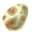

# { .sprite } Hexi egg
*Ordinary* · Edible animal part · value 0 gold

## When used

| Stat | Value |
|---|---|
| On self | Sustenance (magnitude 4, 5 rounds, 100% chance); Food-poisoning (magnitude 4, 6 rounds, 18% chance) |

## Dropped by

| Monster | Chance | Qty |
|---|---|---|
| [Steelthorn hexileg](../monsters/steelthorn_hexileg.md) | 8% | 1-2 |

<small>Item ID: `hexi_egg` · Data from v0.8.18</small>
