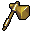

# { .sprite } Bronze warhammer
*Ordinary* · Warhammer · value 0 gold

**Slot:** weapon · **Size:** std

## When equipped

| Stat | Value |
|---|---|
| Attack damage | 5 to 7 |
| Attack cost | +7 |
| Attack chance | +15 |
| Critical skill | +2 |
| Block chance | -15 |
| Critical multiplier | 2.0 |
| setNonWeaponDamageModifier | +175 |

## Sold by

- [Truric](../monsters/truric.md)

<small>Item ID: `hmr_bronze` · Data from v0.8.18</small>
