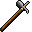

# { .sprite } Iron war hammer
*Ordinary* · Warhammer · value 1 gold

**Slot:** weapon · **Size:** std

## When equipped

| Stat | Value |
|---|---|
| Attack damage | 6 to 8 |
| Attack cost | +8 |
| Attack chance | +23 |
| Critical skill | +5 |
| Block chance | -17 |
| Damage resistance | -1 |
| Critical multiplier | 3.0 |
| setNonWeaponDamageModifier | +218 |

## Sold by

- [Agthor](../monsters/agthor.md)

<small>Item ID: `hmr_iron` · Data from v0.8.18</small>
