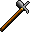

# { .sprite } Iron war hammer
*Ordinary* · Warhammer · value 1 gold

**Slot:** weapon · **Size:** std

## When equipped

| Stat | Value |
|---|---|
| Attack damage | 6 to 8 |
| Attack cost | +8 |
| Attack chance | +23 |
| Critical skill | +5 |
| Block chance | -17 |
| Damage resistance | -1 |
| Critical multiplier | 3.0 |
| setNonWeaponDamageModifier | +218 |

## Sold by

- [Agthor](../monsters/agthor.md)

Verified against v0.8.18 item data.

## Version history

| Version | Change |
|---|---|
| [v0.7.0](../versions/0.7.0.md) | Present in v0.7.0 (earliest release tracked) |
| [v0.7.2](../versions/0.7.2.md) | minor data change |
| [v0.7.4](../versions/0.7.4.md) | name: Iron warhammer → Iron war hammer |
| [v0.7.10](../versions/0.7.10.md) | equipEffect: {"increaseAttackChance": 23, "increaseA… → {"increaseAttackChance": 23, "increaseA… |

Verified against v0.8.18 and every earlier release back to v0.7.0 (game data compared release by release).

<small>Item ID: `hmr_iron` · Data from v0.8.18</small>
