# Items

Every item in Andor's Trail v0.8.18 (1005 total). Use the search box to find one quickly.

## Equipment

### Armor (heavy)

| | Item | Rarity | Value |
|---|---|---|---|
| { .sprite } | [Dented bronze plate](armor6.md) | ordinary | 0 |
| { .sprite } | [Giant's hauberk](haub_giant.md) | extraordinary | 0 |
| { .sprite } | [Rusty heavy cuirass](hvbdy_rust.md) | ordinary | 672 |
| 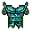{ .sprite } | [Shadowstalker](shdstlk.md) | extraordinary | 9354 |
| { .sprite } | [Stone Cuirass](armor_stone.md) | extraordinary | 52 |
| { .sprite } | [Stormcloak armor](stormcloak_armor.md) | extraordinary | 0 |

### Armor (light)

| | Item | Rarity | Value |
|---|---|---|---|
| 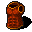{ .sprite } | [Combat vest](armour_cvest1.md) | ordinary | 1116 |
| { .sprite } | [Emberwylde](emberwylde.md) | extraordinary | 0 |
| { .sprite } | [Lightweight chainmail](ltbdy_chmail.md) | ordinary | 4565 |
| { .sprite } | [Lightweight splint mail](ltbdy_spmail.md) | ordinary | 7110 |
| { .sprite } | [Remgard combat vest](armour_cvest2.md) | ordinary | 1244 |
| 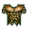{ .sprite } | [Serpent's hauberk](haub_serp.md) | extraordinary | 11077 |
| { .sprite } | [Sturdy leather cuirass](ltbdy_lthr.md) | ordinary | 3436 |

### Armor, cloth

| | Item | Rarity | Value |
|---|---|---|---|
| { .sprite } | [Agent's cloak](brightport_cloak.md) | rare | 0 |
| { .sprite } | [Cloth shirt](shirt1.md) | ordinary | 16 |
| 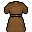{ .sprite } | [Cloth tunic](tunic_cloth.md) | ordinary | 0 |
| { .sprite } | [Fancy shirt](fancy_shirt.md) | ordinary | 0 |
| { .sprite } | [Fine shirt](shirt2.md) | ordinary | 72 |
| { .sprite } | [Green dress](green_dress.md) | ordinary | 100 |
| { .sprite } | [Kid's shirt](kids_shirt.md) | ordinary | 50 |
| 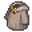{ .sprite } | [Miner's hooded tunic](miner_hood.md) | rare | 0 |
| { .sprite } | [Miner's tunic](miner_tunic.md) | rare | 0 |
| { .sprite } | [Old tunic](tunic_old.md) | ordinary | 3 |
| { .sprite } | [Patched cloth shirt](shirt_patched_cloth.md) | ordinary | 208 |
| 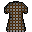{ .sprite } | [Quilted tunic](tunic_quilted.md) | ordinary | 0 |
| { .sprite } | [Robe of the protector](robe_protector.md) | ordinary | 0 |
| { .sprite } | [Robe of the Sublimate](robe_sublime.md) | rare | 0 |
| { .sprite } | [Silk robe of Valugha](valugha_gown.md) | extraordinary | 3109 |
| { .sprite } | [Snakeskin tunic](tunic_snakeskin.md) | ordinary | 1325 |
| 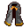{ .sprite } | [Thieves' cloak of whispers](thieve_clock_whispers.md) | rare | 0 |
| { .sprite } | [Torn shirt](shirt_torn.md) | ordinary | 92 |
| { .sprite } | [Weathered shirt](shirt_weathered.md) | ordinary | 125 |

### Armor, leather

| | Item | Rarity | Value |
|---|---|---|---|
| { .sprite } | [Arschleder](arschleder.md) | rare | 0 |
| { .sprite } | [Blackwater leather armor](bwm_leather_armour.md) | rare | 2551 |
| { .sprite } | [Crude leather armor](armour_crude_leather.md) | ordinary | 514 |
| { .sprite } | [Firm leather armor](armour_firm_leather.md) | ordinary | 417 |
| { .sprite } | [Hard leather armor](armor3.md) | ordinary | 2407 |
| { .sprite } | [Hardened leather shirt](shirt_dmgresist.md) | rare | 1633 |
| { .sprite } | [Iced leather armor](armor5.md) | extraordinary | 0 |
| { .sprite } | [Leather armour](armor1.md) | ordinary | 464 |
| { .sprite } | [Leather shirt of misfortune](armour_misfortune.md) | ordinary | 2459 |
| { .sprite } | [Rigid leather armor](armour_rigid_leather.md) | ordinary | 625 |
| { .sprite } | [Superior hard leather armor](armor4.md) | ordinary | 3866 |
| { .sprite } | [Superior leather armor](armor2.md) | ordinary | 624 |
| { .sprite } | [Villain's leather armor](armour_leather_villain.md) | ordinary | 3700 |

### Axe

| | Item | Rarity | Value |
|---|---|---|---|
| { .sprite } | [Axe of fear](axe_fear.md) | rare | 1868 |
| 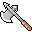{ .sprite } | [Axe of whirlwind](axe_whirl.md) | rare | 3126 |
| { .sprite } | [Black axe](axe_black1.md) | ordinary | 73 |
| 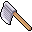{ .sprite } | [Fine iron axe](axe_fine_iron.md) | ordinary | 365 |
| 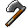{ .sprite } | [Hand Axe](hand_axe.md) | quest | 0 |
| { .sprite } | [Heartsteel handaxe](heartstone_handaxe.md) | legendary | 0 |
| { .sprite } | [Iron axe](axe2.md) | ordinary | 312 |
| 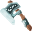{ .sprite } | [Judicar](judicar.md) | extraordinary | 0 |
| { .sprite } | [Light black axe](axe_lightblack.md) | ordinary | 2662 |
| 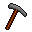{ .sprite } | [Pickhatchet](ratdom_pickaxe.md) | quest | 0 |
| { .sprite } | [Reinforced black axe](axe_black2.md) | ordinary | 752 |
| { .sprite } | [Sharpened hatchet](hatchet_sharp.md) | ordinary | 0 |
| { .sprite } | [War Axe of the Shadow](war_axe_shadow.md) | rare | 3958 |
| { .sprite } | [Woodcutter's axe](axe1.md) | ordinary | 24 |
| { .sprite } | [Woodcutter's hatchet](woodcutter_hatchet.md) | ordinary | 0 |

### Big torch

| | Item | Rarity | Value |
|---|---|---|---|
| { .sprite } | [Ratcave Torch](ratdom_torch.md) | quest | 0 |

### Broadsword

| | Item | Rarity | Value |
|---|---|---|---|
| { .sprite } | [Darkheart broadsword](dark_heart_sword.md) | ordinary | 0 |
| { .sprite } | [Fine iron broadsword](broadsword_fine_iron.md) | ordinary | 422 |
| { .sprite } | [Fine steel broadsword](broadsword_fine_steel.md) | ordinary | 1206 |
| { .sprite } | [Iron broadsword](broadsword1.md) | ordinary | 251 |
| { .sprite } | [Steel broadsword](broadsword2.md) | ordinary | 582 |
| 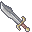{ .sprite } | [Yatagan](sword_g03_crackshot.md) | extraordinary | 0 |

### Buckler

| | Item | Rarity | Value |
|---|---|---|---|
| { .sprite } | [Broken wooden buckler](broken_buckler.md) | ordinary | 120 |
| { .sprite } | [Cracked wooden buckler](shield_cracked_wooden.md) | ordinary | 34 |
| { .sprite } | [Crude wooden buckler](shield_crude_wooden.md) | ordinary | 31 |
| { .sprite } | [Iced broken wooden buckler](shield8.md) | ordinary | 441 |
| { .sprite } | [Paper shield](brv_school_shield.md) | ordinary | 72 |
| { .sprite } | [Reinforced leather buckler](shield_leather.md) | ordinary | 0 |
| { .sprite } | [Reinforced wooden buckler](shield3.md) | ordinary | 226 |
| { .sprite } | [Second-hand wooden buckler](shield_wooden_buckler.md) | ordinary | 92 |
| { .sprite } | [Wooden buckler](shield1.md) | ordinary | 72 |

### Chain mail

| | Item | Rarity | Value |
|---|---|---|---|
| 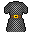{ .sprite } | [Chainmail tunic](tunic_chainmail.md) | ordinary | 0 |
| { .sprite } | [Champion's chain mail](armour_chain_champ.md) | ordinary | 6808 |
| { .sprite } | [Knight's hauberk](waterwayacavearmor.md) | rare | 0 |
| { .sprite } | [Ordinary chain mail](armor_chain2.md) | ordinary | 4191 |
| { .sprite } | [Remgard chain mail](armour_chain_remg.md) | ordinary | 8927 |
| { .sprite } | [Rigid chain mail](armour_rigid_chain.md) | ordinary | 4667 |
| { .sprite } | [Rusty chain mail](armor_chain1.md) | ordinary | 3629 |
| { .sprite } | [Superior chain mail](armour_superior_chain.md) | ordinary | 5992 |
| { .sprite } | [Worn chainmail](chmail2.md) | ordinary | 643 |

### Club

| | Item | Rarity | Value |
|---|---|---|---|
| 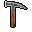{ .sprite } | [Carpenter's hammer](hammer_carpenter.md) | ordinary | 0 |
| 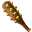{ .sprite } | [Cragbreaker](cragbreaker.md) | extraordinary | 0 |
| { .sprite } | [Fine wooden club](club_fine_wooden.md) | ordinary | 245 |
| { .sprite } | [Spiked club of bleeding](club_bld.md) | ordinary | 107 |
| { .sprite } | [Stone club](club_stone.md) | ordinary | 520 |
| { .sprite } | [Wooden club](club1.md) | ordinary | 7 |

### Dagger

| | Item | Rarity | Value |
|---|---|---|---|
| { .sprite } | [A strange looking dagger](strange_dagger.md) | quest | 0 |
| { .sprite } | [Assassin's blade](dagger_assassin.md) | extraordinary | 3706 |
| 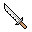{ .sprite } | [Barbed dagger](dagger_barbed.md) | extraordinary | 0 |
| { .sprite } | [Bjorgur's family dagger](bjorgur_dagger.md) | quest | 0 |
| { .sprite } | [Blackwater dagger](bwm_dagger.md) | rare | 539 |
| { .sprite } | [Blackwater poisoned dagger](bwm_dagger_venom.md) | rare | 1552 |
| { .sprite } | [Blade of the defiler](blade_defiler.md) | extraordinary | 5119 |
| { .sprite } | [Bloodletter](daggr_bloodlet.md) | ordinary | 100 |
| { .sprite } | [Curved dagger](daggr_curv.md) | ordinary | 564 |
| { .sprite } | [Dagger of the Shadow priests](dagger_shadow_priests.md) | extraordinary | 15 |
| 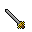{ .sprite } | [Fancy letter opener](letter_opener.md) | ordinary | 986 |
| { .sprite } | [Feygard iron dagger](feygard_iron_dagger.md) | ordinary | 567 |
| 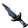{ .sprite } | [Heartsteel dagger](heartstone_dagger.md) | legendary | 0 |
| { .sprite } | [Iron dagger](dagger0.md) | ordinary | 12 |
| { .sprite } | [Jeweled dagger](dagger_jeweled.md) | ordinary | 2942 |
| 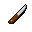{ .sprite } | [Kitchen knife](kitchen_knife.md) | ordinary | 0 |
| { .sprite } | [Obsidian dagger](obsidian_dagger.md) | extraordinary | 1500 |
| { .sprite } | [Quickstrike dagger](quickdagger1.md) | rare | 512 |
| { .sprite } | [Sharp iron dagger](dagger1.md) | ordinary | 53 |
| { .sprite } | [Sharp steel dagger](dagger_sharp_steel.md) | ordinary | 1428 |
| { .sprite } | [Stiletto](stiletto.md) | ordinary | 0 |
| { .sprite } | [Superior iron dagger](dagger2.md) | ordinary | 70 |
| 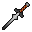{ .sprite } | [Superior steel dagger](dagger_steel_superior.md) | ordinary | 0 |
| { .sprite } | [Superior stiletto](stiletto_superior.md) | ordinary | 0 |
| { .sprite } | [Tiny knife](tiny_knife.md) | ordinary | 0 |
| 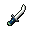{ .sprite } | [Venomfang dirk](venomfang_dagger.md) | rare | 0 |
| { .sprite } | [Venomous Dagger](dagger_venom.md) | extraordinary | 15 |

### Footwear, cloth

| | Item | Rarity | Value |
|---|---|---|---|
| { .sprite } | [Boots of flight](boots_flight.md) | ordinary | 0 |
| { .sprite } | [Elytharan tabi](elytharan_tabi.md) | extraordinary | 4869 |
| { .sprite } | [Feline shoes](feline_shoes.md) | rare | 0 |
| { .sprite } | [Kid's boots](kids_boots.md) | rare | 0 |
| { .sprite } | [Sewn footwear](boots_sewn.md) | ordinary | 73 |
| { .sprite } | [Treads of dark glory](shoe_dark_glory.md) | rare | 0 |

### Footwear, leather

| | Item | Rarity | Value |
|---|---|---|---|
| { .sprite } | [Amphibian boots](bwm_olm_boots1.md) | ordinary | 0 |
| { .sprite } | [Bar brawler's boots](boots_brawler.md) | ordinary | 0 |
| 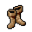{ .sprite } | [Blackwater boots](bwm_boots.md) | rare | 1830 |
| 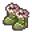{ .sprite } | [Boots of the Globetrotter](globetrotter_boots.md) | extraordinary | 130 |
| { .sprite } | [Coward's boots](boots_coward.md) | ordinary | 933 |
| { .sprite } | [Crude leather boots](boots_crude_leather.md) | ordinary | 31 |
| { .sprite } | [Enhanced leather boots](boots2enhanced.md) | ordinary | 0 |
| { .sprite } | [Goatskin boots](boots_goatskin.md) | ordinary | 0 |
| { .sprite } | [Handsewn leather boots](handsewn_boots2.md) | ordinary | 0 |
| { .sprite } | [Hardened leather boots](boots_hard_leather.md) | ordinary | 626 |
| { .sprite } | [Iced leather boots](boots7.md) | ordinary | 788 |
| { .sprite } | [Leather boots](boots1.md) | ordinary | 23 |
| 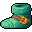{ .sprite } | [Snakeskin boots](boots3.md) | ordinary | 146 |
| { .sprite } | [Superior leather boots](boots2.md) | ordinary | 38 |
| { .sprite } | [Sure step boots](arulir_boots.md) | ordinary | 120 |
| { .sprite } | [Unzel's defensive boots](boots_unzel.md) | extraordinary | 185 |
| { .sprite } | [Vacor's boots of attack](boots_vacor.md) | extraordinary | 185 |
| { .sprite } | [Wizened amphibian boots](bwm_olm_drop2.md) | ordinary | 0 |
| { .sprite } | [Woodcutter's boots](woodcutter_boots.md) | ordinary | 873 |

### Footwear, metal (heavy)

| | Item | Rarity | Value |
|---|---|---|---|
| 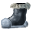{ .sprite } | [Armored boots](armored_boots.md) | rare | 1868 |
| { .sprite } | [Boots of the guardian](boots_guard1.md) | ordinary | 0 |
| { .sprite } | [Brutality boots](brutality_boots.md) | ordinary | 0 |
| { .sprite } | [Heavy iron boots](hboot_irn.md) | ordinary | 638 |
| { .sprite } | [Heavy plated boots](hboot_plat.md) | ordinary | 1579 |
| { .sprite } | [Reinforced boots](boots5.md) | ordinary | 226 |
| { .sprite } | [Remgard boots](boots_remgard1.md) | ordinary | 0 |
| { .sprite } | [Superior combat boots](boots_combat3.md) | ordinary | 0 |
| 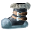{ .sprite } | [Titanforge stompers](titanforge_stompers.md) | extraordinary | 0 |
| { .sprite } | [Worn iron boots](hboot_wirn.md) | ordinary | 314 |

### Footwear, metal (light)

| | Item | Rarity | Value |
|---|---|---|---|
| { .sprite } | [Boots of Swiftness](boots_6.md) | ordinary | 0 |
| { .sprite } | [Combat boots](boots_combat1.md) | ordinary | 0 |
| { .sprite } | [Defender's boots](boots_defender.md) | ordinary | 1190 |
| { .sprite } | [Enhanced combat boots](boots_combat2.md) | ordinary | 0 |
| 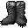{ .sprite } | [Spiked metal boots](boots_spiked.md) | ordinary | 0 |

### Gauntlet

| | Item | Rarity | Value |
|---|---|---|---|
| { .sprite } | [Spiked Gloves](gauntlet_omi2_1.md) | rare | 1994 |
| { .sprite } | [Wraithguard](brightport_wraith.md) | rare | 2599 |

### Giant hammer

| | Item | Rarity | Value |
|---|---|---|---|
| { .sprite } | [Giant hammer](hammer1.md) | ordinary | 121 |
| 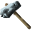{ .sprite } | [Heartsteel doomhammer](heartsteel_2h_hammer.md) | legendary | 0 |
| 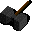{ .sprite } | [Maul](maul.md) | ordinary | 0 |
| { .sprite } | [Skullcrusher](hammer_skullcrusher.md) | ordinary | 3142 |

### Gloves, cloth

| | Item | Rarity | Value |
|---|---|---|---|
| { .sprite } | [Assassin's gloves](gloves_critical.md) | rare | 0 |
| { .sprite } | [Crude cloth gloves](gloves_crude_cloth.md) | ordinary | 31 |
| 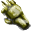{ .sprite } | [Elytharan gloves](elytharan_gloves.md) | extraordinary | 0 |
| { .sprite } | [Enhanced snakeskin gloves](gloves4enhanced.md) | ordinary | 0 |
| { .sprite } | [Fancy gloves](gloves_fancy.md) | ordinary | 78 |
| 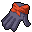{ .sprite } | [Feline gloves](feline_gloves.md) | rare | 0 |
| { .sprite } | [Fine snakeskin gloves](gloves4.md) | ordinary | 146 |
| { .sprite } | [Gardener's gloves](gardener_gloves.md) | extraordinary | 700 |
| 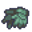{ .sprite } | [Handsewn snakeskin gloves](handsewn_gloves4.md) | ordinary | 0 |
| { .sprite } | [Kid's gloves](kids_gloves.md) | ordinary | 50 |
| { .sprite } | [Snakeskin gloves](gloves3.md) | ordinary | 72 |
| 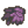{ .sprite } | [Valugha's gloves](valugha_gloves.md) | extraordinary | 0 |

### Gloves, leather

| | Item | Rarity | Value |
|---|---|---|---|
| { .sprite } | [Amphibian gloves](bwm_olm_gloves1.md) | ordinary | 0 |
| { .sprite } | [Arulir skin gloves](gloves_arulir.md) | ordinary | 1793 |
| { .sprite } | [Bar brawler's gloves](gloves_barbrawler.md) | ordinary | 95 |
| { .sprite } | [Battered amphibian gloves](bwm_olm_drop3.md) | ordinary | 0 |
| 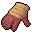{ .sprite } | [Blackwater gloves](bwm_gloves.md) | rare | 0 |
| { .sprite } | [Blood-stained gloves](used_gloves.md) | ordinary | 56 |
| { .sprite } | [Combat gloves](gloves_combat1.md) | ordinary | 956 |
| { .sprite } | [Crude leather gloves](gloves_crude_leather.md) | ordinary | 180 |
| { .sprite } | [Deerskin gloves](brightportgloves.md) | rare | 1172 |
| { .sprite } | [Enhanced combat gloves](gloves_combat2.md) | ordinary | 1204 |
| { .sprite } | [Fine gloves of swift attack](gloves_attack2.md) | ordinary | 221 |
| { .sprite } | [Fine leather gloves](gloves2.md) | ordinary | 38 |
| { .sprite } | [Gloves of better grip](gloves_grip.md) | ordinary | 471 |
| { .sprite } | [Gloves of fumbling](gloves_fumbling.md) | ordinary | -432 |
| { .sprite } | [Gloves of life force](gloves_life.md) | extraordinary | 685 |
| { .sprite } | [Gloves of swift attack](gloves_attack1.md) | ordinary | 150 |
| { .sprite } | [Gloves of the guardian](gloves_guard1.md) | ordinary | 601 |
| 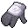{ .sprite } | [Goatskin gloves](gloves_goatskin.md) | ordinary | 0 |
| { .sprite } | [Handsewn leather gloves](handsewn_gloves2.md) | ordinary | 0 |
| { .sprite } | [Hardened leather gloves](gloves_leather1.md) | ordinary | 757 |
| { .sprite } | [Iced leather gloves](gloves5.md) | ordinary | 524 |
| { .sprite } | [Leather gloves](gloves1.md) | ordinary | 23 |
| { .sprite } | [Leather gloves of attack](gloves_leather_attack.md) | ordinary | 510 |
| { .sprite } | [Salamander gloves](brightport_glove.md) | rare | 455 |
| { .sprite } | [Suspect's glove](ogea_glove.md) | quest | 0 |
| { .sprite } | [Troublemaker's gloves](gloves_troublemaker.md) | ordinary | 501 |
| { .sprite } | [Woodcutter's gloves](gloves_woodcutter.md) | ordinary | 426 |

### Gloves, metal (heavy)

| | Item | Rarity | Value |
|---|---|---|---|
| { .sprite } | [Armored gloves](armored_gloves.md) | ordinary | 1868 |
| { .sprite } | [Bronzed grasps](bronzed_gloves.md) | rare | 0 |
| { .sprite } | [Chainmail mittens](hglv_chml.md) | ordinary | 1793 |
| { .sprite } | [Feygard plated gloves](feygard_plated_gloves.md) | rare | 755 |
| { .sprite } | [Heavy iron gloves](hglv_irn.md) | ordinary | 679 |
| { .sprite } | [Heavy plated gloves](hglv_plat2.md) | ordinary | 1712 |
| { .sprite } | [Reinforced steel gloves](hglv_stl.md) | ordinary | 1463 |
| 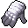{ .sprite } | [Worn plated gloves](hglv_plat1.md) | rare | 532 |

### Gloves, metal (light)

| | Item | Rarity | Value |
|---|---|---|---|
| { .sprite } | [Enchanted Remgard gloves](gloves_remgard2.md) | ordinary | 1326 |
| { .sprite } | [Grips of the warrior](warrior_gloves.md) | ordinary | 0 |
| { .sprite } | [Guard's gloves](gloves_guards.md) | ordinary | 636 |
| { .sprite } | [Remgard fighting gloves](gloves_remgard1.md) | ordinary | 1205 |

### Greataxe

| | Item | Rarity | Value |
|---|---|---|---|
| { .sprite } | [Black greataxe](graxe_black.md) | ordinary | 1 |
| { .sprite } | [Executioner's greataxe](graxe_exec.md) | ordinary | 2290 |
| 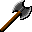{ .sprite } | [Greataxe of broken promises](great_axe_of_bp.md) | rare | 0 |
| { .sprite } | [Greataxe of fury](graxe_fury.md) | ordinary | 110 |
| { .sprite } | [Greataxe of shattered hope](graxe_shatter.md) | rare | 5478 |
| { .sprite } | [Gutsplitter](axe_gutsplitter.md) | ordinary | 2733 |
| { .sprite } | [Heartsteel greataxe](heartstone_greataxe.md) | legendary | 0 |
| { .sprite } | [Massive greataxe](graxe_massive.md) | ordinary | 1548 |
| 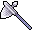{ .sprite } | [Shadow of the slayer](shadow_slayer.md) | extraordinary | 0 |

### Headwear, cloth

| | Item | Rarity | Value |
|---|---|---|---|
| { .sprite } | [Enhanced green hat](hat2enhanced.md) | ordinary | 0 |
| { .sprite } | [Fancy green hat](hat_fancy_green.md) | ordinary | 0 |
| { .sprite } | [Feline hat](feline_hat.md) | rare | 3451 |
| { .sprite } | [Fine green hat](hat2.md) | ordinary | 25 |
| { .sprite } | [Green hat](hat1.md) | ordinary | 13 |
| { .sprite } | [Hat of the protector](hat_of_protector.md) | rare | 4496 |
| 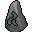{ .sprite } | [Rockfall deflecting cap](arulir_cap.md) | ordinary | 80 |
| { .sprite } | [Valugha's shimmering hat](valugha_hat.md) | extraordinary | 648 |
| { .sprite } | [Woodcutter's feathered hat](hat_crit.md) | extraordinary | 1 |

### Headwear, leather

| | Item | Rarity | Value |
|---|---|---|---|
| { .sprite } | [Blackwater leather cap](bwm_leather_cap.md) | rare | 722 |
| { .sprite } | [Cap of bloody eyes](helm_redeye2.md) | ordinary | 1 |
| { .sprite } | [Cap of red eyes](helm_redeye1.md) | ordinary | 1 |
| { .sprite } | [Crude leather cap](hat3.md) | ordinary | 72 |
| { .sprite } | [Fine leather cap](hat_fine_leather.md) | ordinary | 846 |
| { .sprite } | [Goatskin hat](hat_goatskin.md) | ordinary | 0 |
| { .sprite } | [Hardened leather cap](hat_hard_leather.md) | ordinary | 648 |
| { .sprite } | [Leather cap](hat4.md) | ordinary | 146 |
| { .sprite } | [Leather cap of reduced vision](hat_leather_vision.md) | ordinary | 971 |
| { .sprite } | [Ordinary leather cap](hat_leather1.md) | ordinary | 261 |

### Headwear, metal (heavy)

| | Item | Rarity | Value |
|---|---|---|---|
| { .sprite } | [Armored helmet](armored_helmet.md) | extraordinary | 1868 |
| { .sprite } | [Brimhaven steel helmet](brimhaven_steel_helmet.md) | ordinary | 0 |
| { .sprite } | [Crude iron helmet](helm_crude_iron.md) | ordinary | 1120 |
| { .sprite } | [Defender's helmet](helm_defend1.md) | ordinary | 1975 |
| { .sprite } | [Engraved steel helmet](brimhaven_engraved_steel_helmet.md) | rare | 0 |
| { .sprite } | [Heavy iron skullcap](hvhead_irn.md) | ordinary | 433 |
| { .sprite } | [Heavy steel skullcap](hvhead_stl.md) | ordinary | 767 |
| { .sprite } | [Remgard combat helmet](helm_combat3.md) | ordinary | 1540 |
| { .sprite } | [Steel barbute](brightport_helmet.md) | ordinary | 0 |
| { .sprite } | [Steel helm](helm_steel.md) | ordinary | 0 |
| { .sprite } | [Trollbone helmet](brightport_trollhelmet.md) | extraordinary | 2670 |

### Headwear, metal (light)

| | Item | Rarity | Value |
|---|---|---|---|
| { .sprite } | [Argentscale diadem](brightport_crown.md) | extraordinary | 0 |
| { .sprite } | [Bronze helmet](bronze_helmet.md) | ordinary | 0 |
| { .sprite } | [Combat helm](helm_combat1.md) | ordinary | 455 |
| { .sprite } | [Crown of studied defiance](undertell_lgd_headgear.md) | legendary | 0 |
| { .sprite } | [Dark protector](helm_protector.md) | extraordinary | 3119 |
| { .sprite } | [Enhanced combat helmet](helm_combat2.md) | ordinary | 485 |
| { .sprite } | [Helm of Foreseeing](Helm_foreseeing.md) | legendary | 0 |
| { .sprite } | [Korhald's kettle](korhald_kettle.md) | extraordinary | 0 |
| { .sprite } | [Strange looking helmet](helm_protector0.md) | quest | 0 |

### Hide armor

| | Item | Rarity | Value |
|---|---|---|---|
| { .sprite } | [Kazarite cloak](kamelio_drop3.md) | extraordinary | 0 |
| { .sprite } | [King's hide](brightport_kingarmor.md) | extraordinary | 4792 |
| { .sprite } | [Wolfpack's animal hide](packhide.md) | extraordinary | 121 |

### Longsword

| | Item | Rarity | Value |
|---|---|---|---|
| { .sprite } | [Balanced steel sword](sword_balanced_steel.md) | ordinary | 2797 |
| { .sprite } | [Blackwater iron longsword](bwm_longsword.md) | rare | 1699 |
| { .sprite } | [Blackwater iron sword](bwm_ironsword.md) | rare | 1224 |
| { .sprite } | [Blood seeker](bloodseeker.md) | extraordinary | 0 |
| { .sprite } | [Challenger's iron sword](sword_challengers.md) | ordinary | 785 |
| { .sprite } | [Crude iron sword](ironsword0.md) | ordinary | 12 |
| { .sprite } | [Defender's blade](sword_defenders.md) | ordinary | 1711 |
| { .sprite } | [Degraded Feygard iron sword](fg_ironsword_d.md) | quest | 0 |
| { .sprite } | [Feygard iron sword](fg_ironsword.md) | quest | 0 |
| { .sprite } | [Flagstone's pride](sword_flagstone.md) | extraordinary | 169 |
| { .sprite } | [Hardened iron longsword](longsword_hard_iron.md) | ordinary | 362 |
| { .sprite } | [Hardened iron sword](sword_hard_iron.md) | ordinary | 369 |
| { .sprite } | [Heartsteel warblade](heartstone_1h_sword.md) | legendary | 0 |
| 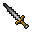{ .sprite } | [Hunter's Sword](hunters_sword.md) | extraordinary | 0 |
| { .sprite } | [Iron longsword](ironsword2.md) | ordinary | 121 |
| { .sprite } | [Iron sword](ironsword1.md) | ordinary | 78 |
| { .sprite } | [Klingenlied](klingenlied.md) | rare | 3884 |
| { .sprite } | [LifeTaker](lifetaker.md) | extraordinary | 5045 |
| { .sprite } | [Rusted iron sword](rusted_iron_sword.md) | ordinary | 52 |
| { .sprite } | [Steel sword](steelsword1.md) | ordinary | 874 |

### Mace

| | Item | Rarity | Value |
|---|---|---|---|
| 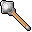{ .sprite } | [Balanced heavy iron club](club_wood2.md) | ordinary | 2194 |
| { .sprite } | [Bronze morningstar](morn_bronze.md) | ordinary | 0 |
| { .sprite } | [Brutal club](club_brutal.md) | ordinary | 2522 |
| { .sprite } | [Death mace](death_mace.md) | ordinary | 0 |
| { .sprite } | [Elm steel mace](mace2.md) | ordinary | 0 |
| 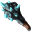{ .sprite } | [Gornaud's stone mace](stone_mace.md) | extraordinary | 639 |
| { .sprite } | [Heartsteel mace](heartstone_mace.md) | legendary | 0 |
| { .sprite } | [Heavy club](heavy_club.md) | ordinary | 1229 |
| { .sprite } | [Heavy iron club](club_wood1.md) | ordinary | 950 |
| { .sprite } | [Iron club](club3.md) | ordinary | 253 |
| { .sprite } | [Iron flail](flail_iron.md) | ordinary | 0 |
| { .sprite } | [Iron mace](mace_iron.md) | ordinary | 614 |
| { .sprite } | [Iron morningstar](morn_iron.md) | ordinary | 0 |

### Necklace

| | Item | Rarity | Value |
|---|---|---|---|
| 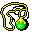{ .sprite } | [Audela's necklace](audela_necklace.md) | quest | 0 |
| { .sprite } | [Blue rat necklace](ratdom_compass_bwm.md) | rare | 3000 |
| { .sprite } | [Bogsten's necklace](bogsten_necklace.md) | quest | 50 |
| { .sprite } | [Broken Feygard medallion](feygard_necklace1.md) | ordinary | 0 |
| { .sprite } | [Circe's Necklace](ll2_necklace.md) | extraordinary | 0 |
| 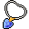{ .sprite } | [Defender's stone](necklace_defender_stone.md) | rare | 1325 |
| { .sprite } | [Diamond Necklace](expensive_necklace.md) | rare | 100000 |
| { .sprite } | [Enhanced Shielding necklace](necklace_shield3.md) | rare | 1255 |
| { .sprite } | [Fire opal necklace](kamelio_drop2.md) | ordinary | 0 |
| { .sprite } | [Heartfire pendant of Kazaul](heartfire_pendant.md) | extraordinary | 0 |
| { .sprite } | [Impressive Diamond Necklace](very_expensive_necklace.md) | extraordinary | 500000 |
| { .sprite } | [Iqhan pendant](iqhan_pendant.md) | ordinary | 10 |
| { .sprite } | [Irogotu's necklace](neck_irogotu.md) | extraordinary | 30 |
| { .sprite } | [Jewel of Fallhaven](jewel_fallhaven.md) | rare | 3125 |
| { .sprite } | [Lesser shielding necklace](necklace_shield_0.md) | ordinary | 131 |
| { .sprite } | [Lutarc's medallion](lutarc_medallion.md) | quest | 0 |
| { .sprite } | [Marrowtaint](marrowtaint.md) | extraordinary | 4760 |
| { .sprite } | [Mundane necklace](junk_necklace0.md) | ordinary | 0 |
| { .sprite } | [Mysterious Korhald pendant](korhald_chamber_key.md) | quest | 0 |
| { .sprite } | [Necklace for father](necklace_for_father2.md) | quest | 500 |
| { .sprite } | [Necklace for father (cheap)](necklace_for_father1.md) | quest | 5 |
| { .sprite } | [Necklace for father (expensive)](necklace_for_father3.md) | quest | 50000 |
| { .sprite } | [Necklace of dexterity](necklace_dexterity.md) | ordinary | 3160 |
| { .sprite } | [Necklace of Feygard's Glory](feygard_necklace.md) | extraordinary | 3118 |
| { .sprite } | [Necklace of lifesteal](necklace_lifesteal.md) | rare | 3993 |
| { .sprite } | [Necklace of strike](necklace_strike.md) | ordinary | 832 |
| { .sprite } | [Necklace of the guardian](necklace_shield1.md) | rare | 935 |
| { .sprite } | [Necklace of the protector](necklace_protector.md) | rare | 3207 |
| { .sprite } | [Necklace of the Undead](necklace_undead.md) | extraordinary | 10 |
| { .sprite } | [Necklace with a medal from Teccow](mg2_rewarded_necklace.md) | rare | 100 |
| { .sprite } | [Orange rat necklace](ratdom_compass_tour.md) | rare | 5000 |
| { .sprite } | [Ortholion's talisman](ortholion_reward.md) | extraordinary | 5836 |
| { .sprite } | [Polished necklace](junk_necklace1.md) | ordinary | 0 |
| { .sprite } | [Sapphire Necklace](g02_ambelie.md) | quest | 5000 |
| { .sprite } | [Shielding necklace](necklace_shield2.md) | rare | 1255 |
| { .sprite } | [Stoutford combat amulet](necklace_stfrd_combat.md) | ordinary | 0 |
| { .sprite } | [Superior necklace of the protector](necklace_protector2.md) | rare | 0 |
| { .sprite } | [Venomscale amulet](vscale_amul.md) | rare | 0 |

### Parrying weapon

| | Item | Rarity | Value |
|---|---|---|---|
| 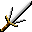{ .sprite } | [Blade of the protector](blade_protector.md) | extraordinary | 0 |
| 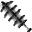{ .sprite } | [Heartsteel blade breaker](heartstone_blade_breaker.md) | legendary | 0 |
| { .sprite } | [Trident dagger](dagger_trident.md) | ordinary | 0 |

### Plate mail

| | Item | Rarity | Value |
|---|---|---|---|
| { .sprite } | [Brimhaven plate mail](brimhaven_plate_mail1.md) | rare | 0 |
| { .sprite } | [Brimhaven rigid plate mail](brimhaven_plate_mail2.md) | rare | 0 |
| { .sprite } | [Steel cuirass](cuirass_steel.md) | ordinary | 0 |

### Pole weapon

| | Item | Rarity | Value |
|---|---|---|---|
| { .sprite } | [Blackwater rusted pickaxe](bwm_pick.md) | ordinary | 598 |
| 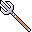{ .sprite } | [Brandistock](brandistock.md) | ordinary | 0 |
| { .sprite } | [Broom](brightport_broom.md) | ordinary | 100 |
| 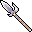{ .sprite } | [Glaive of Imeria](glaive_butcher.md) | extraordinary | 0 |
| { .sprite } | [Heartsteel trident](heartstone_glaive.md) | legendary | 0 |
| 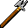{ .sprite } | [Iron halberd](halberd_iron.md) | ordinary | 0 |
| { .sprite } | [Iron spear](spear_iron.md) | ordinary | 0 |
| { .sprite } | [Pine spear](spear1.md) | ordinary | 0 |
| { .sprite } | [Remgard steel spear](spear_steel_remgard.md) | ordinary | 0 |
| { .sprite } | [Rusty iron spear](spear_rusty.md) | ordinary | 0 |
| { .sprite } | [Rusty scythe](scythe_rusty.md) | ordinary | 464 |
| { .sprite } | [Scythe](scythe.md) | ordinary | 0 |
| { .sprite } | [Steel fauchard](fauchard_steel.md) | ordinary | 0 |
| { .sprite } | [Steel glaive](glaive_steel.md) | ordinary | 0 |
| { .sprite } | [Steel spear](spear_steel.md) | ordinary | 0 |
| { .sprite } | [Undertell pickaxe](undertell_pickaxe.md) | rare | 598 |
| { .sprite } | [Undertell shovel](undertell_shovel.md) | rare | 2194 |

### Quarterstaff

| | Item | Rarity | Value |
|---|---|---|---|
| { .sprite } | [Bogsten's staff](bogsten_staff.md) | quest | 0 |
| { .sprite } | [Farmer's flail](flail_farm.md) | ordinary | 0 |
| { .sprite } | [Oaken staff](oaken_staff.md) | rare | 2562 |
| { .sprite } | [Quarterstaff](swampwitch_staff.md) | ordinary | 10 |
| { .sprite } | [Quarterstaff](qtrstaff.md) | ordinary | 10 |
| { .sprite } | [Superior quarterstaff](qtrstaff_2.md) | rare | 1600 |

### Rapier

| | Item | Rarity | Value |
|---|---|---|---|
| { .sprite } | [Fencing blade](sword_fencing.md) | ordinary | 922 |
| { .sprite } | [Prim arming sword](kamelio_drop1.md) | ordinary | 0 |
| { .sprite } | [Rapier of lifesteal](rapier_lifesteal.md) | legendary | 0 |
| { .sprite } | [Sharp steel rapier](rapier_steel.md) | ordinary | 0 |
| { .sprite } | [Soul rapier](soul_rapier.md) | ordinary | 0 |
| { .sprite } | [Sword of Shadow's rage](clouded_rage.md) | extraordinary | 0 |

### Ring

| | Item | Rarity | Value |
|---|---|---|---|
| { .sprite } | [Arensia's Ring of Promise](ring_of_promise_quest.md) | quest | 50 |
| { .sprite } | [Arensia's Ring of Promise](ring_of_promise.md) | extraordinary | 750 |
| { .sprite } | [Bar brawler's ring](ring_barbrawler.md) | ordinary | 222 |
| { .sprite } | [Blackwater ring of combat](bwm_combat_ring.md) | rare | 595 |
| { .sprite } | [Broken ring of shielding](broken_ring_shielding.md) | rare | 0 |
| { .sprite } | [Challenger's ring](ring_challenger.md) | ordinary | 408 |
| { .sprite } | [Circlet of clarity](circlet_clarity.md) | extraordinary | 4127 |
| { .sprite } | [Crude combat ring](ring_crude_combat.md) | ordinary | 44 |
| { .sprite } | [Crude ring of block](ring_crude_block.md) | ordinary | 73 |
| { .sprite } | [Crude ring of surehit](ring_crude_surehit.md) | ordinary | 52 |
| { .sprite } | [Cursed ring of focus](cursed_ring_focus.md) | quest | 0 |
| { .sprite } | [Defender's ring](ring_defender.md) | ordinary | 755 |
| { .sprite } | [Diamond Ring](diamond_ring.md) | extraordinary | 50000 |
| { .sprite } | [Elythara's ring](elythara_ring_upgraded.md) | extraordinary | 0 |
| { .sprite } | [Elythara's ring](elythara_ring.md) | quest | 0 |
| { .sprite } | [Garnet whisper ring](old_lady_ring.md) | rare | 0 |
| { .sprite } | [Godwin's ring](godwin_ring.md) | rare | 0 |
| { .sprite } | [Jinxed ring of damage resistance](ring_jinxed1.md) | ordinary | 229 |
| { .sprite } | [Kid's ring](kids_ring.md) | ordinary | 0 |
| { .sprite } | [Lesser ring of block](ring_block1.md) | rare | 1239 |
| { .sprite } | [Lord Erwyn's ring](erwyn_ring.md) | extraordinary | 0 |
| { .sprite } | [Luthor's Ring](ring_luthor.md) | quest | 0 |
| { .sprite } | [Mikhail's ring](ring_mikhail.md) | ordinary | 15 |
| { .sprite } | [Mundane ring](ring1.md) | ordinary | 13 |
| { .sprite } | [Old man's ring of bone](guynmart_bonering.md) | quest | 0 |
| { .sprite } | [Polished combat ring](ring_polished_combat.md) | rare | 1346 |
| { .sprite } | [Polished ring](ring2.md) | ordinary | 21 |
| { .sprite } | [Polished ring of backstabbing](ring_polished_backstab.md) | rare | 2731 |
| { .sprite } | [Polished ring of block](ring_block2.md) | rare | 3866 |
| { .sprite } | [Polished ring of damage resistance](ring_dr2.md) | ordinary | 0 |
| { .sprite } | [Polished ring of the protector](polished_ring_protector.md) | rare | 3744 |
| { .sprite } | [Ring of backstabbing](ring_backstab.md) | ordinary | 1363 |
| { .sprite } | [Ring of block](ring_block.md) | rare | 2192 |
| { .sprite } | [Ring of damage +1](ring_dmg1.md) | ordinary | 215 |
| { .sprite } | [Ring of damage +2](ring_dmg2.md) | ordinary | 398 |
| { .sprite } | [Ring of damage +3](ring_dmg_3.md) | ordinary | 624 |
| { .sprite } | [Ring of damage +4](ring_dmg_4.md) | ordinary | 1168 |
| { .sprite } | [Ring of damage +5](ring_dmg5.md) | rare | 2014 |
| { .sprite } | [Ring of damage +6](ring_dmg6.md) | rare | 3186 |
| { .sprite } | [Ring of damage +7](ring_dmg7.md) | rare | 3186 |
| { .sprite } | [Ring of damage resistance](ring_dr1.md) | ordinary | 0 |
| { .sprite } | [Ring of dexterity](ring_dexterity.md) | ordinary | 0 |
| { .sprite } | [Ring of far lesser Shadow](ring_shadow1.md) | legendary | 0 |
| { .sprite } | [Ring of fumbling](ring_fumbling.md) | ordinary | -463 |
| { .sprite } | [Ring of lesser Shadow](ring_shadow0.md) | legendary | 0 |
| { .sprite } | [Ring of life force](ring_life.md) | ordinary | 557 |
| { .sprite } | [Ring of poison immunity](ring_antipoison.md) | extraordinary | 23000 |
| { .sprite } | [Ring of Shadow embrace](ring_shadow_embrace.md) | extraordinary | 0 |
| { .sprite } | [Ring of strike](ring_crit1.md) | rare | 2921 |
| { .sprite } | [Ring of surehit](ring_atkch1.md) | ordinary | 215 |
| { .sprite } | [Ring of the guardian](ring_guardian.md) | rare | 1489 |
| { .sprite } | [Ring of the protector](ring_protector.md) | rare | 3744 |
| { .sprite } | [Ring of venom](ring_venom.md) | rare | 5000 |
| { .sprite } | [Ring of vicious strike](ring_crit2.md) | rare | 3455 |
| { .sprite } | [Rough ring of damage](ring_rough_damage.md) | ordinary | 56 |
| { .sprite } | [Rough ring of life force](ring_rough_life.md) | ordinary | 100 |
| { .sprite } | [Stanwick's signet ring](brightport_ring.md) | quest | 0 |
| { .sprite } | [Tavern brawler's ring](ring_taverbrawler.md) | ordinary | 314 |
| { .sprite } | [Troublemaker's ring](ring_troublemaker.md) | ordinary | 797 |
| { .sprite } | [Verigil's signet ring](verigil_ring.md) | quest | 0 |
| { .sprite } | [Villain's ring](ring_villain.md) | rare | 2750 |

### Scepter

| | Item | Rarity | Value |
|---|---|---|---|
| { .sprite } | [Branch of twilight](branch_of_twilight.md) | rare | 4387 |
| { .sprite } | [Chaosreaper](chaosreaper.md) | extraordinary | 339 |
| { .sprite } | [Enchanted evergreen rod](witch_scepter.md) | extraordinary | 5004 |
| { .sprite } | [Inlaid scepter](scepter_inlaid.md) | ordinary | 712 |
| { .sprite } | [Runed scepter](scptr_runed.md) | ordinary | 2234 |
| { .sprite } | [Yczorah nucleus](yczorah2.md) | legendary | 0 |

### Shield, metal (heavy)

| | Item | Rarity | Value |
|---|---|---|---|
| { .sprite } | [Crude iron shield](shield_iron1.md) | ordinary | 558 |
| { .sprite } | [Iron shield](shield_iron2.md) | ordinary | 0 |
| { .sprite } | [Shield of dark reflections](shield_dark_ref.md) | extraordinary | 0 |
| { .sprite } | [Shield of the Brave](shield_of_brave.md) | extraordinary | 0 |
| { .sprite } | [Superior iron shield](shield_iron3.md) | ordinary | 0 |

### Shield, metal (light)

| | Item | Rarity | Value |
|---|---|---|---|
| { .sprite } | [Black defender](shield_blk_defender.md) | extraordinary | 0 |
| { .sprite } | [Copper shield](brightport_bronzeshield.md) | ordinary | 0 |
| { .sprite } | [Guynmart shield](guynmart_shield.md) | ordinary | 1000 |
| { .sprite } | [Hand mirror](hand_mirror.md) | ordinary | 0 |
| { .sprite } | [Remgard combat shield](remgard_shield_2.md) | ordinary | 2720 |
| { .sprite } | [Remgard shield](remgard_shield_1.md) | ordinary | 2189 |
| { .sprite } | [Shield of the undead](shield_of_undead.md) | extraordinary | 11155 |

### Shield, wood (light)

| | Item | Rarity | Value |
|---|---|---|---|
| { .sprite } | [Blackwater shield](bwm_shield.md) | rare | 2198 |
| { .sprite } | [Crude wooden shield](shield4.md) | ordinary | 464 |
| { .sprite } | [Kid's shield](kids_shield.md) | rare | 100 |
| { .sprite } | [Spiked buckler](shield_spiked.md) | ordinary | 0 |
| { .sprite } | [Superior wooden shield](shield5.md) | ordinary | 624 |
| { .sprite } | [Wooden defender](shield_wooden_defender.md) | ordinary | 1996 |
| { .sprite } | [Wooden shield](shield_wooden.md) | ordinary | 514 |

### Shortsword

| | Item | Rarity | Value |
|---|---|---|---|
| { .sprite } | [Blazebite](blazebite.md) | extraordinary | 1665 |
| { .sprite } | [Hunter's knife](brightport_dagger.md) | ordinary | 0 |
| { .sprite } | [Iron shortsword](shortsword1.md) | ordinary | 78 |
| { .sprite } | [Pyrite scimitar](brightport_sword.md) | rare | 0 |
| { .sprite } | [Shadowfang](shadowfang.md) | extraordinary | 512 |
| { .sprite } | [Steel shortsword](shortsword2.md) | ordinary | 0 |
| { .sprite } | [Villain's blade](sword_villains.md) | ordinary | 1665 |
| { .sprite } | [Wooden sword](brv_school_sword.md) | ordinary | 78 |

### Splint mail

| | Item | Rarity | Value |
|---|---|---|---|
| { .sprite } | [Worn splint mail](spmail2.md) | ordinary | 2199 |

### Tower shield

| | Item | Rarity | Value |
|---|---|---|---|
| { .sprite } | [Strong wooden tower shield](shield7.md) | ordinary | 1538 |
| { .sprite } | [Wooden tower shield](shield6.md) | ordinary | 952 |

### Two-handed mace

| | Item | Rarity | Value |
|---|---|---|---|
| { .sprite } | [Giant's flail](flail_giant.md) | extraordinary | 0 |

### Two-handed sword

| | Item | Rarity | Value |
|---|---|---|---|
| { .sprite } | [Claymore of the berserker](clmr_bers.md) | ordinary | 718 |
| { .sprite } | [Claymore of the warlord](clmr_wrld.md) | rare | 2230 |
| { .sprite } | [Defender's claymore](clmr_def1.md) | ordinary | 522 |
| { .sprite } | [Dull two-handed sword](clmr_dl.md) | ordinary | 38 |
| { .sprite } | [Elytharan redeemer](elytharan_redeemer.md) | legendary | 0 |
| { .sprite } | [Flaming greatsword](brightportflamesword.md) | extraordinary | 0 |
| { .sprite } | [Giant's claymore](clmr_gnt.md) | ordinary | 2626 |
| { .sprite } | [Gleaming claymore of ruin](clmr_ruin.md) | rare | 1887 |
| { .sprite } | [Heartsteel claymore](heartstone_2h_sword.md) | legendary | 0 |
| { .sprite } | [Massive two-handed sword](clmr_msv.md) | ordinary | 767 |
| { .sprite } | [Rat King Rah's sword](ratdom_rat_sword.md) | extraordinary | 2000 |
| { .sprite } | [Rusty claymore](clmr_rst.md) | ordinary | 36 |
| { .sprite } | [Serpent's fang](clmr_serp.md) | rare | 3590 |
| { .sprite } | [Steel claymore](claymore_steel.md) | ordinary | 0 |
| { .sprite } | [Superior defender's claymore](clmr_def2.md) | ordinary | 1019 |
| { .sprite } | [Sword of the annihilator](sword_annihilator.md) | extraordinary | 0 |
| { .sprite } | [Thunderguard Copper sword](thunderguard_2h_sword.md) | rare | 0 |
| { .sprite } | [Two-handed iron claymore](clmr_irn2.md) | ordinary | 854 |
| { .sprite } | [Two-handed iron sword](clmr_irn1.md) | ordinary | 92 |
| { .sprite } | [Two-handed steel sword](clmr_stl.md) | ordinary | 466 |
| { .sprite } | [Wraith's massive claymore](clmr_wrmas.md) | extraordinary | 3900 |
| { .sprite } | [Xul'viir](xulviir.md) | extraordinary | 5045 |

### Warhammer

| | Item | Rarity | Value |
|---|---|---|---|
| { .sprite } | [Bridgebreaker](bridgebreaker.md) | legendary | 0 |
| { .sprite } | [Bronze warhammer](hmr_bronze.md) | ordinary | 0 |
| { .sprite } | [Feygard's might](feygard_might.md) | rare | 0 |
| { .sprite } | [Iron hammer](hammer0.md) | ordinary | 12 |
| { .sprite } | [Iron war hammer](hmr_iron.md) | ordinary | 1 |
| { .sprite } | [Olwyn's curse](hmr_olwyns.md) | rare | 2502 |

### Whip

| | Item | Rarity | Value |
|---|---|---|---|
| { .sprite } | [Amphibian whip](bwm_olm_weapon1.md) | ordinary | 901 |
| { .sprite } | [Leather whip](whip_leather.md) | ordinary | 0 |
| { .sprite } | [Raider's reach](raiders_reach.md) | rare | 6700 |
| { .sprite } | [Whip of binding](whip_bind.md) | extraordinary | 6700 |

## Consumable

### Drink

| | Item | Rarity | Value |
|---|---|---|---|
| { .sprite } | [Apple juice](drink_applej.md) | ordinary | 34 |
| { .sprite } | [Bandit's Brew](sullengrad_bandit_brew.md) | ordinary | 0 |
| { .sprite } | [Brimhaven brew](brv_brew.md) | ordinary | 0 |
| { .sprite } | [Concentrated charwood sap](drink_charwood2.md) | ordinary | 255 |
| { .sprite } | [Dark Beer Sour](sullengard_dark_beer_sour.md) | ordinary | 0 |
| { .sprite } | [Forest Ale](sullengard_forest_ale.md) | ordinary | 0 |
| { .sprite } | [Goat milk](milk_goat.md) | ordinary | 0 |
| { .sprite } | [Lowyna's foul brew](drink_lowyn1.md) | ordinary | 430 |
| { .sprite } | [Lowyna's rat poison](drink_lowyn3.md) | ordinary | 170 |
| { .sprite } | [Lowyna's special brew](drink_lowyn2.md) | ordinary | 580 |
| { .sprite } | [Mead](mead.md) | ordinary | 15 |
| { .sprite } | [Milk](milk.md) | ordinary | 21 |
| { .sprite } | [Mountain Top Juice](sullengard_mtn_tj.md) | ordinary | 0 |
| { .sprite } | [Prune juice](drink_prunej.md) | ordinary | 112 |
| { .sprite } | [Sap of the charwood tree](drink_charwood1.md) | ordinary | 96 |
| { .sprite } | [Southernhaze](sullengrad_southernhaze.md) | ordinary | 0 |
| { .sprite } | [Spring Squeeze](sullengard_spring_squeeze.md) | ordinary | 0 |
| { .sprite } | [Sullengard's Finest](sullengrad_finest.md) | ordinary | 0 |

### Edible animal part

| | Item | Rarity | Value |
|---|---|---|---|
| { .sprite } | [Bramblefin](bramblefin_fish.md) | ordinary | 40 |
| { .sprite } | [Corrupted swamp core](corrupted_swamp_core.md) | extraordinary | 0 |
| { .sprite } | [Cyclopea root](cyclopea_root.md) | rare | 0 |
| { .sprite } | [Feline milk](feline_milk.md) | ordinary | 0 |
| { .sprite } | [Healthier worm meat](better_worm_meat.md) | ordinary | 0 |
| { .sprite } | [Hexi egg](hexi_egg.md) | ordinary | 0 |
| { .sprite } | [Izthiel claw](izthiel_claw.md) | ordinary | 1 |
| { .sprite } | [Leech](leech_usable.md) | ordinary | 10 |
| { .sprite } | [Meat](meat.md) | ordinary | 29 |
| { .sprite } | [Mountain eel meat](eel_meat.md) | ordinary | 42 |
| { .sprite } | [Photosynthetic leaf](photosynthetic_leaf.md) | rare | 0 |
| { .sprite } | [Raw inkyfish](bwm_fish.md) | ordinary | 22 |
| { .sprite } | [Spider eggs](spider_eggs.md) | ordinary | 0 |
| { .sprite } | [Worm meat](meat3.md) | ordinary | 42 |

### Food

| | Item | Rarity | Value |
|---|---|---|---|
| { .sprite } | [A single grape from Kalypso](ll2_grape_kalypso.md) | extraordinary | 10000 |
| { .sprite } | [Apple pie](brightport_bakery2.md) | ordinary | 24 |
| { .sprite } | [Berry pie](brightport_bakery1.md) | ordinary | 26 |
| { .sprite } | [Blue cheese](cheese_blue.md) | ordinary | 45 |
| { .sprite } | [Bogsten's mushroom](mushroom_bogsten.md) | ordinary | 0 |
| { .sprite } | [Boiled tripe](tripe_boiled.md) | ordinary | 8 |
| { .sprite } | [Boletus spelunca](elm_mushroom1.md) | rare | 191 |
| { .sprite } | [Bread](bread.md) | ordinary | 6 |
| { .sprite } | [Brightport bread](brightport_bakery.md) | ordinary | 12 |
| { .sprite } | [Broccoli](broccoli.md) | ordinary | 27 |
| { .sprite } | [Butter](butter.md) | ordinary | 10 |
| { .sprite } | [Cake](cake.md) | ordinary | 200 |
| { .sprite } | [Carrot](carrot.md) | ordinary | 14 |
| { .sprite } | [Carrots](carrots.md) | ordinary | 25 |
| { .sprite } | [Cave fern](elm_fern.md) | rare | 132 |
| { .sprite } | [Charwood cheddar](charwood_cheddar.md) | ordinary | 63 |
| { .sprite } | [Cheese](cheese.md) | ordinary | 38 |
| { .sprite } | [Coconut](coconut.md) | extraordinary | 180 |
| { .sprite } | [Cooked chicken leg](chkn_leg.md) | ordinary | 126 |
| { .sprite } | [Cooked inkyfish](bwm_fish2.md) | ordinary | 80 |
| { .sprite } | [Cooked lamb meat](lamb_meat.md) | ordinary | 65 |
| { .sprite } | [Cooked meat](meat_cooked.md) | ordinary | 78 |
| { .sprite } | [Cooked perch](cookperch.md) | ordinary | 150 |
| { .sprite } | [Cooked snake meat](snake_meat_cooked.md) | ordinary | 90 |
| { .sprite } | [Cooked venison](brightport_meat.md) | ordinary | 213 |
| { .sprite } | [Corn](corn.md) | ordinary | 28 |
| { .sprite } | [Cured ham](cured_ham.md) | ordinary | 70 |
| { .sprite } | [Deebo's apple cider](apple_orchard_cider.md) | rare | 80 |
| { .sprite } | [Deebo's apple juice](apple_orchard_juice.md) | rare | 97 |
| { .sprite } | [Deebo's apple pie](apple_orchard_pie.md) | rare | 72 |
| { .sprite } | [Dried goat meat](goat_meat_dried.md) | ordinary | 70 |
| { .sprite } | [Duck eggs](eggs_duck.md) | ordinary | 15 |
| { .sprite } | [Durian fruit](durian.md) | ordinary | 110 |
| { .sprite } | [Eggs](eggs.md) | ordinary | 10 |
| { .sprite } | [Especially sweet cherries](esp_sweet_cherries.md) | ordinary | 256 |
| { .sprite } | [Especially sweet ice berries](wild_berry2a.md) | ordinary | 220 |
| { .sprite } | [Especially sweet red berries](wild_berry3a.md) | ordinary | 210 |
| { .sprite } | [Especially sweet wild berries](wild_berry1a.md) | ordinary | 120 |
| { .sprite } | [Fermented garlic](ferm-garlic.md) | rare | 25 |
| { .sprite } | [Feydelight](feydelight.md) | extraordinary | 0 |
| { .sprite } | [Fig](fig_fruit.md) | ordinary | 100 |
| { .sprite } | [Fruit assortment](brightport_fruit2.md) | ordinary | 0 |
| { .sprite } | [Gison and Nimael's soup of the forest](soup_forest.md) | rare | 54 |
| { .sprite } | [Gison's mushroom soup](gison_soup.md) | rare | 0 |
| { .sprite } | [Gloriosa mushroom soup](gloriosa_mushroom_soup.md) | rare | 0 |
| { .sprite } | [Goat cheese](cheese_goat.md) | ordinary | 50 |
| { .sprite } | [Green apple](apple_green.md) | ordinary | 14 |
| { .sprite } | [Green Pepper](green_pepper.md) | ordinary | 16 |
| { .sprite } | [Hannah's lunch](guynmart_lunch.md) | ordinary | 100 |
| { .sprite } | [Hard biscuits](biscuit_hard.md) | ordinary | 6 |
| { .sprite } | [Headless fish](headless_fish.md) | ordinary | 22 |
| { .sprite } | [Honey](honey.md) | rare | 45 |
| { .sprite } | [Ice berries](wild_berry2.md) | ordinary | 22 |
| { .sprite } | [Mushroom](mushroom.md) | ordinary | 3 |
| { .sprite } | [Nimael's vegetable soup](nimael_soup.md) | rare | 0 |
| { .sprite } | [Nutritious snake meat](ratdom_maze_mole_food.md) | ordinary | 120 |
| { .sprite } | [Orchard apple](deebo_apples.md) | rare | 50 |
| { .sprite } | [Pear](pear.md) | ordinary | 14 |
| { .sprite } | [Pickled cabbage](pickled-cabbage.md) | ordinary | 10 |
| { .sprite } | [Piece of cake](cake_piece.md) | ordinary | 20 |
| { .sprite } | [Pineapple](pineapple.md) | rare | 211 |
| { .sprite } | [Polyphem's favourite wine](ll2_wine.md) | ordinary | 250 |
| { .sprite } | [Pork pie](pie_pork.md) | ordinary | 67 |
| { .sprite } | [Radish](radish.md) | ordinary | 6 |
| { .sprite } | [Rat's artifact](ratdom_artefact.md) | extraordinary | 3000 |
| { .sprite } | [Raw lamb meat](lamb_meat_raw.md) | ordinary | 32 |
| { .sprite } | [Raw perch](rawperch.md) | ordinary | 23 |
| { .sprite } | [Raw venison](brightport_rawmeat.md) | ordinary | 46 |
| { .sprite } | [Red apple](apple_red.md) | ordinary | 22 |
| { .sprite } | [Red Pepper](red_pepper.md) | ordinary | 34 |
| { .sprite } | [Rice](brightport_rice.md) | ordinary | 12 |
| { .sprite } | [Rosethorn apple](rosethorn_apple.md) | ordinary | 50 |
| { .sprite } | [Rotten apple](rotten_apple.md) | ordinary | 0 |
| { .sprite } | [Rotten fish](rotten_fish.md) | ordinary | 0 |
| { .sprite } | [Rotten meat](meat2.md) | ordinary | 0 |
| { .sprite } | [Salt pork](salt_pork.md) | ordinary | 40 |
| { .sprite } | [Serpent meat](serpent_meat.md) | ordinary | 0 |
| { .sprite } | [Smoked sausage](smoked-sausage.md) | ordinary | 150 |
| { .sprite } | [Snake meat](snake_meat.md) | ordinary | 34 |
| { .sprite } | [Specially peppered lamb meat](lamb_meat2.md) | extraordinary | 310 |
| { .sprite } | [Strawberry](strawberry.md) | ordinary | 3 |
| { .sprite } | [Stuffed pepper](brightport_green.md) | ordinary | 42 |
| { .sprite } | [Stuffed pepper](brightport_red.md) | rare | 66 |
| { .sprite } | [Stuffed pepper](brightport_yellow.md) | ordinary | 54 |
| { .sprite } | [Toasted inkyfish](bwm_fish3.md) | ordinary | 108 |
| { .sprite } | [Warg veal](warg_veal.md) | ordinary | 49 |
| { .sprite } | [Watermelon slice](watermelon_slice.md) | ordinary | 10 |
| { .sprite } | [Wild berries](wild_berry1.md) | ordinary | 12 |
| { .sprite } | [Wild red berries](wild_berry3.md) | ordinary | 22 |
| { .sprite } | [Wine](guynmart_wine.md) | ordinary | 25 |
| { .sprite } | [Yellow Pepper](yellow_pepper.md) | ordinary | 22 |

### Healing item

| | Item | Rarity | Value |
|---|---|---|---|
| { .sprite } | [Bandage](bandage.md) | quest | 256 |
| { .sprite } | [Bottle of mountain water](bwm_water1.md) | extraordinary | 65 |
| { .sprite } | [Bottle of well water](well_water.md) | extraordinary | 126 |
| { .sprite } | [Burn ointment](burn_ointment.md) | rare | 440 |
| { .sprite } | [Large bottle of mountain water](bwm_water2.md) | extraordinary | 126 |
| { .sprite } | [Vaelric's purging wash](vaelric_purging_wash.md) | rare | 419 |

### Potion

| | Item | Rarity | Value |
|---|---|---|---|
| { .sprite } | [Antidote](antifoodp.md) | ordinary | 79 |
| { .sprite } | [Basilisk blood](basilisk_blood.md) | quest | 0 |
| { .sprite } | [Blackwater brew](bwm_brew.md) | ordinary | 57 |
| { .sprite } | [Bonemeal potion](bonemeal_potion.md) | ordinary | 45 |
| { .sprite } | [Curative potion against mushroom wounding](fungi_panic_cure.md) | ordinary | 150 |
| { .sprite } | [Essence concentrate potion](brightport_bonemeal.md) | rare | 0 |
| { .sprite } | [Fog in a bottle](fogbottle.md) | ordinary | 17 |
| { .sprite } | [Fungi potion](liquid_fungi.md) | extraordinary | 500 |
| { .sprite } | [Hexapede crawler slime](hexapede_crawler_slime.md) | ordinary | 0 |
| { .sprite } | [Insectbane tonic](insectbane_tonic.md) | rare | 480 |
| { .sprite } | [Irdegh poison elixir](pot_irdegh_poison_elixir.md) | ordinary | 423 |
| { .sprite } | [Kazaul bonemeal](pot_bm_kazaul.md) | ordinary | 79 |
| { .sprite } | [Liquid courage](pot_courage.md) | ordinary | 170 |
| { .sprite } | [Lodar's bonemeal potion](pot_bm_lodar.md) | ordinary | 79 |
| { .sprite } | [Lodar's perilous concoction](pot_rnd.md) | ordinary | 96 |
| { .sprite } | [Lodar's potion of health](pot_healthlodar.md) | ordinary | 90 |
| { .sprite } | [Madame Mim's Medicine](swampwitch_health.md) | ordinary | 33 |
| { .sprite } | [Major flask of health](health_major.md) | ordinary | 210 |
| { .sprite } | [Major potion of health](health_major2.md) | ordinary | 280 |
| { .sprite } | [Major potion of speed](major_potion_speed.md) | rare | 522 |
| { .sprite } | [Minor potion of health](health_minor2.md) | ordinary | 18 |
| { .sprite } | [Minor potion of speed](pot_speed_1.md) | ordinary | 261 |
| { .sprite } | [Minor potion of strength](pot_str.md) | ordinary | 120 |
| { .sprite } | [Minor vial of health](health_minor.md) | ordinary | 5 |
| { .sprite } | [Ointment of bleeding wounds](pot_bleeding_ointment.md) | ordinary | 310 |
| { .sprite } | [Pink potion of stomach calming](pink_potion.md) | ordinary | 265 |
| { .sprite } | [Potion of accuracy focus](pot_focus_ac.md) | ordinary | 210 |
| { .sprite } | [Potion of alertness](pot_alertness.md) | ordinary | 290 |
| { .sprite } | [Potion of awareness](pot_awareness.md) | ordinary | 310 |
| { .sprite } | [Potion of bark skin](pot_barkskin.md) | ordinary | 540 |
| { .sprite } | [Potion of blind rage](pot_blind_rage.md) | ordinary | 495 |
| { .sprite } | [Potion of damage focus](pot_focus_dmg.md) | ordinary | 272 |
| { .sprite } | [Potion of deftness](potion_deftness.md) | ordinary | 372 |
| { .sprite } | [Potion of deftness](potion_deftness_bad.md) | ordinary | 250 |
| { .sprite } | [Potion of dexterity](pot_dexterity.md) | ordinary | 240 |
| { .sprite } | [Potion of haste](pot_haste.md) | rare | 2050 |
| { .sprite } | [Potion of heightened senses](pot_senses.md) | rare | 1570 |
| { .sprite } | [Potion of heroism](pot_heroism.md) | ordinary | 380 |
| { .sprite } | [Potion of improved defense](pot_def.md) | ordinary | 112 |
| { .sprite } | [Potion of lightning attack](pot_light_attack.md) | extraordinary | 4999 |
| { .sprite } | [Potion of minor regeneration](pot_regen1.md) | ordinary | 80 |
| { .sprite } | [Potion of quick death](pot_quickdeath.md) | ordinary | 4500 |
| { .sprite } | [Potion of sound mind](pot_sound_mind.md) | ordinary | 450 |
| { .sprite } | [Potion of the brave](potion_brave.md) | ordinary | 150 |
| { .sprite } | [Potion of vulnerabilities](pot_aware.md) | ordinary | 450 |
| { .sprite } | [Regular potion of health](health.md) | ordinary | 40 |
| { .sprite } | [Restore dazed](pot_dazed_restore.md) | ordinary | 320 |
| { .sprite } | [Restore fatigue](pot_fatigue_restore.md) | ordinary | 210 |
| { .sprite } | [Restore fear](pot_fear_restore.md) | ordinary | 450 |
| { .sprite } | [Restore stunned](pot_stunned_restore.md) | ordinary | 350 |
| { .sprite } | [Restore weapon feebleness](pot_feebleness_restore.md) | ordinary | 280 |
| { .sprite } | [Scaradon extract](pot_scaradon.md) | ordinary | 28 |
| { .sprite } | [Small vial of mountain water](bwm_water0.md) | ordinary | 0 |
| { .sprite } | [Spiritbane potion](spiritbane_potion.md) | rare | 1906 |
| { .sprite } | [Strong potion of accuracy focus](pot_focus_ac2.md) | ordinary | 618 |
| { .sprite } | [Strong potion of damage focus](pot_focus_dmg2.md) | ordinary | 630 |
| { .sprite } | [Tears of the Shadow](pot_shadowtear.md) | rare | 2700 |
| { .sprite } | [Tonic of blood](tonic_of_blood.md) | ordinary | 0 |
| { .sprite } | [Vaelric's elixir of vitality](vaelric_pot_health.md) | rare | 90 |
| { .sprite } | [Weak poison](pot_poison_weak.md) | ordinary | 125 |
| { .sprite } | [Weak poison antidote](pot_poison_weak_antidote.md) | ordinary | 337 |

## Other

### Animal part

| | Item | Rarity | Value |
|---|---|---|---|
| { .sprite } | [Animal hair](hair.md) | ordinary | 2 |
| { .sprite } | [Arulir skin](arulir_skin.md) | ordinary | 4 |
| { .sprite } | [Ash covered dragon scales](ancient_dragon_scales.md) | rare | 0 |
| { .sprite } | [Bat eye](eye_ball.md) | ordinary | 25 |
| { .sprite } | [Bat wing](bat_wing.md) | ordinary | 2 |
| { .sprite } | [Bone](bone.md) | ordinary | 2 |
| { .sprite } | [Caterpillar cocoon](cocoon_caterpillar.md) | ordinary | 10 |
| { .sprite } | [Cave rat tail](tail_caverat.md) | quest | 0 |
| { .sprite } | [Centipede skin](centipede_skin.md) | ordinary | 0 |
| { .sprite } | [Chewed bone](thorin_bone.md) | quest | 0 |
| { .sprite } | [Claws](claws.md) | ordinary | 2 |
| { .sprite } | [Contaminated bone](bone2.md) | rare | 13 |
| { .sprite } | [Contaminated poison gland](gland2.md) | ordinary | 84 |
| { .sprite } | [Cursed rat fang](cursed_fang.md) | rare | 0 |
| { .sprite } | [Dead spider](spider.md) | ordinary | 1 |
| { .sprite } | [Deer antlers](brightport_deer.md) | ordinary | 67 |
| { .sprite } | [Dragon claw](dragon_claw_key.md) | quest | 0 |
| { .sprite } | [Eye](eye.md) | ordinary | 6 |
| { .sprite } | [Feather](feather.md) | ordinary | 6 |
| { .sprite } | [Feline fang](feline_fang.md) | ordinary | 0 |
| { .sprite } | [Gelatinous blob](jelly_blob.md) | ordinary | 4 |
| { .sprite } | [Giant wasp wing](hadracor_waspwing.md) | quest | 0 |
| { .sprite } | [Golden jackal fur](golden_jackal_fur.md) | quest | 0 |
| { .sprite } | [Honeycomb](honeycomb.md) | rare | 519 |
| { .sprite } | [Huge bones from the Blackwater Mountains](bwm_bones.md) | ordinary | 20 |
| { .sprite } | [Human skull](skull1.md) | ordinary | 33 |
| { .sprite } | [Insect claw](insect_claw.md) | ordinary | 0 |
| { .sprite } | [Insect shell](shell.md) | ordinary | 2 |
| { .sprite } | [Insect stinger](insect_stinger.md) | ordinary | 5 |
| { .sprite } | [Insect wing](insectwing.md) | ordinary | 3 |
| { .sprite } | [Irdegh poison gland](irdegh.md) | ordinary | 5 |
| { .sprite } | [Khakin eye](khakin.md) | ordinary | 2 |
| { .sprite } | [Laska blizz fur](laska_fur.md) | ordinary | 0 |
| { .sprite } | [Leech](leech.md) | ordinary | 10 |
| { .sprite } | [Lithic scales](lithic_scale.md) | ordinary | 4 |
| { .sprite } | [Lizard skin](lizard_skin.md) | ordinary | 10 |
| { .sprite } | [Lizardman bone](brightport_bone.md) | ordinary | 0 |
| { .sprite } | [Meat from Tinlyn's sheep](tinlyn_sheep_meat.md) | quest | 0 |
| { .sprite } | [Mosquito proboscis](mosquito_proboscis.md) | ordinary | 0 |
| { .sprite } | [Mudfiend goo](mudfiend.md) | ordinary | 2 |
| { .sprite } | [Mushroom spores](spore_mush.md) | ordinary | 3 |
| { .sprite } | [Pig's bone](pig_bone.md) | rare | 0 |
| { .sprite } | [Poison gland](gland.md) | ordinary | 15 |
| { .sprite } | [Rat tail](rat_tail.md) | ordinary | 2 |
| { .sprite } | [Red feather](red_feather.md) | ordinary | 11 |
| { .sprite } | [Redfoot beast hair](redfthair.md) | ordinary | 15 |
| { .sprite } | [Scorpion sting](scorpion_sting.md) | ordinary | 3 |
| { .sprite } | [Shredded tunic](shredded_tunic.md) | ordinary | 109 |
| { .sprite } | [Small rat tail](tail_trainingrat.md) | quest | 0 |
| { .sprite } | [Spider fang](spider_fang.md) | ordinary | 22 |
| { .sprite } | [Stinging gland](stinging_gland.md) | ordinary | 86 |
| { .sprite } | [Strange looking rat tail](algangror_rat.md) | quest | 0 |
| { .sprite } | [Thin amphibian skin](bwm_olm_drop.md) | ordinary | 15 |
| { .sprite } | [Venomscale scales](venomscale.md) | ordinary | 2 |
| { .sprite } | [White wyrm claw](bwm_claws.md) | ordinary | 35 |
| { .sprite } | [Wyrm meat](hettar_bone.md) | quest | 2 |
| { .sprite } | [Yczorah tentacle](yczorah.md) | ordinary | 44 |

### Gem

| | Item | Rarity | Value |
|---|---|---|---|
| { .sprite } | [A strange-looking gem](strange_gem.md) | quest | 437 |
| { .sprite } | [Amethyst](amethyst.md) | rare | 291 |
| { .sprite } | [Azure gem](gem6.md) | ordinary | 20 |
| { .sprite } | [Blob of kazarite](elm_gem.md) | extraordinary | 116 |
| { .sprite } | [Blue Crystals](crystal_blue.md) | ordinary | 5 |
| { .sprite } | [Brilliant gem](gem8.md) | ordinary | 68 |
| { .sprite } | [Cithurn's talisman](cithurn_talisman.md) | quest | 0 |
| { .sprite } | [Cyclopean eye gem](cyclopean_eye_gem.md) | rare | 0 |
| { .sprite } | [Depleted oegyth crystal](oegyth7.md) | rare | 100 |
| { .sprite } | [Diminished oegyth crystal](oegyth2.md) | quest | 0 |
| { .sprite } | [Emerald](undertell_emerald.md) | extraordinary | 12859 |
| { .sprite } | [Emerald shard](emerald_shard.md) | rare | 410 |
| { .sprite } | [Garnet stone](garnet_stone.md) | rare | 0 |
| { .sprite } | [Gem of warmth](gem_fire.md) | extraordinary | 25 |
| { .sprite } | [Glass gem](gem1.md) | ordinary | 2 |
| { .sprite } | [Gold bar](gold_bar.md) | ordinary | 519 |
| { .sprite } | [Heartstone](heartstone.md) | quest | 0 |
| { .sprite } | [Heartstone](heartstone_unrefined.md) | quest | 0 |
| { .sprite } | [Heavily diminished oegyth crystal](oegyth4.md) | quest | 0 |
| { .sprite } | [Lead bar](lead_bar.md) | ordinary | 119 |
| { .sprite } | [Nearly depleted oegyth crystal](oegyth6.md) | quest | 0 |
| { .sprite } | [Nixite crystal](nixite_crystal.md) | extraordinary | 0 |
| { .sprite } | [Obsidian](obsidian.md) | rare | 1000 |
| { .sprite } | [Oegyth crystal](oegyth.md) | quest | 0 |
| { .sprite } | [Polished gem](gem3.md) | ordinary | 8 |
| { .sprite } | [Polished sparkling gem](gem5.md) | ordinary | 15 |
| { .sprite } | [Raw sapphire](raw_sapphire.md) | rare | 248 |
| { .sprite } | [Red Crystals](crystal_red.md) | ordinary | 4 |
| { .sprite } | [Ruby gem](gem2.md) | ordinary | 6 |
| { .sprite } | [Sharpened gem](gem4.md) | ordinary | 13 |
| { .sprite } | [Shimmering opal](gem7.md) | ordinary | 125 |
| { .sprite } | [Silver bar](silver_bar.md) | ordinary | 319 |
| { .sprite } | [Slightly diminished oegyth crystal](oegyth1.md) | quest | 0 |
| { .sprite } | [Small rock](rock.md) | ordinary | 1 |
| { .sprite } | [Soul pearl](soul_pearl.md) | quest | 0 |
| { .sprite } | [Undertell diamond](undertell_diamond.md) | rare | 308 |
| { .sprite } | [Unknown gem (extracted from the Elm mine)](elm_gem_u.md) | quest | 0 |
| { .sprite } | [Vein ruby](vein_ruby.md) | rare | 286 |
| { .sprite } | [Very diminished oegyth crystal](oegyth3.md) | quest | 0 |
| { .sprite } | [Very heavily diminished oegyth crystal](oegyth5.md) | quest | 0 |

### Liquid container

| | Item | Rarity | Value |
|---|---|---|---|
| { .sprite } | [Empty crystal vial](empty_crystal_vial.md) | quest | 0 |
| { .sprite } | [Empty flask](vial_empty3.md) | ordinary | 6 |
| { .sprite } | [Empty potion bottle](vial_empty4.md) | ordinary | 11 |
| { .sprite } | [Empty vial](vial_empty2.md) | ordinary | 4 |
| { .sprite } | [Small empty vial](vial_empty1.md) | ordinary | 2 |

### Money

| | Item | Rarity | Value |
|---|---|---|---|
| { .sprite } | [Coin of Prestige](hero_coin.md) | quest | 0 |
| { .sprite } | [Feygard gold coins](feygard_gold.md) | ordinary | 1 |
| { .sprite } | [Gold coins](gold.md) | ordinary | 1 |
| { .sprite } | [Mysterious coin](mysterious_coin.md) | rare | 0 |
| { .sprite } | [Nor gold coins](nor_gold.md) | ordinary | 1 |
| { .sprite } | [Rare coins](rare_coins.md) | rare | 0 |
| { .sprite } | [Trader's Guild bronze coin](trader_guild-coins.md) | quest | 0 |

### Other

| | Item | Rarity | Value |
|---|---|---|---|
| { .sprite } | [Adakin's diary](adakin_diary.md) | quest | 0 |
| { .sprite } | [Aidem fake vault key](aidem_fake_vault_key.md) | quest | 0 |
| { .sprite } | [Algangror's ring](algangror_ring.md) | quest | 0 |
| { .sprite } | [Alkapoans's letters](alkapoans_letters.md) | quest | 0 |
| { .sprite } | [Ancient locked box](ancient_locked_box.md) | quest | 0 |
| { .sprite } | [Ancient text](graveyardtext.md) | quest | 0 |
| { .sprite } | [Andor's bonemeal box](guynmart_bonemealbox.md) | quest | 0 |
| { .sprite } | [Angel feather](angel_feather.md) | rare | 0 |
| { .sprite } | [Aulowenn's signet ring](aulowenn.md) | quest | 0 |
| { .sprite } | [Back bones of a rat](ratdom_rat_skelett_back.md) | quest | 0 |
| { .sprite } | [Bag with mushrooms](fungi_panic_bag.md) | quest | 0 |
| { .sprite } | [Bees wax](beeswax.md) | ordinary | 50 |
| { .sprite } | [Blessed key of luthor](g03_luthor2.md) | quest | 0 |
| { .sprite } | [Blood-stained rope](bwm72_rope.md) | quest | 0 |
| { .sprite } | [Blue globe of the elements](final_cave_b.md) | quest | 0 |
| { .sprite } | [Bogsten's key](bogsten_key.md) | quest | 0 |
| { .sprite } | [Booklet from Kealwea](mg2_rewarded_book.md) | rare | 100 |
| { .sprite } | [Boulder](brv_boulder.md) | quest | 350 |
| { .sprite } | [Broken bell](mg_broken_bell.md) | quest | 0 |
| { .sprite } | [Broken sword](xulviir0.md) | quest | 0 |
| { .sprite } | [Bronze coin](bronze_coin.md) | rare | 5 |
| { .sprite } | [Buceth's vial of green liquid](buceth_vial.md) | quest | 0 |
| { .sprite } | [Burnt ash](ash.md) | ordinary | 1 |
| { .sprite } | [Cage passkey](elm4f3_key.md) | ordinary | 74 |
| { .sprite } | [Calomyran secrets](calomyran_secrets.md) | quest | 0 |
| { .sprite } | [Cards of luck](card_deck.md) | ordinary | 500 |
| { .sprite } | [Chandelier](brv_wh_item_04.md) | quest | 0 |
| { .sprite } | [Coin bag (with the name "Alkapoan" on it)](brv_richmans_coin_bag.md) | quest | 0 |
| { .sprite } | [Cold bottle of mountain water](bwm_water1_quest.md) | quest | 0 |
| { .sprite } | [Cold jar of mountain water](bwm_water2_quest.md) | quest | 0 |
| { .sprite } | [Cold Lava Rock](lava_rock_cold.md) | ordinary | 0 |
| { .sprite } | [Crystal ball](crystal_ball.md) | rare | 0 |
| { .sprite } | [Crystal globe](brv_wh_item_00.md) | quest | 0 |
| { .sprite } | [Cube](lae_cube.md) | extraordinary | 0 |
| { .sprite } | [Cuned's diary](diary_cuned.md) | quest | 0 |
| { .sprite } | [Damerilias](damerilias.md) | quest | 0 |
| { .sprite } | [Defy's ring](defy_ring.md) | quest | 0 |
| { .sprite } | [Demon heart](eliszylae_heart.md) | quest | 0 |
| { .sprite } | [Demon heart](toszylae_heart.md) | quest | 0 |
| { .sprite } | [Dorhantarh's heart](lae_island_boss_heart.md) | quest | 0 |
| { .sprite } | [Dunla's Journal](Dunla_journal.md) | quest | 0 |
| { .sprite } | [Duskbloom](duskbloom_flower.md) | rare | 0 |
| { .sprite } | [Dusty old book](brv_wh_item_09.md) | quest | 0 |
| { .sprite } | [Earplugs](earplugs.md) | quest | 100 |
| { .sprite } | [Empty bottle](bottle_empty.md) | quest | 3 |
| { .sprite } | [Erinith's book](erinith_book.md) | quest | 0 |
| { .sprite } | [Ewmondold's map](inspiring_snake_master_map.md) | quest | 0 |
| { .sprite } | [Eyvipa's candlestick](eyvipa_candlestick.md) | quest | 0 |
| { .sprite } | [Fabulous cookings](gison_cookbook.md) | quest | 0 |
| { .sprite } | [Fabulous cookings (copy)](gison_cookbook_2.md) | quest | 0 |
| { .sprite } | [Facutloni's Docket](facutloni_docket.md) | quest | 0 |
| { .sprite } | [Fake Thieve's Guild vault key](thieves_vault_key_fake.md) | quest | 0 |
| { .sprite } | [Fanamor's Journal](Fanamor_journal.md) | quest | 0 |
| { .sprite } | [Fancy looking key](laeroth_box_key.md) | quest | 0 |
| { .sprite } | [Farmer's pitchfork](farmer_pitchfork.md) | quest | 0 |
| { .sprite } | [Feygard patrol ring](ffguard_qitem.md) | quest | 0 |
| { .sprite } | [Fierce Lava Rock](lava_rock_hot.md) | ordinary | 0 |
| { .sprite } | [Flagstone Warden's necklace](necklace_flagstone.md) | quest | 0 |
| { .sprite } | [Folded copper talisman](folded_copper_talisman.md) | quest | 0 |
| { .sprite } | [Forenza's key](forenza_key.md) | quest | 0 |
| { .sprite } | [Forged papers for Blackwater](bwm_permit.md) | quest | 0 |
| { .sprite } | [Fraedro's key](ratdom_fraedro_key.md) | quest | 0 |
| { .sprite } | [Fresh fruit for Stanwick](brightport_fruit.md) | quest | 0 |
| { .sprite } | [Galmore ice](galmore_ice.md) | ordinary | 0 |
| { .sprite } | [Gamjee's rope](gamjee_rope.md) | quest | 0 |
| { .sprite } | [Gandir's ring](ring_gandir.md) | quest | 0 |
| { .sprite } | [Gatekeeper stone](lodarstone.md) | quest | 0 |
| { .sprite } | [Gloriosa mushroom](gloriosa_mushroom.md) | rare | 0 |
| { .sprite } | [Gold coins](erwyn_coin.md) | quest | 1 |
| { .sprite } | [Golden key from Circe](ll2_key_circe.md) | quest | 0 |
| { .sprite } | [Gorwath's letter](gorwath_letter.md) | quest | 0 |
| { .sprite } | [Grabby's ring](grabby_ring.md) | quest | 0 |
| { .sprite } | [Graveyard key](graveyardkey.md) | quest | 0 |
| { .sprite } | [Greedy's ring](greedy_ring.md) | quest | 0 |
| { .sprite } | [Green globe of the elements](final_cave_g.md) | quest | 0 |
| { .sprite } | [Guild brig key](guildbrigK.md) | quest | 0 |
| { .sprite } | [Guthbered's ring](guthbered_id.md) | quest | 0 |
| { .sprite } | [Gylew's key](gylew_key.md) | quest | 0 |
| { .sprite } | [Hand carved snowball](handcarved_snowball.md) | ordinary | 10 |
| { .sprite } | [Hannah's special herbs](guynmart_herbs.md) | quest | 0 |
| { .sprite } | [Harlenn's ring](harlenn_id.md) | quest | 0 |
| { .sprite } | [Heart of the Hira'zinn](hirazinn.md) | quest | 0 |
| { .sprite } | [Human skull](human_skull.md) | rare | 0 |
| { .sprite } | [Ink](brightport_ink.md) | ordinary | 20 |
| { .sprite } | [Jakrar's woodcutting axe](jakrar_axe.md) | quest | 0 |
| { .sprite } | [Jerelin's seal](seal_jerelin.md) | quest | 0 |
| { .sprite } | [Kaverin's sealed message](kaverin_message.md) | quest | 0 |
| { .sprite } | [Kazaul rotworm](potion_rotworm.md) | quest | 0 |
| { .sprite } | [Key (found in run-down house East Brimhaven)](brv_key_brother2.md) | quest | 0 |
| { .sprite } | [Key for Adakin's chest](adakin_chest_key.md) | quest | 0 |
| { .sprite } | [Key for Adakin's diary](adakin_diary_key.md) | quest | 0 |
| { .sprite } | [Key of Luthor](g03_luthor.md) | quest | 0 |
| { .sprite } | [Key of Luthor](key_luthor.md) | quest | 0 |
| { .sprite } | [Key to the glade](glade_key.md) | quest | 0 |
| { .sprite } | [Korhald coin chest](korhald_coins.md) | quest | 0 |
| { .sprite } | [Korhald Family Legacy](korhald_book.md) | rare | 0 |
| { .sprite } | [Laeroth prison key](lae_prison_key.md) | quest | 0 |
| { .sprite } | [Large empty bottle](large_bottle.md) | quest | 0 |
| { .sprite } | [Large rock](rock2.md) | ordinary | 9 |
| { .sprite } | [Leg bone of a rat](ratdom_rat_skelett_leg_coll.md) | quest | 0 |
| { .sprite } | [Leg bones of a rat](ratdom_rat_skelett_leg.md) | quest | 0 |
| { .sprite } | [Leta's Journal](Leta_journal.md) | quest | 0 |
| { .sprite } | [Letter from Adakin](adakin_letter.md) | quest | 0 |
| { .sprite } | [Library key](brightport_key.md) | quest | 0 |
| { .sprite } | [Lich dust](lich_dust.md) | rare | 0 |
| { .sprite } | [Lleglaris' amulet](lleglaris.md) | quest | 0 |
| { .sprite } | [Lodar's activation vial](vial_activation.md) | quest | 0 |
| { .sprite } | [Lodar's letter](lodar_letter.md) | quest | 0 |
| { .sprite } | [Lovis' Flute](guynmart_flute.md) | quest | 0 |
| { .sprite } | [Lump of clay](clay.md) | ordinary | 1 |
| { .sprite } | [Lyre](brv_wh_item_02.md) | quest | 0 |
| { .sprite } | [Map to Vacor's old hideout](vacor_map.md) | quest | 0 |
| { .sprite } | [Marshal sigil](marshal_sigil.md) | rare | 0 |
| { .sprite } | [Mayor Ale's letter](sullengard_mayor_letter.md) | quest | 0 |
| { .sprite } | [Miner's lamp fuel](torch.md) | ordinary | 34 |
| { .sprite } | [Music box](music_box.md) | rare | 0 |
| { .sprite } | [Mysterious green something](brv_wh_item_05.md) | quest | 0 |
| { .sprite } | [Mysterious Korhald map](korhald_map.md) | quest | 0 |
| { .sprite } | [Mysterious music box](mg_music_box.md) | quest | 0 |
| { .sprite } | [Mystery Laeroth key](mystery_laeroth_key.md) | quest | 0 |
| { .sprite } | [Nasty looking book](ratdom_book.md) | extraordinary | 300 |
| { .sprite } | [New fence](tunlon_fence2.md) | quest | 0 |
| { .sprite } | [Nor city made blade](brightport_sword0.md) | ordinary | 256 |
|  | [Old Teddy Bear](guynmart_doll.md) | ordinary | 25 |
| { .sprite } | [Old, worn cape](brv_wh_item_06.md) | quest | 0 |
| { .sprite } | [Ortholion's signet](ortholion_signet.md) | quest | 0 |
| { .sprite } | [Package](brightportpackage.md) | quest | 0 |
| { .sprite } | [Paintbrush](paint_brush.md) | ordinary | 0 |
| { .sprite } | [Paper](brightport_paper.md) | ordinary | 15 |
| { .sprite } | [Parchment from Flora's fountain](ratdom_parchment.md) | extraordinary | 0 |
| { .sprite } | [Piece of bright shining crystal](mg2_exploded_star.md) | quest | 0 |
| { .sprite } | [Piece of painting](rogorn_qitem.md) | quest | 0 |
| { .sprite } | [Piece of Vacor's spell](vacor_spell.md) | quest | 0 |
| { .sprite } | [Pile of wood](tunlon_wood.md) | quest | 0 |
| { .sprite } | [Plush pillow](brv_wh_item_01.md) | quest | 0 |
| { .sprite } | [Poisonous spores](poisonous_spores.md) | ordinary | 10 |
| { .sprite } | [Pondslime extract](pondslime_extract.md) | quest | 0 |
| { .sprite } | [Potion of truth](potion_truth.md) | quest | 3720 |
| { .sprite } | [Prepared sleepy mead](sleepingmead.md) | quest | 0 |
| { .sprite } | [Pretty porcelain figure](brv_wh_item_07.md) | quest | 0 |
| { .sprite } | [Prim treasury key](prim_treasure_key.md) | ordinary | 100 |
| { .sprite } | [Rat skull](ratdom_rat_skelett_skull.md) | quest | 0 |
| { .sprite } | [Raw dough](dough.md) | ordinary | 30 |
| { .sprite } | [Red globe of the elements](final_cave_r.md) | quest | 0 |
| { .sprite } | [Rib bones of a rat](ratdom_rat_skelett_ribs.md) | quest | 0 |
| { .sprite } | [Rolled up vine](bwm17_vine.md) | quest | 1 |
| { .sprite } | [Rose](guynmart_rose.md) | extraordinary | 110 |
| { .sprite } | [Rubycrest feather](rubycrest_feather.md) | extraordinary | 0 |
| { .sprite } | [Rusted key](elm2_key.md) | ordinary | 18 |
| { .sprite } | [Scroll of earth](final_cave_e.md) | quest | 0 |
| { .sprite } | [Scroll of fire](final_cave_f.md) | quest | 0 |
| { .sprite } | [Scroll of water](final_cave_w.md) | quest | 0 |
| { .sprite } | [Scroll of wind](final_cave_a.md) | quest | 0 |
| { .sprite } | [Scroll of wisdom](guynmart_scroll.md) | ordinary | 50 |
| { .sprite } | [Secret scroll](brightport_scroll.md) | quest | 0 |
| { .sprite } | [Shimmering globe](ratdom_wells_ball.md) | quest | 0 |
| { .sprite } | [Silver coin](silver_coin.md) | rare | 10 |
| { .sprite } | [Skeletal remains](skeletal_remains.md) | ordinary | 10 |
| { .sprite } | [Slime essence](slime_essence.md) | ordinary | 508 |
| { .sprite } | [Small idol](algangror_idol.md) | quest | 0 |
| { .sprite } | [Small tree branch](small_tree_branch.md) | ordinary | 0 |
| { .sprite } | [Snake leather purse](gael_purse.md) | ordinary | 353 |
| { .sprite } | [Soap](soap.md) | ordinary | 0 |
| { .sprite } | [Sparkling egg](clear_egg.md) | extraordinary | 1000 |
| { .sprite } | [Spores of the giant mushroom](fungi_panic_spores.md) | ordinary | 0 |
| { .sprite } | [Spotted Hornbeam fungus](hornbeam.md) | quest | 0 |
| { .sprite } | [Stoutford chief's helmet](stoutford_helmet.md) | quest | 0 |
| { .sprite } | [Striped hammer](brv_wh_item_08.md) | quest | 0 |
| { .sprite } | [Stuephant's marble](guynmart_marble.md) | quest | 0 |
| { .sprite } | [Stuffed rat from Andor](stuffed_rat.md) | ordinary | 0 |
| { .sprite } | [Sturdy fence](tunlon_fence1.md) | quest | 0 |
| { .sprite } | [Suspicious package](g04_package.md) | quest | 0 |
| { .sprite } | [Tail bones of a rat](ratdom_rat_skelett_tail.md) | quest | 0 |
| { .sprite } | [Tattered coin purse](lich_purse.md) | rare | 309 |
| { .sprite } | [Tesrekan's bone](tesrekanbone.md) | quest | 0 |
| { .sprite } | [The $playernameyssey - Adventures of $playername](ll2_book.md) | extraordinary | 100 |
| { .sprite } | [The Noble Wars](brightport_book.md) | ordinary | 0 |
| { .sprite } | [The Ritual of Five Aspects](ancient_kazaul_ritual.md) | quest | 0 |
| { .sprite } | [Thieves' vault key](thieves_vault_key.md) | quest | 0 |
| { .sprite } | [Thukuzun bone](thukuzun.md) | quest | 0 |
| { .sprite } | [Tinlyn's sheep bell](tinlyn_bells.md) | quest | 0 |
| { .sprite } | [Tiny grey stone key from Polyphem](ll2_key_polyphem.md) | quest | 0 |
| { .sprite } | [Tiqui's shield](tiqui.md) | quest | 0 |
| { .sprite } | [Trapped mouse](trapped_mouse.md) | quest | 0 |
| { .sprite } | [Undertell: Its Ghosts and History](undertell_book.md) | quest | 0 |
| { .sprite } | [Unknown book passage](page_from_unknown_book.md) | extraordinary | 0 |
| { .sprite } | [Unzel's ring](ring_unzel.md) | quest | 0 |
| { .sprite } | [Vacor's ring](ring_vacor.md) | quest | 0 |
| { .sprite } | [Vaelric's empty bottle](vaelrics_empty_bottle.md) | quest | 0 |
| { .sprite } | [Vial of Lyson marrow extract](lyson_marrow.md) | quest | 0 |
| { .sprite } | [Vial of purifying spirit](q_kazaul_vial.md) | quest | 0 |
| { .sprite } | [Wanted poster](mg2_andor_wanted.md) | ordinary | 0 |
| { .sprite } | [White house deed](white_house_deed.md) | quest | 0 |
| { .sprite } | [White house key](white_house_key.md) | quest | 0 |
| { .sprite } | [Wild Flower](wild_flower.md) | ordinary | 0 |
| { .sprite } | [Witch's candle](witch_candle.md) | rare | 0 |
| { .sprite } | [Wooden green key from Kalypso](ll2_key_kalypso.md) | quest | 0 |
| { .sprite } | [World History](book_world_history.md) | ordinary | 500 |
| { .sprite } | [World History](book_world_history_complete.md) | ordinary | 5000 |
| { .sprite } | [Written note](brightport_note.md) | quest | 0 |
| { .sprite } | [Yellow boot](brv_wh_item_03.md) | quest | 0 |
| { .sprite } | [Zaccheria's shop inventory](zaccheria_inventory.md) | quest | 0 |
| { .sprite } | [Zachlanny ring](zachlanny_ring.md) | quest | 0 |

### Uncategorized

| | Item | Rarity | Value |
|---|---|---|---|
| { .sprite } | [Bakery ledger](brightport_documents.md) | ordinary | 0 |
