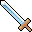

# { .sprite } Iron longsword
*Ordinary* · Longsword · value 121 gold

**Slot:** weapon · **Size:** std

## When equipped

| Stat | Value |
|---|---|
| Attack damage | 1 to 4 |
| Attack cost | +5 |
| setNonWeaponDamageModifier | +120 |
| Attack chance | +10 |

## Dropped by

| Monster | Chance | Qty |
|---|---|---|
| [Strong cave rat](../monsters/strong_cave_rat.md) | 100% | 1 |
| [Dungeon rat](../monsters/guynmart_rat.md) | 100% | 1 |

## Sold by

- [Audir](../monsters/audir.md)

Verified against v0.8.18 item data.

## Version history

| Version | Change |
|---|---|
| [v0.7.0](../versions/0.7.0.md) | Present in v0.7.0 (earliest release tracked) |
| [v0.7.10](../versions/0.7.10.md) | equipEffect: {"increaseAttackChance": 10, "increaseA… → {"increaseAttackChance": 10, "increaseA… |

Verified against v0.8.18 and every earlier release back to v0.7.0 (game data compared release by release).

<small>Item ID: `ironsword2` · Data from v0.8.18</small>
