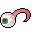

# { .sprite } Khakin eye
*Ordinary* · Animal part · value 2 gold

## Dropped by

| Monster | Chance | Qty |
|---|---|---|
| [Khakin spawn](../monsters/khakin1.md) | 5% | 1 |
| [Aggressive khakin beast](../monsters/khakin2.md) | 5% | 1 |
| [Tough khakin beast](../monsters/khakin3.md) | 5% | 1 |
| [Strong khakin beast](../monsters/khakin4.md) | 5% | 1 |

## Sold by

- [General's henchman](../monsters/ortholion_guard1.md)

Verified against v0.8.18 item data.

## Version history

| Version | Change |
|---|---|
| [v0.7.0](../versions/0.7.0.md) | Present in v0.7.0 (earliest release tracked) |

Verified against v0.8.18 and every earlier release back to v0.7.0 (game data compared release by release).

<small>Item ID: `khakin` · Data from v0.8.18</small>
