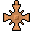

# { .sprite } Mysterious Korhald pendant

*Quest necklace.*

<div class="infobox" markdown>

<p class="ib-img">{ .sprite }</p>

| | |
|---|---|
| **Item ID** | `korhald_chamber_key` |
| **Category** | Necklace |
| **Slot** | neck |
| **Rarity** | Quest |
| **Base value** | 0 gold |
| **Quest item** | Yes |
| **Introduced** | [v0.8.11](../versions/0.8.11.md) |

</div>

> Found in the Korhald coin chest. This is a mysterous item indeed.

## Statistics

### When equipped

| Stat | Value |
|---|---|
| Max HP | -15 |
| Attack chance | -1 |
| Block chance | +5 |
| Damage resistance | +3 |

<p class="verified">Verified against v0.8.18 item data.</p>

## How to get it

### Quest & dialogue rewards

- From [Forenza](../monsters/forenza_waytobrimhaven3.md) ([waytobrimhaven3](../maps/waytobrimhaven3.md)), [Gylew](../monsters/gylew.md) ([waterway5](../maps/waterway5.md)) during [The odd coin collector](../quests/odd_coin_collector.md#stage-60) (1×)


<p class="verified">Verified against v0.8.18 item, loot, map and dialogue data.</p>

## Uses

Where the game checks for this item in dialogue:

| With | Quest | What happens to it | Option |
|---|---|---|---|
| walking into a blocked passage on [korhald_cave2](../maps/korhald_cave2.md) | – | must be carried (1×) | “(automatic)” |
| walking into a blocked passage on [korhald_cave2](../maps/korhald_cave2.md) | – | must be worn (1×) | “(automatic)” |
| stepping on a trigger on [korhald_cave2](../maps/korhald_cave2.md) | [Placeholder for hidden quest stages (not displayed) (hidden flag)](../quests/nondisplay.md#stage-43) | must be carried (1×) | “(automatic)” |
| stepping on a trigger on [korhald_cave2](../maps/korhald_cave2.md) | [Placeholder for hidden quest stages (not displayed) (hidden flag)](../quests/nondisplay.md#stage-43) | must be worn (1×) | “(automatic)” |

<p class="verified">Verified against v0.8.18 dialogue data.</p>


## Version history

| Version | Change |
|---|---|
| [v0.8.11](../versions/0.8.11.md) | Added |

<p class="verified">Verified against v0.8.18 and every earlier release back to v0.7.0 (game data compared release by release).</p>


## Community notes

<small>Written by players, not generated from game data. **Strategy**: how and when to use it · **Lore**: the in-world story · **Trivia**: real-world facts, references, development history · **Theory / speculation**: unconfirmed ideas; may just be unfinished content</small>

### Strategy

*Nothing here yet. Know something? [Add it](https://github.com/asdfghjkl628/Andor-s-Trail-Wikiiii/new/main/notes/items?filename=korhald_chamber_key.md&value=%23%23%20Strategy%0A%0A%3C%21--%20how%20and%20when%20to%20use%20it%20--%3E%0A%0A%23%23%20Lore%0A%0A%3C%21--%20the%20in-world%20story%20--%3E%0A%0A%23%23%20Trivia%0A%0A%3C%21--%20real-world%20facts%2C%20references%2C%20development%20history%20--%3E%0A%0A%23%23%20Theory%20/%20speculation%0A%0A%3C%21--%20unconfirmed%20ideas%3B%20may%20just%20be%20unfinished%20content%20--%3E%0A).*

### Lore

*Nothing here yet. Know something? [Add it](https://github.com/asdfghjkl628/Andor-s-Trail-Wikiiii/new/main/notes/items?filename=korhald_chamber_key.md&value=%23%23%20Strategy%0A%0A%3C%21--%20how%20and%20when%20to%20use%20it%20--%3E%0A%0A%23%23%20Lore%0A%0A%3C%21--%20the%20in-world%20story%20--%3E%0A%0A%23%23%20Trivia%0A%0A%3C%21--%20real-world%20facts%2C%20references%2C%20development%20history%20--%3E%0A%0A%23%23%20Theory%20/%20speculation%0A%0A%3C%21--%20unconfirmed%20ideas%3B%20may%20just%20be%20unfinished%20content%20--%3E%0A).*

### Trivia

*Nothing here yet. Know something? [Add it](https://github.com/asdfghjkl628/Andor-s-Trail-Wikiiii/new/main/notes/items?filename=korhald_chamber_key.md&value=%23%23%20Strategy%0A%0A%3C%21--%20how%20and%20when%20to%20use%20it%20--%3E%0A%0A%23%23%20Lore%0A%0A%3C%21--%20the%20in-world%20story%20--%3E%0A%0A%23%23%20Trivia%0A%0A%3C%21--%20real-world%20facts%2C%20references%2C%20development%20history%20--%3E%0A%0A%23%23%20Theory%20/%20speculation%0A%0A%3C%21--%20unconfirmed%20ideas%3B%20may%20just%20be%20unfinished%20content%20--%3E%0A).*

### Theory / speculation

*Nothing here yet. Know something? [Add it](https://github.com/asdfghjkl628/Andor-s-Trail-Wikiiii/new/main/notes/items?filename=korhald_chamber_key.md&value=%23%23%20Strategy%0A%0A%3C%21--%20how%20and%20when%20to%20use%20it%20--%3E%0A%0A%23%23%20Lore%0A%0A%3C%21--%20the%20in-world%20story%20--%3E%0A%0A%23%23%20Trivia%0A%0A%3C%21--%20real-world%20facts%2C%20references%2C%20development%20history%20--%3E%0A%0A%23%23%20Theory%20/%20speculation%0A%0A%3C%21--%20unconfirmed%20ideas%3B%20may%20just%20be%20unfinished%20content%20--%3E%0A).*


??? info "Technical information"

    | | |
    |---|---|
    | Item ID | `korhald_chamber_key` |
    | Category ID | `neck` |
    | Icon | `items_jewelry:13` |
    | Defined in | `res/raw/itemlist_laeroth.json` |
    | Loot tables containing it | – |

    Raw data:

    ```json
    {
     "id": "korhald_chamber_key",
     "iconID": "items_jewelry:13",
     "name": "Mysterious Korhald pendant",
     "displaytype": "quest",
     "hasManualPrice": 1,
     "baseMarketCost": 0,
     "category": "neck",
     "description": "Found in the Korhald coin chest. This is a mysterous item indeed.",
     "equipEffect": {
      "increaseMaxHP": -15,
      "increaseAttackChance": -1,
      "increaseBlockChance": 5,
      "increaseDamageResistance": 3
     }
    }
    ```


<small>Data from v0.8.18</small>
