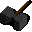

# { .sprite } Maul

*Ordinary giant hammer.*

<div class="infobox" markdown>

<p class="ib-img">{ .sprite }</p>

| | |
|---|---|
| **Item ID** | `maul` |
| **Category** | Giant hammer |
| **Slot** | weapon |
| **Hands** | Two-handed |
| **Proficiency** | Blunt |
| **Rarity** | Ordinary |
| **Base value** | 0 gold |
| **Introduced** | [v0.7.11](../versions/0.7.11.md) |

</div>

## Statistics

### When equipped

| Stat | Value |
|---|---|
| Attack damage | 7 to 11 |
| Attack cost | +8 |
| Attack chance | +15 |
| Block chance | +3 |
| setNonWeaponDamageModifier | +183 |

<p class="verified">Verified against v0.8.18 item data.</p>

## How to get it

### Dropped by

| Monster | Chance | Qty | Found in |
|---|---|---|---|
| [Dirty grimmthorn marauder](../monsters/dirty_grimmthorn_marauder.md) | 3% | 1 | way_to_sullengard_west_0, way_to_sullengard_west_1, way_to_sullengard_west_2 |
| [Grimmthorn marauder](../monsters/grimmthorn_marauder.md) | 2% | 1 | way_to_sullengard_west_1, way_to_sullengard_west_3 |

### Sold by

- [Truric](../monsters/truric.md) (Brimhaven)


<p class="verified">Verified against v0.8.18 item, loot, map and dialogue data.</p>


## Version history

| Version | Change |
|---|---|
| [v0.7.11](../versions/0.7.11.md) | Added |

<p class="verified">Verified against v0.8.18 and every earlier release back to v0.7.0 (game data compared release by release).</p>


## Community notes

<small>Written by players, not generated from game data. **Strategy**: how and when to use it · **Lore**: the in-world story · **Trivia**: real-world facts, references, development history · **Theory / speculation**: unconfirmed ideas; may just be unfinished content</small>

### Strategy

*Nothing here yet. Know something? [Add it](https://github.com/asdfghjkl628/Andor-s-Trail-Wikiiii/new/main/notes/items?filename=maul.md&value=%23%23%20Strategy%0A%0A%3C%21--%20how%20and%20when%20to%20use%20it%20--%3E%0A%0A%23%23%20Lore%0A%0A%3C%21--%20the%20in-world%20story%20--%3E%0A%0A%23%23%20Trivia%0A%0A%3C%21--%20real-world%20facts%2C%20references%2C%20development%20history%20--%3E%0A%0A%23%23%20Theory%20/%20speculation%0A%0A%3C%21--%20unconfirmed%20ideas%3B%20may%20just%20be%20unfinished%20content%20--%3E%0A).*

### Lore

*Nothing here yet. Know something? [Add it](https://github.com/asdfghjkl628/Andor-s-Trail-Wikiiii/new/main/notes/items?filename=maul.md&value=%23%23%20Strategy%0A%0A%3C%21--%20how%20and%20when%20to%20use%20it%20--%3E%0A%0A%23%23%20Lore%0A%0A%3C%21--%20the%20in-world%20story%20--%3E%0A%0A%23%23%20Trivia%0A%0A%3C%21--%20real-world%20facts%2C%20references%2C%20development%20history%20--%3E%0A%0A%23%23%20Theory%20/%20speculation%0A%0A%3C%21--%20unconfirmed%20ideas%3B%20may%20just%20be%20unfinished%20content%20--%3E%0A).*

### Trivia

*Nothing here yet. Know something? [Add it](https://github.com/asdfghjkl628/Andor-s-Trail-Wikiiii/new/main/notes/items?filename=maul.md&value=%23%23%20Strategy%0A%0A%3C%21--%20how%20and%20when%20to%20use%20it%20--%3E%0A%0A%23%23%20Lore%0A%0A%3C%21--%20the%20in-world%20story%20--%3E%0A%0A%23%23%20Trivia%0A%0A%3C%21--%20real-world%20facts%2C%20references%2C%20development%20history%20--%3E%0A%0A%23%23%20Theory%20/%20speculation%0A%0A%3C%21--%20unconfirmed%20ideas%3B%20may%20just%20be%20unfinished%20content%20--%3E%0A).*

### Theory / speculation

*Nothing here yet. Know something? [Add it](https://github.com/asdfghjkl628/Andor-s-Trail-Wikiiii/new/main/notes/items?filename=maul.md&value=%23%23%20Strategy%0A%0A%3C%21--%20how%20and%20when%20to%20use%20it%20--%3E%0A%0A%23%23%20Lore%0A%0A%3C%21--%20the%20in-world%20story%20--%3E%0A%0A%23%23%20Trivia%0A%0A%3C%21--%20real-world%20facts%2C%20references%2C%20development%20history%20--%3E%0A%0A%23%23%20Theory%20/%20speculation%0A%0A%3C%21--%20unconfirmed%20ideas%3B%20may%20just%20be%20unfinished%20content%20--%3E%0A).*


??? info "Technical information"

    | | |
    |---|---|
    | Item ID | `maul` |
    | Category ID | `hammer2h` |
    | Icon | `items_misc_6:17` |
    | Defined in | `res/raw/itemlist_brimhaven.json` |
    | Loot tables containing it | `truric`, `grimmthorn_marauder_dl`, `dirty_grimmthorn_marauder_dl` |

    Raw data:

    ```json
    {
     "id": "maul",
     "iconID": "items_misc_6:17",
     "name": "Maul",
     "displaytype": "ordinary",
     "category": "hammer2h",
     "equipEffect": {
      "increaseAttackDamage": {
       "min": 7,
       "max": 11
      },
      "increaseAttackCost": 8,
      "increaseAttackChance": 15,
      "increaseBlockChance": 3,
      "setNonWeaponDamageModifier": 183
     }
    }
    ```


<small>Data from v0.8.18</small>
