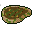

# { .sprite } Rotten meat

*Ordinary food.*

<div class="infobox" markdown>

<p class="ib-img">{ .sprite }</p>

| | |
|---|---|
| **Item ID** | `meat2` |
| **Category** | Food |
| **Rarity** | Ordinary |
| **Base value** | 0 gold |
| **Introduced** | [v0.7.8](../versions/0.7.8.md) |

</div>

> Even fly larvae have died eating this.

## Statistics

### When used

| Stat | Value |
|---|---|
| Heal HP | -15 to -10 |
| On self | Food-poisoning (magnitude 5, 10 rounds, 100% chance) |

<p class="verified">Verified against v0.8.18 item data.</p>

## How to get it

### Dropped by

| Monster | Chance | Qty | Found in |
|---|---|---|---|
| [Ancient wolf](../monsters/lonely_wolf.md) | 100% | 1 | Foaming Flask Tavern |
| [Aroughcun](../monsters/aroughcun.md) | 35% | 1 | Mt. Galmore |
| [Sow aroughcun](../monsters/aroughcun_sow.md) | 30% | 1 | Mt. Galmore |
| [Agile aroughcun](../monsters/aroughcun_agile.md) | 30% | 1 | Mt. Galmore |
| [Contaminated woodworm](../monsters/elm_woodworm.md) | 10% | 1 | elm_2f_1, elm_3f, elm_4f_1 |
| [Aggresive woodworm](../monsters/elm_woodworm2.md) | 10% | 1 | elm_2f_1, elm_3f, elm_4f_1 |
| [Revenant servant](../monsters/revenant_servant.md) | 5% | 1-2 | waterwayacave2, waterwayacave3, waterwayacave4 |
| [Revenant](../monsters/revenant.md) | 5% | 1-2 | waterwayacave2, waterwayacave3, waterwayacave4 |

### Found in containers

- [crackshot_hideout4](../maps/crackshot_hideout4.md#container-3) (container 4, 100%)
- [final_cave1](../maps/final_cave1.md#container-2) (container 3, 100%)
- [guildbrig1](../maps/guildbrig1.md#container-0) (container 1, 100%), Fallhaven
- [guildbrig2](../maps/guildbrig2.md#container-0) (container 1, 100%), Fallhaven
- [laerothprison2](../maps/laerothprison2.md#container-0) (container 1, 100%), Lake Laeroth
- [ll2_cyclops_cave](../maps/ll2_cyclops_cave.md#container-1) (container 2, 100%)

### Quest & dialogue rewards

- From stepping on a trigger on [blackwater_mountain70](../maps/blackwater_mountain70.md) during [Vines in bwm_17 (hidden flag)](../quests/bwm17_vine.md#stage-1) (50%)


<p class="verified">Verified against v0.8.18 item, loot, map and dialogue data.</p>

## Uses

Where the game checks for this item in dialogue:

| With | Quest | What happens to it | Option |
|---|---|---|---|
| [Hungry pig](../monsters/hungry_pig.md) ([gapfillerhole](../maps/gapfillerhole.md)) | – | must be carried (1×) | “(automatic)” |
| [Hungry pig](../monsters/hungry_pig.md) ([gapfillerhole](../maps/gapfillerhole.md)) | [Placeholder for hidden quest stages (not displayed) (hidden flag)](../quests/nondisplay.md#stage-51) | handed over (1×) | “Here. Have another piece of rotten meat. It's good for you.” |
| [Hungry pig](../monsters/hungry_pig.md) ([gapfillerhole](../maps/gapfillerhole.md)) | – | handed over (1×) | “Hungry? Here, have a piece of rotten meat.” |
| stepping on a trigger on [wexlow_village](../maps/wexlow_village.md) | – | handed over (1×) | “[Throw a piece of rotten meat into the well]” |
| stepping on a trigger on [loneford13](../maps/loneford13.md) | – | handed over (1×) | “[Toss in a piece of that gross rotten meat.]” |
| [Tocsin](../monsters/tocsin.md) ([undertell_4_00](../maps/undertell_4_00.md)) | – | handed over (1×) | “(automatic)” |
| [Tocsin](../monsters/tocsin.md) ([undertell_4_00](../maps/undertell_4_00.md)) | – | must be carried (1×) | “(automatic)” |

<p class="verified">Verified against v0.8.18 dialogue data.</p>


## Version history

| Version | Change |
|---|---|
| [v0.7.8](../versions/0.7.8.md) | Added |

<p class="verified">Verified against v0.8.18 and every earlier release back to v0.7.0 (game data compared release by release).</p>


## Community notes

<small>Written by players, not generated from game data. **Strategy**: how and when to use it · **Lore**: the in-world story · **Trivia**: real-world facts, references, development history · **Theory / speculation**: unconfirmed ideas; may just be unfinished content</small>

### Strategy

*Nothing here yet. Know something? [Add it](https://github.com/asdfghjkl628/Andor-s-Trail-Wikiiii/new/main/notes/items?filename=meat2.md&value=%23%23%20Strategy%0A%0A%3C%21--%20how%20and%20when%20to%20use%20it%20--%3E%0A%0A%23%23%20Lore%0A%0A%3C%21--%20the%20in-world%20story%20--%3E%0A%0A%23%23%20Trivia%0A%0A%3C%21--%20real-world%20facts%2C%20references%2C%20development%20history%20--%3E%0A%0A%23%23%20Theory%20/%20speculation%0A%0A%3C%21--%20unconfirmed%20ideas%3B%20may%20just%20be%20unfinished%20content%20--%3E%0A).*

### Lore

*Nothing here yet. Know something? [Add it](https://github.com/asdfghjkl628/Andor-s-Trail-Wikiiii/new/main/notes/items?filename=meat2.md&value=%23%23%20Strategy%0A%0A%3C%21--%20how%20and%20when%20to%20use%20it%20--%3E%0A%0A%23%23%20Lore%0A%0A%3C%21--%20the%20in-world%20story%20--%3E%0A%0A%23%23%20Trivia%0A%0A%3C%21--%20real-world%20facts%2C%20references%2C%20development%20history%20--%3E%0A%0A%23%23%20Theory%20/%20speculation%0A%0A%3C%21--%20unconfirmed%20ideas%3B%20may%20just%20be%20unfinished%20content%20--%3E%0A).*

### Trivia

*Nothing here yet. Know something? [Add it](https://github.com/asdfghjkl628/Andor-s-Trail-Wikiiii/new/main/notes/items?filename=meat2.md&value=%23%23%20Strategy%0A%0A%3C%21--%20how%20and%20when%20to%20use%20it%20--%3E%0A%0A%23%23%20Lore%0A%0A%3C%21--%20the%20in-world%20story%20--%3E%0A%0A%23%23%20Trivia%0A%0A%3C%21--%20real-world%20facts%2C%20references%2C%20development%20history%20--%3E%0A%0A%23%23%20Theory%20/%20speculation%0A%0A%3C%21--%20unconfirmed%20ideas%3B%20may%20just%20be%20unfinished%20content%20--%3E%0A).*

### Theory / speculation

*Nothing here yet. Know something? [Add it](https://github.com/asdfghjkl628/Andor-s-Trail-Wikiiii/new/main/notes/items?filename=meat2.md&value=%23%23%20Strategy%0A%0A%3C%21--%20how%20and%20when%20to%20use%20it%20--%3E%0A%0A%23%23%20Lore%0A%0A%3C%21--%20the%20in-world%20story%20--%3E%0A%0A%23%23%20Trivia%0A%0A%3C%21--%20real-world%20facts%2C%20references%2C%20development%20history%20--%3E%0A%0A%23%23%20Theory%20/%20speculation%0A%0A%3C%21--%20unconfirmed%20ideas%3B%20may%20just%20be%20unfinished%20content%20--%3E%0A).*


??? info "Technical information"

    | | |
    |---|---|
    | Item ID | `meat2` |
    | Category ID | `food` |
    | Icon | `items_consumables_omi1:0` |
    | Defined in | `res/raw/itemlist_omicronrg9.json` |
    | Loot tables containing it | `guildbrig_1`, `lonely_wolf`, `revenant_1`, `revenant_2`, `bwm17_vine`, `elm_woodworm`, `final_cave_loot3`, `lae_prison1_l1`, `tt_loot4`, `aroughcun_sow_dl`, `aroughcun_agile_dl`, `aroughcun_dl`, `ll2_cyclops_trashbin` |

    Raw data:

    ```json
    {
     "id": "meat2",
     "iconID": "items_consumables_omi1:0",
     "name": "Rotten meat",
     "hasManualPrice": 1,
     "baseMarketCost": 0,
     "category": "food",
     "description": "Even fly larvae have died eating this.",
     "useEffect": {
      "increaseCurrentHP": {
       "min": -15,
       "max": -10
      },
      "conditionsSource": [
       {
        "condition": "foodp",
        "magnitude": 5,
        "duration": 10,
        "chance": "100"
       }
      ]
     }
    }
    ```


<small>Data from v0.8.18</small>
