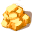

# { .sprite } Piece of bright shining crystal

*Quest other.*

<div class="infobox" markdown>

<p class="ib-img">{ .sprite }</p>

| | |
|---|---|
| **Item ID** | `mg2_exploded_star` |
| **Category** | Other |
| **Rarity** | Quest |
| **Base value** | 0 gold |
| **Quest item** | Yes |
| **Introduced** | [v0.8.14](../versions/0.8.14.md) |

</div>

> Parts of the exploded star

## How to get it

### Quest & dialogue rewards

- From stepping on a trigger on [galmore_66](../maps/galmore_66.md), stepping on a trigger on [galmore_77](../maps/galmore_77.md) (1×)


<p class="verified">Verified against v0.8.18 item, loot, map and dialogue data.</p>

## Uses

Where the game checks for this item in dialogue:

| With | Quest | What happens to it | Option |
|---|---|---|---|
| [Pangitain](../monsters/brv_fortune_teller.md) ([brimhaven_fortune_teller](../maps/brimhaven_fortune_teller.md)) | – | must be carried (10×) | “(automatic)” |
| [Pangitain](../monsters/brv_fortune_teller.md) ([brimhaven_fortune_teller](../maps/brimhaven_fortune_teller.md)) | [The exploded star](../quests/mg2_exploded_star.md#stage-60) | handed over (10×) | “Here, you can have them for the greater glory.” |
| [Pangitain](../monsters/brv_fortune_teller.md) ([brimhaven_fortune_teller](../maps/brimhaven_fortune_teller.md)) | [The exploded star](../quests/mg2_exploded_star.md#stage-62) | handed over (10×) | “Sounds great - I choose this one. [Touch the item]” |
| [Kealwea](../monsters/sullengard_priest.md) ([sullengard_church](../maps/sullengard_church.md)) | – | must be carried (1×) | “Here I have some pieces already.” |
| [Kealwea](../monsters/sullengard_priest.md) ([sullengard_church](../maps/sullengard_church.md)) | – | must be carried (5×) | “I might give you half of them - five pieces.” |
| [Kealwea](../monsters/sullengard_priest.md) ([sullengard_church](../maps/sullengard_church.md)) | [The exploded star](../quests/mg2_exploded_star.md#stage-48) | handed over (5×) | “I might give you the rest of them - five pieces.” |
| [Kealwea](../monsters/sullengard_priest.md) ([sullengard_church](../maps/sullengard_church.md)) | [The exploded star](../quests/mg2_exploded_star.md#stage-52) | handed over (10×) | “OK, you are right. Here take them and do what you must.” |
| [Kealwea](../monsters/sullengard_priest.md) ([sullengard_church](../maps/sullengard_church.md)) | [The exploded star](../quests/mg2_exploded_star.md#stage-47) | handed over (5×) | “No, I will give you only half of them.” |
| [Kealwea](../monsters/sullengard_priest.md) ([sullengard_church](../maps/sullengard_church.md)) | [The exploded star](../quests/mg2_exploded_star.md#stage-47) | must be carried (1×) | “I might throw the remaining ones at Andor. Hmm ...” |
| [Kealwea](../monsters/sullengard_priest.md) ([sullengard_church](../maps/sullengard_church.md)) | [The exploded star](../quests/mg2_exploded_star.md#stage-52) | handed over (10×) | “Here you go. Take it and do what you have to do.” |
| [Kealwea](../monsters/sullengard_priest.md) ([sullengard_church](../maps/sullengard_church.md)) | [The exploded star](../quests/mg2_exploded_star.md#stage-32) | must be carried (10×) | “I've changed my mind. These glittery things are too pretty to be destroyed.” |
| [Kealwea](../monsters/sullengard_priest.md) ([sullengard_church](../maps/sullengard_church.md)) | [The exploded star](../quests/mg2_exploded_star.md#stage-52) | handed over (10×) | “You are certainly right. Take it and do what you have to do.” |
| [Teccow](../monsters/mg2_starwatcher.md) ([wild22](../maps/wild22.md)) | – | must be carried (1×) | “Anyway, here I have some pieces already.” |
| [Teccow](../monsters/mg2_starwatcher.md) ([wild22](../maps/wild22.md)) | – | must be carried (5×) | “I might give you half of them - five pieces.” |
| [Teccow](../monsters/mg2_starwatcher.md) ([wild22](../maps/wild22.md)) | [The exploded star](../quests/mg2_exploded_star.md#stage-46) | handed over (5×) | “I might give you the rest of them - five pieces.” |
| [Teccow](../monsters/mg2_starwatcher.md) ([wild22](../maps/wild22.md)) | [The exploded star](../quests/mg2_exploded_star.md#stage-50) | handed over (10×) | “OK, you are right. Here take them and do what you must.” |
| [Teccow](../monsters/mg2_starwatcher.md) ([wild22](../maps/wild22.md)) | [The exploded star](../quests/mg2_exploded_star.md#stage-45) | handed over (5×) | “No, I will give you only half of them.” |
| [Teccow](../monsters/mg2_starwatcher.md) ([wild22](../maps/wild22.md)) | [The exploded star](../quests/mg2_exploded_star.md#stage-45) | must be carried (1×) | “I might throw the remaining ones at Andor. Hmm ...” |
| [Teccow](../monsters/mg2_starwatcher.md) ([wild22](../maps/wild22.md)) | [The exploded star](../quests/mg2_exploded_star.md#stage-50) | handed over (10×) | “Here you go. Take it and do what you have to do.” |
| [Teccow](../monsters/mg2_starwatcher.md) ([wild22](../maps/wild22.md)) | [The exploded star](../quests/mg2_exploded_star.md#stage-30) | must be carried (10×) | “I've changed my mind. These glittery things are too pretty to be destroyed.” |
| [Teccow](../monsters/mg2_starwatcher.md) ([wild22](../maps/wild22.md)) | [The exploded star](../quests/mg2_exploded_star.md#stage-50) | handed over (10×) | “You are certainly right. Take it and do what you have to do.” |

<p class="verified">Verified against v0.8.18 dialogue data.</p>


## Version history

| Version | Change |
|---|---|
| [v0.8.14](../versions/0.8.14.md) | Added |

<p class="verified">Verified against v0.8.18 and every earlier release back to v0.7.0 (game data compared release by release).</p>


## Community notes

<small>Written by players, not generated from game data. **Strategy**: how and when to use it · **Lore**: the in-world story · **Trivia**: real-world facts, references, development history · **Theory / speculation**: unconfirmed ideas; may just be unfinished content</small>

### Strategy

*No notes yet. Contributions are welcome: [add a note](https://github.com/asdfghjkl628/Andor-s-Trail-Wikiiii/new/main/notes/items?filename=mg2_exploded_star.md&value=%23%23%20Strategy%0A%0A%3C%21--%20how%20and%20when%20to%20use%20it%20--%3E%0A%0A%23%23%20Lore%0A%0A%3C%21--%20the%20in-world%20story%20--%3E%0A%0A%23%23%20Trivia%0A%0A%3C%21--%20real-world%20facts%2C%20references%2C%20development%20history%20--%3E%0A%0A%23%23%20Theory%20/%20speculation%0A%0A%3C%21--%20unconfirmed%20ideas%3B%20may%20just%20be%20unfinished%20content%20--%3E%0A).*

### Lore

*No notes yet. Contributions are welcome: [add a note](https://github.com/asdfghjkl628/Andor-s-Trail-Wikiiii/new/main/notes/items?filename=mg2_exploded_star.md&value=%23%23%20Strategy%0A%0A%3C%21--%20how%20and%20when%20to%20use%20it%20--%3E%0A%0A%23%23%20Lore%0A%0A%3C%21--%20the%20in-world%20story%20--%3E%0A%0A%23%23%20Trivia%0A%0A%3C%21--%20real-world%20facts%2C%20references%2C%20development%20history%20--%3E%0A%0A%23%23%20Theory%20/%20speculation%0A%0A%3C%21--%20unconfirmed%20ideas%3B%20may%20just%20be%20unfinished%20content%20--%3E%0A).*

### Trivia

*No notes yet. Contributions are welcome: [add a note](https://github.com/asdfghjkl628/Andor-s-Trail-Wikiiii/new/main/notes/items?filename=mg2_exploded_star.md&value=%23%23%20Strategy%0A%0A%3C%21--%20how%20and%20when%20to%20use%20it%20--%3E%0A%0A%23%23%20Lore%0A%0A%3C%21--%20the%20in-world%20story%20--%3E%0A%0A%23%23%20Trivia%0A%0A%3C%21--%20real-world%20facts%2C%20references%2C%20development%20history%20--%3E%0A%0A%23%23%20Theory%20/%20speculation%0A%0A%3C%21--%20unconfirmed%20ideas%3B%20may%20just%20be%20unfinished%20content%20--%3E%0A).*

### Theory / speculation

*No notes yet. Contributions are welcome: [add a note](https://github.com/asdfghjkl628/Andor-s-Trail-Wikiiii/new/main/notes/items?filename=mg2_exploded_star.md&value=%23%23%20Strategy%0A%0A%3C%21--%20how%20and%20when%20to%20use%20it%20--%3E%0A%0A%23%23%20Lore%0A%0A%3C%21--%20the%20in-world%20story%20--%3E%0A%0A%23%23%20Trivia%0A%0A%3C%21--%20real-world%20facts%2C%20references%2C%20development%20history%20--%3E%0A%0A%23%23%20Theory%20/%20speculation%0A%0A%3C%21--%20unconfirmed%20ideas%3B%20may%20just%20be%20unfinished%20content%20--%3E%0A).*


??? info "Technical information"

    | | |
    |---|---|
    | Item ID | `mg2_exploded_star` |
    | Category ID | `other` |
    | Icon | `items_misc_2:200` |
    | Defined in | `res/raw/itemlist_mt_galmore2.json` |
    | Loot tables containing it | – |

    Raw data:

    ```json
    {
     "id": "mg2_exploded_star",
     "iconID": "items_misc_2:200",
     "name": "Piece of bright shining crystal",
     "displaytype": "quest",
     "category": "other",
     "description": "Parts of the exploded star"
    }
    ```


<small>Data from v0.8.18</small>
