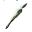

# { .sprite } Mosquito proboscis

*Ordinary animal part.*

<div class="infobox" markdown>

<p class="ib-img">{ .sprite }</p>

| | |
|---|---|
| **Item ID** | `mosquito_proboscis` |
| **Category** | Animal part |
| **Rarity** | Ordinary |
| **Base value** | 0 gold |
| **Introduced** | [v0.8.14](../versions/0.8.14.md) |

</div>

> A sharp, hollow needle extracted from swamp mosquitoes.

## How to get it

### Dropped by

| Monster | Chance | Qty | Found in |
|---|---|---|---|
| [Giant mosquito](../monsters/giant_mosquito.md) | 35% | 1 | Mt. Galmore |


<p class="verified">Verified against v0.8.18 item, loot, map and dialogue data.</p>

## Uses

Where the game checks for this item in dialogue:

| With | Quest | What happens to it | Option |
|---|---|---|---|
| [Vaelric](../monsters/vaelric.md) ([Galmore 17 house](../maps/galmore_17_house.md)) | – | must be carried (5×) | “(automatic)” |
| [Vaelric](../monsters/vaelric.md) ([Galmore 17 house](../maps/galmore_17_house.md)) | [Restless in the grave](../quests/mg_restless_grave.md#stage-115) | must be carried (5×) | “(automatic)” |
| [Vaelric](../monsters/vaelric.md) ([Galmore 17 house](../maps/galmore_17_house.md)) | [Restless in the grave](../quests/mg_restless_grave.md#stage-115) | handed over (5×) | “Here, take them, please.” |
| [Vaelric](../monsters/vaelric.md) ([Galmore 17 house](../maps/galmore_17_house.md)) | – | handed over (5×) | “Here, take them, please.” |

<p class="verified">Verified against v0.8.18 dialogue data.</p>


## Version history

| Version | Change |
|---|---|
| [v0.8.14](../versions/0.8.14.md) | Added |

<p class="verified">Verified against v0.8.18 and every earlier release back to v0.7.0 (game data compared release by release).</p>


## Community notes

<small>Written by players, not generated from game data. **Strategy**: how and when to use it · **Lore**: the in-world story · **Trivia**: real-world facts, references, development history · **Theory / speculation**: unconfirmed ideas; may just be unfinished content</small>

### Strategy

*No notes yet. Contributions are welcome: [add a note](https://github.com/asdfghjkl628/Andor-s-Trail-Wikiiii/new/main/notes/items?filename=mosquito_proboscis.md&value=%23%23%20Strategy%0A%0A%3C%21--%20how%20and%20when%20to%20use%20it%20--%3E%0A%0A%23%23%20Lore%0A%0A%3C%21--%20the%20in-world%20story%20--%3E%0A%0A%23%23%20Trivia%0A%0A%3C%21--%20real-world%20facts%2C%20references%2C%20development%20history%20--%3E%0A%0A%23%23%20Theory%20/%20speculation%0A%0A%3C%21--%20unconfirmed%20ideas%3B%20may%20just%20be%20unfinished%20content%20--%3E%0A).*

### Lore

*No notes yet. Contributions are welcome: [add a note](https://github.com/asdfghjkl628/Andor-s-Trail-Wikiiii/new/main/notes/items?filename=mosquito_proboscis.md&value=%23%23%20Strategy%0A%0A%3C%21--%20how%20and%20when%20to%20use%20it%20--%3E%0A%0A%23%23%20Lore%0A%0A%3C%21--%20the%20in-world%20story%20--%3E%0A%0A%23%23%20Trivia%0A%0A%3C%21--%20real-world%20facts%2C%20references%2C%20development%20history%20--%3E%0A%0A%23%23%20Theory%20/%20speculation%0A%0A%3C%21--%20unconfirmed%20ideas%3B%20may%20just%20be%20unfinished%20content%20--%3E%0A).*

### Trivia

*No notes yet. Contributions are welcome: [add a note](https://github.com/asdfghjkl628/Andor-s-Trail-Wikiiii/new/main/notes/items?filename=mosquito_proboscis.md&value=%23%23%20Strategy%0A%0A%3C%21--%20how%20and%20when%20to%20use%20it%20--%3E%0A%0A%23%23%20Lore%0A%0A%3C%21--%20the%20in-world%20story%20--%3E%0A%0A%23%23%20Trivia%0A%0A%3C%21--%20real-world%20facts%2C%20references%2C%20development%20history%20--%3E%0A%0A%23%23%20Theory%20/%20speculation%0A%0A%3C%21--%20unconfirmed%20ideas%3B%20may%20just%20be%20unfinished%20content%20--%3E%0A).*

### Theory / speculation

*No notes yet. Contributions are welcome: [add a note](https://github.com/asdfghjkl628/Andor-s-Trail-Wikiiii/new/main/notes/items?filename=mosquito_proboscis.md&value=%23%23%20Strategy%0A%0A%3C%21--%20how%20and%20when%20to%20use%20it%20--%3E%0A%0A%23%23%20Lore%0A%0A%3C%21--%20the%20in-world%20story%20--%3E%0A%0A%23%23%20Trivia%0A%0A%3C%21--%20real-world%20facts%2C%20references%2C%20development%20history%20--%3E%0A%0A%23%23%20Theory%20/%20speculation%0A%0A%3C%21--%20unconfirmed%20ideas%3B%20may%20just%20be%20unfinished%20content%20--%3E%0A).*


??? info "Technical information"

    | | |
    |---|---|
    | Item ID | `mosquito_proboscis` |
    | Category ID | `animal` |
    | Icon | `items_newb:566` |
    | Defined in | `res/raw/itemlist_mt_galmore2.json` |
    | Loot tables containing it | `giant_mosquito_dl` |

    Raw data:

    ```json
    {
     "id": "mosquito_proboscis",
     "iconID": "items_newb:566",
     "name": "Mosquito proboscis",
     "displaytype": "ordinary",
     "category": "animal",
     "description": "A sharp, hollow needle extracted from swamp mosquitoes."
    }
    ```


<small>Data from v0.8.18</small>
