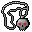

# { .sprite } Necklace of the Undead

*Extraordinary necklace.*

<div class="infobox" markdown>

<p class="ib-img">{ .sprite }</p>

| | |
|---|---|
| **Item ID** | `necklace_undead` |
| **Category** | Necklace |
| **Slot** | neck |
| **Rarity** | Extraordinary |
| **Base value** | 10 gold |
| **Introduced** | [v0.7.2](../versions/0.7.2.md) |

</div>

> This necklace calls for death, and yours will do.

## Statistics

### When equipped

| Stat | Value |
|---|---|
| Max HP | +10 |
| Grants | [Curse of the Undead](../conditions/curse_undead.md) (magnitude 1) |

### On hit

| Stat | Value |
|---|---|
| Heal HP | 1 to 2 |

### On kill

| Stat | Value |
|---|---|
| Heal HP | 2 to 5 |

<p class="verified">Verified against v0.8.18 item data.</p>

## How to get it

### Quest & dialogue rewards

- From [Glasforn](../monsters/stoutford_innkeeper.md) ([Stoutford tavern](../maps/stoutford_tavern.md)) during [Rumblings](../quests/rumblings.md#stage-70) (1×)
- From [Burhczyd](../monsters/burhczyd1.md) ([Crossglen hall](../maps/crossglen_hall.md)), [Knight of Elythom](../monsters/burhczyd1e.md) ([Crossglen hall](../maps/crossglen_hall.md)) (1×)


<p class="verified">Verified against v0.8.18 item, loot, map and dialogue data.</p>

## Uses

Where the game checks for this item in dialogue:

| With | Quest | What happens to it | Option |
|---|---|---|---|
| [Burhczyd](../monsters/burhczyd1.md) ([Crossglen hall](../maps/crossglen_hall.md)), [Knight of Elythom](../monsters/burhczyd1e.md) ([Crossglen hall](../maps/crossglen_hall.md)) | [Young merchant story flags (hidden flag)](../quests/quest_burhczyd_nd.md#stage-82) | handed over (1×) | “(automatic)” |

<p class="verified">Verified against v0.8.18 dialogue data.</p>


## Version history

| Version | Change |
|---|---|
| [v0.7.2](../versions/0.7.2.md) | Added |

<p class="verified">Verified against v0.8.18 and every earlier release back to v0.7.0 (game data compared release by release).</p>


## Community notes

<small>Written by players, not generated from game data. **Strategy**: how and when to use it · **Lore**: the in-world story · **Trivia**: real-world facts, references, development history · **Theory / speculation**: unconfirmed ideas; may just be unfinished content</small>

### Strategy

*No notes yet. Contributions are welcome: [add a note](https://github.com/asdfghjkl628/Andor-s-Trail-Wikiiii/new/main/notes/items?filename=necklace_undead.md&value=%23%23%20Strategy%0A%0A%3C%21--%20how%20and%20when%20to%20use%20it%20--%3E%0A%0A%23%23%20Lore%0A%0A%3C%21--%20the%20in-world%20story%20--%3E%0A%0A%23%23%20Trivia%0A%0A%3C%21--%20real-world%20facts%2C%20references%2C%20development%20history%20--%3E%0A%0A%23%23%20Theory%20/%20speculation%0A%0A%3C%21--%20unconfirmed%20ideas%3B%20may%20just%20be%20unfinished%20content%20--%3E%0A).*

### Lore

*No notes yet. Contributions are welcome: [add a note](https://github.com/asdfghjkl628/Andor-s-Trail-Wikiiii/new/main/notes/items?filename=necklace_undead.md&value=%23%23%20Strategy%0A%0A%3C%21--%20how%20and%20when%20to%20use%20it%20--%3E%0A%0A%23%23%20Lore%0A%0A%3C%21--%20the%20in-world%20story%20--%3E%0A%0A%23%23%20Trivia%0A%0A%3C%21--%20real-world%20facts%2C%20references%2C%20development%20history%20--%3E%0A%0A%23%23%20Theory%20/%20speculation%0A%0A%3C%21--%20unconfirmed%20ideas%3B%20may%20just%20be%20unfinished%20content%20--%3E%0A).*

### Trivia

*No notes yet. Contributions are welcome: [add a note](https://github.com/asdfghjkl628/Andor-s-Trail-Wikiiii/new/main/notes/items?filename=necklace_undead.md&value=%23%23%20Strategy%0A%0A%3C%21--%20how%20and%20when%20to%20use%20it%20--%3E%0A%0A%23%23%20Lore%0A%0A%3C%21--%20the%20in-world%20story%20--%3E%0A%0A%23%23%20Trivia%0A%0A%3C%21--%20real-world%20facts%2C%20references%2C%20development%20history%20--%3E%0A%0A%23%23%20Theory%20/%20speculation%0A%0A%3C%21--%20unconfirmed%20ideas%3B%20may%20just%20be%20unfinished%20content%20--%3E%0A).*

### Theory / speculation

*No notes yet. Contributions are welcome: [add a note](https://github.com/asdfghjkl628/Andor-s-Trail-Wikiiii/new/main/notes/items?filename=necklace_undead.md&value=%23%23%20Strategy%0A%0A%3C%21--%20how%20and%20when%20to%20use%20it%20--%3E%0A%0A%23%23%20Lore%0A%0A%3C%21--%20the%20in-world%20story%20--%3E%0A%0A%23%23%20Trivia%0A%0A%3C%21--%20real-world%20facts%2C%20references%2C%20development%20history%20--%3E%0A%0A%23%23%20Theory%20/%20speculation%0A%0A%3C%21--%20unconfirmed%20ideas%3B%20may%20just%20be%20unfinished%20content%20--%3E%0A).*


??? info "Technical information"

    | | |
    |---|---|
    | Item ID | `necklace_undead` |
    | Category ID | `neck` |
    | Icon | `items_rijackson_1:1` |
    | Defined in | `res/raw/itemlist_stoutford.json` |
    | Loot tables containing it | – |

    Raw data:

    ```json
    {
     "id": "necklace_undead",
     "iconID": "items_rijackson_1:1",
     "name": "Necklace of the Undead",
     "displaytype": "extraordinary",
     "hasManualPrice": 1,
     "baseMarketCost": 10,
     "category": "neck",
     "description": "This necklace calls for death, and yours will do.",
     "equipEffect": {
      "increaseMaxHP": 10,
      "addedConditions": [
       {
        "condition": "curse_undead",
        "magnitude": 1
       }
      ]
     },
     "hitEffect": {
      "increaseCurrentHP": {
       "min": 1,
       "max": 2
      }
     },
     "killEffect": {
      "increaseCurrentHP": {
       "min": 2,
       "max": 5
      }
     }
    }
    ```


<small>Data from v0.8.18</small>
