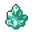

# { .sprite } Nixite crystal

*Extraordinary gem.*

<div class="infobox" markdown>

<p class="ib-img">{ .sprite }</p>

| | |
|---|---|
| **Item ID** | `nixite_crystal` |
| **Category** | Gem |
| **Rarity** | Extraordinary |
| **Base value** | 0 gold |
| **Introduced** | [v0.8.8](../versions/0.8.8.md) |

</div>

> A remarkable jewel of unparalleled rarity, exudes an enchanting iridescence reminiscent of tranquil waters under a midday sun. Its surface seems to shimmer with an inner light, casting a soothing teal glow that captivates all who behold it. Legends tell of its unique power coveted by wizards and sorcerers.

## How to get it

### Quest & dialogue rewards

- From [Rennik](../monsters/wild6_house_thief.md) ([wild6_house](../maps/wild6_house.md)) during [Sutdove_nondisplay (hidden flag)](../quests/sutdover_hidden.md#stage-2) (100%)


<p class="verified">Verified against v0.8.18 item, loot, map and dialogue data.</p>

## Uses

Where the game checks for this item in dialogue:

| With | Quest | What happens to it | Option |
|---|---|---|---|
| [Rock eater](../monsters/rock_eater.md) ([undertell_exit](../maps/undertell_exit.md)) | [hidden_undertell (hidden flag)](../quests/undertell_hidden.md#stage-60) | handed over (1×) | “Here, I have it. Take it.” |

<p class="verified">Verified against v0.8.18 dialogue data.</p>


## Version history

| Version | Change |
|---|---|
| [v0.8.8](../versions/0.8.8.md) | Added |

<p class="verified">Verified against v0.8.18 and every earlier release back to v0.7.0 (game data compared release by release).</p>


## Community notes

<small>Written by players, not generated from game data. **Strategy**: how and when to use it · **Lore**: the in-world story · **Trivia**: real-world facts, references, development history · **Theory / speculation**: unconfirmed ideas; may just be unfinished content</small>

### Strategy

*No notes yet. Contributions are welcome: [add a note](https://github.com/asdfghjkl628/Andor-s-Trail-Wikiiii/new/main/notes/items?filename=nixite_crystal.md&value=%23%23%20Strategy%0A%0A%3C%21--%20how%20and%20when%20to%20use%20it%20--%3E%0A%0A%23%23%20Lore%0A%0A%3C%21--%20the%20in-world%20story%20--%3E%0A%0A%23%23%20Trivia%0A%0A%3C%21--%20real-world%20facts%2C%20references%2C%20development%20history%20--%3E%0A%0A%23%23%20Theory%20/%20speculation%0A%0A%3C%21--%20unconfirmed%20ideas%3B%20may%20just%20be%20unfinished%20content%20--%3E%0A).*

### Lore

*No notes yet. Contributions are welcome: [add a note](https://github.com/asdfghjkl628/Andor-s-Trail-Wikiiii/new/main/notes/items?filename=nixite_crystal.md&value=%23%23%20Strategy%0A%0A%3C%21--%20how%20and%20when%20to%20use%20it%20--%3E%0A%0A%23%23%20Lore%0A%0A%3C%21--%20the%20in-world%20story%20--%3E%0A%0A%23%23%20Trivia%0A%0A%3C%21--%20real-world%20facts%2C%20references%2C%20development%20history%20--%3E%0A%0A%23%23%20Theory%20/%20speculation%0A%0A%3C%21--%20unconfirmed%20ideas%3B%20may%20just%20be%20unfinished%20content%20--%3E%0A).*

### Trivia

*No notes yet. Contributions are welcome: [add a note](https://github.com/asdfghjkl628/Andor-s-Trail-Wikiiii/new/main/notes/items?filename=nixite_crystal.md&value=%23%23%20Strategy%0A%0A%3C%21--%20how%20and%20when%20to%20use%20it%20--%3E%0A%0A%23%23%20Lore%0A%0A%3C%21--%20the%20in-world%20story%20--%3E%0A%0A%23%23%20Trivia%0A%0A%3C%21--%20real-world%20facts%2C%20references%2C%20development%20history%20--%3E%0A%0A%23%23%20Theory%20/%20speculation%0A%0A%3C%21--%20unconfirmed%20ideas%3B%20may%20just%20be%20unfinished%20content%20--%3E%0A).*

### Theory / speculation

*No notes yet. Contributions are welcome: [add a note](https://github.com/asdfghjkl628/Andor-s-Trail-Wikiiii/new/main/notes/items?filename=nixite_crystal.md&value=%23%23%20Strategy%0A%0A%3C%21--%20how%20and%20when%20to%20use%20it%20--%3E%0A%0A%23%23%20Lore%0A%0A%3C%21--%20the%20in-world%20story%20--%3E%0A%0A%23%23%20Trivia%0A%0A%3C%21--%20real-world%20facts%2C%20references%2C%20development%20history%20--%3E%0A%0A%23%23%20Theory%20/%20speculation%0A%0A%3C%21--%20unconfirmed%20ideas%3B%20may%20just%20be%20unfinished%20content%20--%3E%0A).*


??? info "Technical information"

    | | |
    |---|---|
    | Item ID | `nixite_crystal` |
    | Category ID | `gem` |
    | Icon | `items_japozero:341` |
    | Defined in | `res/raw/itemlist_mt_galmore.json` |
    | Loot tables containing it | `thief_rennik_dl` |

    Raw data:

    ```json
    {
     "id": "nixite_crystal",
     "iconID": "items_japozero:341",
     "name": "Nixite crystal",
     "displaytype": "extraordinary",
     "category": "gem",
     "description": "A remarkable jewel of unparalleled rarity, exudes an enchanting iridescence reminiscent of tranquil waters under a midday sun. Its surface seems to shimmer with an inner light, casting a soothing teal glow that captivates all who behold it. Legends tell of its unique power coveted by wizards and sorcerers."
    }
    ```


<small>Data from v0.8.18</small>
