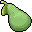

# { .sprite } Pear
*Ordinary* · Food · value 14 gold

## When used

| Stat | Value |
|---|---|
| On self | Sustenance (magnitude 1, 8 rounds, 100% chance) |

## Sold by

- [Torilo](../monsters/torilo.md)
- [Hofala](../monsters/guynmart_cook.md)
- [Peasant grandfather](../monsters/brv_old_farmer.md)
- [Rosmara](../monsters/rosmara.md)

Verified against v0.8.18 item data.

## Version history

| Version | Change |
|---|---|
| [v0.7.0](../versions/0.7.0.md) | Present in v0.7.0 (earliest release tracked) |
| [v0.7.2](../versions/0.7.2.md) | useEffect: {"conditionsSource": [{"chance": 100, "… → {"conditionsSource": [{"chance": "100",… |

Verified against v0.8.18 and every earlier release back to v0.7.0 (game data compared release by release).

<small>Item ID: `pear` · Data from v0.8.18</small>
