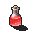

# { .sprite } Lodar's potion of health
*Ordinary* · Potion · value 90 gold

## When used

| Stat | Value |
|---|---|
| Heal HP | 10 to 20 |
| On self | Regeneration (magnitude 3, 8 rounds, 100% chance) |

## Sold by

- [Lodar](../monsters/lodar.md)

Verified against v0.8.18 item data.

## Version history

| Version | Change |
|---|---|
| [v0.7.0](../versions/0.7.0.md) | Present in v0.7.0 (earliest release tracked) |
| [v0.7.2](../versions/0.7.2.md) | useEffect: {"conditionsSource": [{"chance": 100, "… → {"conditionsSource": [{"chance": "100",… |

Verified against v0.8.18 and every earlier release back to v0.7.0 (game data compared release by release).

<small>Item ID: `pot_healthlodar` · Data from v0.8.18</small>
