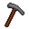

# { .sprite } Pickhatchet

*Quest axe.*

<div class="infobox" markdown>

<p class="ib-img">{ .sprite }</p>

| | |
|---|---|
| **Item ID** | `ratdom_pickaxe` |
| **Category** | Axe |
| **Slot** | weapon |
| **Hands** | One-handed |
| **Proficiency** | [Axe proficiency](../skills/weaponProficiencyAxe.md) |
| **Rarity** | Quest |
| **Base value** | 0 gold |
| **Quest item** | Yes |
| **Introduced** | [v0.8.5](../versions/0.8.5.md) |

</div>

## Statistics

### When equipped

| Stat | Value |
|---|---|
| Attack damage | 1 to 2 |
| Attack cost | +7 |
| Attack chance | -1 |
| Block chance | +1 |

<p class="verified">Verified against v0.8.18 item data.</p>

## How to get it

### Quest & dialogue rewards

- From [Audir](../monsters/audir.md) during [Yellow is it](../quests/ratdom_quest.md#stage-82) (1×)


<p class="verified">Verified against v0.8.18 item, loot, map and dialogue data.</p>

## Uses

Where the game checks for this item in dialogue:

| With | Quest | What happens to it | Option |
|---|---|---|---|
| walking into a blocked passage on [ratdom_maze_531](../maps/ratdom_maze_531.md) | [ratdom_nondisplay (hidden flag)](../quests/ratdom_nondisplay.md#stage-91) | must be worn (1×) | “(automatic)” |
| walking into a blocked passage on [ratdom_maze_626](../maps/ratdom_maze_626.md) | – | must be carried (1×) | “Hit the hole with your pickaxe.” |
| [Andor's statue](../monsters/ratdom_rat_statue.md) ([crossglen_cave](../maps/crossglen_cave.md)) | – | must be worn (1×) | “(automatic)” |

<p class="verified">Verified against v0.8.18 dialogue data.</p>


## Version history

| Version | Change |
|---|---|
| [v0.8.5](../versions/0.8.5.md) | Added |
| [v0.8.12.1](../versions/0.8.12.1.md) | name: Pickaxe → Pickhatchet |

<p class="verified">Verified against v0.8.18 and every earlier release back to v0.7.0 (game data compared release by release).</p>


## Community notes

<small>Written by players, not generated from game data. **Strategy**: how and when to use it · **Lore**: the in-world story · **Trivia**: real-world facts, references, development history · **Theory / speculation**: unconfirmed ideas; may just be unfinished content</small>

### Strategy

*No notes yet. Contributions are welcome: [add a note](https://github.com/asdfghjkl628/Andor-s-Trail-Wikiiii/new/main/notes/items?filename=ratdom_pickaxe.md&value=%23%23%20Strategy%0A%0A%3C%21--%20how%20and%20when%20to%20use%20it%20--%3E%0A%0A%23%23%20Lore%0A%0A%3C%21--%20the%20in-world%20story%20--%3E%0A%0A%23%23%20Trivia%0A%0A%3C%21--%20real-world%20facts%2C%20references%2C%20development%20history%20--%3E%0A%0A%23%23%20Theory%20/%20speculation%0A%0A%3C%21--%20unconfirmed%20ideas%3B%20may%20just%20be%20unfinished%20content%20--%3E%0A).*

### Lore

*No notes yet. Contributions are welcome: [add a note](https://github.com/asdfghjkl628/Andor-s-Trail-Wikiiii/new/main/notes/items?filename=ratdom_pickaxe.md&value=%23%23%20Strategy%0A%0A%3C%21--%20how%20and%20when%20to%20use%20it%20--%3E%0A%0A%23%23%20Lore%0A%0A%3C%21--%20the%20in-world%20story%20--%3E%0A%0A%23%23%20Trivia%0A%0A%3C%21--%20real-world%20facts%2C%20references%2C%20development%20history%20--%3E%0A%0A%23%23%20Theory%20/%20speculation%0A%0A%3C%21--%20unconfirmed%20ideas%3B%20may%20just%20be%20unfinished%20content%20--%3E%0A).*

### Trivia

*No notes yet. Contributions are welcome: [add a note](https://github.com/asdfghjkl628/Andor-s-Trail-Wikiiii/new/main/notes/items?filename=ratdom_pickaxe.md&value=%23%23%20Strategy%0A%0A%3C%21--%20how%20and%20when%20to%20use%20it%20--%3E%0A%0A%23%23%20Lore%0A%0A%3C%21--%20the%20in-world%20story%20--%3E%0A%0A%23%23%20Trivia%0A%0A%3C%21--%20real-world%20facts%2C%20references%2C%20development%20history%20--%3E%0A%0A%23%23%20Theory%20/%20speculation%0A%0A%3C%21--%20unconfirmed%20ideas%3B%20may%20just%20be%20unfinished%20content%20--%3E%0A).*

### Theory / speculation

*No notes yet. Contributions are welcome: [add a note](https://github.com/asdfghjkl628/Andor-s-Trail-Wikiiii/new/main/notes/items?filename=ratdom_pickaxe.md&value=%23%23%20Strategy%0A%0A%3C%21--%20how%20and%20when%20to%20use%20it%20--%3E%0A%0A%23%23%20Lore%0A%0A%3C%21--%20the%20in-world%20story%20--%3E%0A%0A%23%23%20Trivia%0A%0A%3C%21--%20real-world%20facts%2C%20references%2C%20development%20history%20--%3E%0A%0A%23%23%20Theory%20/%20speculation%0A%0A%3C%21--%20unconfirmed%20ideas%3B%20may%20just%20be%20unfinished%20content%20--%3E%0A).*


??? info "Technical information"

    | | |
    |---|---|
    | Item ID | `ratdom_pickaxe` |
    | Category ID | `axe` |
    | Icon | `items_misc_5:24` |
    | Defined in | `res/raw/itemlist_ratdom.json` |
    | Loot tables containing it | – |

    Raw data:

    ```json
    {
     "id": "ratdom_pickaxe",
     "iconID": "items_misc_5:24",
     "name": "Pickhatchet",
     "displaytype": "quest",
     "category": "axe",
     "equipEffect": {
      "increaseAttackDamage": {
       "min": 1,
       "max": 2
      },
      "increaseAttackCost": 7,
      "increaseAttackChance": -1,
      "increaseBlockChance": 1
     }
    }
    ```


<small>Data from v0.8.18</small>
