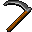

# { .sprite } Scythe
*Ordinary* · Pole weapon · value 0 gold

> This looks more suited to farming than fighting

**Slot:** weapon · **Size:** large

## When equipped

| Stat | Value |
|---|---|
| Attack damage | 2 to 6 |
| Attack cost | +6 |
| Attack chance | +11 |
| Block chance | +4 |
| setNonWeaponDamageModifier | +130 |

## Sold by

- [Arlish](../monsters/arlish.md)
- [Cornith](../monsters/stoutford_smith.md)

<small>Item ID: `scythe` · Data from v0.8.18</small>
