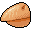

# { .sprite } Insect shell

*Ordinary animal part.*

<div class="infobox" markdown>

<p class="ib-img"></p>

| | |
|---|---|
| **Item ID** | `shell` |
| **Category** | Animal part |
| **Rarity** | Ordinary |
| **Base value** | 2 gold |
| **Introduced** | v0.7.0 or earlier |

</div>

## How to get it

### Dropped by

| Monster | Chance | Qty | Found in |
|---|---|---|---|
| [Black ant](../monsters/black_ant.md) | 30% | 1 | Crossglen, Guynmart Castle |
| [Beetle](../monsters/beetle.md) | 30% | 1 | Crossglen |
| [Forest ant](../monsters/forest_ant.md) | 30% | 1 | Fallhaven, Crossglen, Blackwater Mountain |
| [Yellow forest ant](../monsters/yellow_forest_ant.md) | 30% | 1 | Fallhaven, Crossglen, Blackwater Mountain |
| [Yellow cave ant](../monsters/yellow_cave_ant.md) | 30% | 1 | Fallhaven |
| [Forest beetle](../monsters/forest_beetle.md) | 30% | 1 | Foaming Flask Tavern, Flagstone Prison, Fallhaven |
| [Hardshell beetle](../monsters/hardshell_beetle.md) | 30% | 1 | Greenscale tribe, Foaming Flask Tavern, Fallhaven |
| [Grasslands ant](../monsters/grass_ant.md) | 30% | 1 | Crossroads Guardhouse, Guynmart Castle, Loneford |
| [Tough grasslands ant](../monsters/grass_ant2.md) | 30% | 1 | Crossroads Guardhouse, Guynmart Castle, Loneford |
| [Grasslands beetle](../monsters/grass_beetle.md) | 30% | 1 | Crossroads Guardhouse, Loneford, Guynmart Castle |
| [Tough grasslands beetle](../monsters/grass_beetle2.md) | 30% | 1 | Crossroads Guardhouse, Loneford, Guynmart Castle |
| [Young carrion beetle](../monsters/cbeetle_1.md) | 30% | 1 | Brightport |
| [Carrion beetle](../monsters/cbeetle_2.md) | 30% | 1 | Brightport |
| [Young scaradon](../monsters/scaradon_1.md) | 30% | 1 | Brightport |
| [Small scaradon](../monsters/scaradon_2.md) | 30% | 1 | Mountaincave 1, Mountaincave 2, Waytolake 0 |
| [Scaradon](../monsters/scaradon_3.md) | 30% | 1 | Mountaincave 1, Mountaincave 2, Waytolake 0 |
| [Tough scaradon](../monsters/scaradon_4.md) | 30% | 1 | Mountaincave 1, Mountaincave 2, Waytolake 0 |
| [Hardshell scaradon](../monsters/scaradon_5.md) | 30% | 1 | Brightport |
| [Larval cave burrower](../monsters/burrower_1.md) | 30% | 1 | Waterway 14, Waterway 15 |
| [Cave burrower](../monsters/burrower_2.md) | 30% | 1 | Waterway 14, Waterway 15 |
| [Strong larval burrower](../monsters/burrower_3.md) | 30% | 1 | Brimhaven |
| [Giant larval burrower](../monsters/burrower_4.md) | 30% | 1 | Pub, Bloskelt + Roskelt, Entry |
| [Carrion centipede](../monsters/ccentip0.md) | 30% | 1 | Charwood, Foaming Flask Tavern |
| [Ravenous carrion centipede](../monsters/ccentip1.md) | 30% | 1 | Charwood, Foaming Flask Tavern |
| [Bloated carrion centipede](../monsters/ccentip2.md) | 30% | 1 | Charwood, Foaming Flask Tavern |
| [Young poisonous cave burrower](../monsters/caveburr1.md) | 30% | 1 | Loneford |
| [Infected larval cave burrower](../monsters/caveburr2.md) | 30% | 1 | Loneford |
| [Poisonous cave burrower](../monsters/caveburr3.md) | 30% | 1 | Loneford |
| [Strong poisonous cave burrower](../monsters/caveburr4.md) | 30% | 1 | Lodar 5cave 0, Lodar 5cave 1, Lodar 5cave 2 |
| [Giant poisonous cave burrower](../monsters/caveburr5.md) | 30% | 1 | Lodar 5cave 0, Lodar 5cave 1, Lodar 5cave 2 |
| [Hardershell beetle](../monsters/hardershell_beetle.md) | 30% | 1 | Foaming Flask Tavern, Guynmart Castle |
| [Village ant](../monsters/village_ant.md) | 30% | 1 | Wexlow Village |
| [Queen spider](../monsters/spider_queen.md) | 20% | 1 | Laerothcave 2, Secretpassage 1, Undertell 1 1 |
| [Basement spider](../monsters/laerothbasement_spider.md) | 10% | 1 | Lake Laeroth |
| [Giant spider](../monsters/spider_massive.md) | 10% | 1 | Lake Laeroth |
| [Grass spider](../monsters/grass_spider.md) | 10% | 1 | Mt. Galmore, Flagstone Prison, Wexlow Village |
| [Dirt spider](../monsters/dirt_spider.md) | 10% | 1 | Stoutford, Mt. Galmore |


<p class="verified">Verified against v0.8.18 item, loot, map and dialogue data.</p>

## Uses

Where the game checks for this item in dialogue:

| With | Quest | What happens to it | Option |
|---|---|---|---|
| stepping on a trigger on [Loneford 13](../maps/loneford13.md) | – | handed over (1×) | “[Lob down an insect shell.]” |

<p class="verified">Verified against v0.8.18 dialogue data.</p>


## Version history

| Version | Change |
|---|---|
| [v0.7.0](../versions/0.7.0.md) | Present in v0.7.0 (earliest release tracked) |

<p class="verified">Verified against v0.8.18 and every earlier release back to v0.7.0 (game data compared release by release).</p>


## Community notes

<small>Written by players, not generated from game data. **Strategy**: how and when to use it · **Lore**: the in-world story · **Trivia**: real-world facts, references, development history · **Theory / speculation**: unconfirmed ideas; may just be unfinished content</small>

### Strategy

*No notes yet. Contributions are welcome: [add a note](https://github.com/asdfghjkl628/Andor-s-Trail-Wikiiii/new/main/notes/items?filename=shell.md&value=%23%23%20Strategy%0A%0A%3C%21--%20how%20and%20when%20to%20use%20it%20--%3E%0A%0A%23%23%20Lore%0A%0A%3C%21--%20the%20in-world%20story%20--%3E%0A%0A%23%23%20Trivia%0A%0A%3C%21--%20real-world%20facts%2C%20references%2C%20development%20history%20--%3E%0A%0A%23%23%20Theory%20/%20speculation%0A%0A%3C%21--%20unconfirmed%20ideas%3B%20may%20just%20be%20unfinished%20content%20--%3E%0A).*

### Lore

*No notes yet. Contributions are welcome: [add a note](https://github.com/asdfghjkl628/Andor-s-Trail-Wikiiii/new/main/notes/items?filename=shell.md&value=%23%23%20Strategy%0A%0A%3C%21--%20how%20and%20when%20to%20use%20it%20--%3E%0A%0A%23%23%20Lore%0A%0A%3C%21--%20the%20in-world%20story%20--%3E%0A%0A%23%23%20Trivia%0A%0A%3C%21--%20real-world%20facts%2C%20references%2C%20development%20history%20--%3E%0A%0A%23%23%20Theory%20/%20speculation%0A%0A%3C%21--%20unconfirmed%20ideas%3B%20may%20just%20be%20unfinished%20content%20--%3E%0A).*

### Trivia

*No notes yet. Contributions are welcome: [add a note](https://github.com/asdfghjkl628/Andor-s-Trail-Wikiiii/new/main/notes/items?filename=shell.md&value=%23%23%20Strategy%0A%0A%3C%21--%20how%20and%20when%20to%20use%20it%20--%3E%0A%0A%23%23%20Lore%0A%0A%3C%21--%20the%20in-world%20story%20--%3E%0A%0A%23%23%20Trivia%0A%0A%3C%21--%20real-world%20facts%2C%20references%2C%20development%20history%20--%3E%0A%0A%23%23%20Theory%20/%20speculation%0A%0A%3C%21--%20unconfirmed%20ideas%3B%20may%20just%20be%20unfinished%20content%20--%3E%0A).*

### Theory / speculation

*No notes yet. Contributions are welcome: [add a note](https://github.com/asdfghjkl628/Andor-s-Trail-Wikiiii/new/main/notes/items?filename=shell.md&value=%23%23%20Strategy%0A%0A%3C%21--%20how%20and%20when%20to%20use%20it%20--%3E%0A%0A%23%23%20Lore%0A%0A%3C%21--%20the%20in-world%20story%20--%3E%0A%0A%23%23%20Trivia%0A%0A%3C%21--%20real-world%20facts%2C%20references%2C%20development%20history%20--%3E%0A%0A%23%23%20Theory%20/%20speculation%0A%0A%3C%21--%20unconfirmed%20ideas%3B%20may%20just%20be%20unfinished%20content%20--%3E%0A).*


??? info "Technical information"

    | | |
    |---|---|
    | Item ID | `shell` |
    | Category ID | `animal` |
    | Icon | `items_misc:54` |
    | Defined in | `res/raw/itemlist_animal.json` |
    | Loot tables containing it | `insect`, `beetle2`, `fieldcritter_0`, `fieldcritter_1`, `scaradon`, `scaradon_b`, `burrower`, `spider`, `spider_2` |

    Raw data:

    ```json
    {
     "id": "shell",
     "iconID": "items_misc:54",
     "name": "Insect shell",
     "hasManualPrice": 1,
     "baseMarketCost": 2,
     "category": "animal"
    }
    ```


<small>Data from v0.8.18</small>
