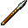

# { .sprite } Rusty iron spear
*Ordinary* · Pole weapon · value 0 gold

**Slot:** weapon · **Size:** large

## When equipped

| Stat | Value |
|---|---|
| Attack damage | 1 to 2 |
| Attack cost | +6 |
| Attack chance | +9 |
| Block chance | +4 |
| setNonWeaponDamageModifier | +130 |

## Sold by

- [Audir](../monsters/audir.md)

Verified against v0.8.18 item data.

## Version history

| Version | Change |
|---|---|
| [v0.7.12](../versions/0.7.12.md) | Added |
| [v0.7.13](../versions/0.7.13.md) | equipEffect: {"increaseAttackCost": 6, "increaseAtta… → {"increaseAttackChance": 9, "increaseAt… |

Verified against v0.8.18 and every earlier release back to v0.7.0 (game data compared release by release).

<small>Item ID: `spear_rusty` · Data from v0.8.18</small>
