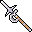

# { .sprite } Remgard steel spear
*Ordinary* · Pole weapon · value 0 gold

**Slot:** weapon · **Size:** large

## When equipped

| Stat | Value |
|---|---|
| Attack damage | 6 to 8 |
| Attack cost | +5 |
| Attack chance | +25 |
| Critical skill | +5 |
| Block chance | +7 |
| Critical multiplier | 1.5 |
| setNonWeaponDamageModifier | +120 |

## Sold by

- [Arnal](../monsters/arnal.md)

Verified against v0.8.18 item data.

## Version history

| Version | Change |
|---|---|
| [v0.7.12](../versions/0.7.12.md) | Added |
| [v0.7.13](../versions/0.7.13.md) | equipEffect: {"increaseAttackCost": 5, "increaseAtta… → {"increaseAttackChance": 25, "increaseA… |

Verified against v0.8.18 and every earlier release back to v0.7.0 (game data compared release by release).

<small>Item ID: `spear_steel_remgard` · Data from v0.8.18</small>
