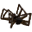

# { .sprite } Dead spider
*Ordinary* · Animal part · value 1 gold

## Dropped by

| Monster | Chance | Qty |
|---|---|---|
| [Forest hunter](../monsters/forest_hunter.md) | 25% | 1 |
| [Puny plaguecrawler](../monsters/plaguesp_1.md) | 5% | 1 |
| [Plaguecrawler](../monsters/plaguesp_2.md) | 5% | 1 |
| [Tough plaguecrawler](../monsters/plaguesp_3.md) | 5% | 1 |
| [Black plaguecrawler](../monsters/plaguesp_4.md) | 5% | 1 |
| [Plaguestrider](../monsters/plaguesp_5.md) | 5% | 1 |
| [Hardshell plaguestrider](../monsters/plaguesp_6.md) | 5% | 1 |
| [Tough plaguestrider](../monsters/plaguesp_7.md) | 5% | 1 |
| [Wooly plaguestrider](../monsters/plaguesp_8.md) | 5% | 1 |
| [Tough wooly plaguestrider](../monsters/plaguesp_9.md) | 5% | 1 |
| [Vile plaguestrider](../monsters/plaguesp_10.md) | 5% | 1 |
| [Nesting plaguestrider](../monsters/plaguesp_11.md) | 5% | 1 |
| [Plaguestrider servant](../monsters/plaguesp_12.md) | 5% | 1 |

<small>Item ID: `spider` · Data from v0.8.18</small>
