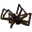

# { .sprite } Dead spider

*Ordinary animal part.*

<div class="infobox" markdown>

<p class="ib-img">{ .sprite }</p>

| | |
|---|---|
| **Item ID** | `spider` |
| **Category** | Animal part |
| **Rarity** | Ordinary |
| **Base value** | 1 gold |
| **Introduced** | v0.7.0 or earlier |

</div>

## How to get it

### Dropped by

| Monster | Chance | Qty | Found in |
|---|---|---|---|
| [Forest hunter](../monsters/forest_hunter.md) | 25% | 1 | haunted_forest1, haunted_forest13, haunted_forest14 |
| [Puny plaguecrawler](../monsters/plaguesp_1.md) | 5% | 1 | waytolake0, waytolake1, waytolake2 |
| [Plaguecrawler](../monsters/plaguesp_2.md) | 5% | 1 | waytolake0, waytolake1, waytolake2 |
| [Tough plaguecrawler](../monsters/plaguesp_3.md) | 5% | 1 | waytolake0, waytolake1, waytolake2 |
| [Black plaguecrawler](../monsters/plaguesp_4.md) | 5% | 1 | mountainlake0, waytolake0, waytolake1 |
| [Plaguestrider](../monsters/plaguesp_5.md) | 5% | 1 | mountainlake0, waytolake0, waytolake1 |
| [Hardshell plaguestrider](../monsters/plaguesp_6.md) | 5% | 1 | mountainlake0, waytolake0, waytolake1 |
| [Tough plaguestrider](../monsters/plaguesp_7.md) | 5% | 1 | mountainlake0, waytolake11, waytolake12 |
| [Wooly plaguestrider](../monsters/plaguesp_8.md) | 5% | 1 | mountainlake0, waytolake11, waytolake12 |
| [Tough wooly plaguestrider](../monsters/plaguesp_9.md) | 5% | 1 | mountainlake0, waytolake11, waytolake12 |
| [Vile plaguestrider](../monsters/plaguesp_10.md) | 5% | 1 | waytolake4, waytolake5 |
| [Nesting plaguestrider](../monsters/plaguesp_11.md) | 5% | 1 | waytolake4, waytolake5 |
| [Plaguestrider servant](../monsters/plaguesp_12.md) | 5% | 1 | waytolake4, waytolake5 |

### Found in containers

- [final_cave1](../maps/final_cave1.md#container-1) (container 2, 100%)


<p class="verified">Verified against v0.8.18 item, loot, map and dialogue data.</p>

## Uses

Where the game checks for this item in dialogue:

| With | Quest | What happens to it | Option |
|---|---|---|---|
| [Lodar](../monsters/lodar.md) ([lodarhouse1](../maps/lodarhouse1.md)) | [Lodar's potions](../quests/lodar_pots.md#stage-42) | handed over (1×) | “I have those things on me, here.” |
| [Lodar](../monsters/lodar.md) ([lodarhouse1](../maps/lodarhouse1.md)) | [Lodar's potions](../quests/lodar_pots.md#stage-42) | handed over (5×) | “I have enough of those things on me for five potions, here.” |
| [Lodar](../monsters/lodar.md) ([lodarhouse1](../maps/lodarhouse1.md)) | [Lodar's potions](../quests/lodar_pots.md#stage-42) | handed over (10×) | “I have enough of those things on me for ten potions, here.” |

<p class="verified">Verified against v0.8.18 dialogue data.</p>


## Version history

| Version | Change |
|---|---|
| [v0.7.0](../versions/0.7.0.md) | Present in v0.7.0 (earliest release tracked) |

<p class="verified">Verified against v0.8.18 and every earlier release back to v0.7.0 (game data compared release by release).</p>


## Community notes

<small>Written by players, not generated from game data. **Strategy**: how and when to use it · **Lore**: the in-world story · **Trivia**: real-world facts, references, development history · **Theory / speculation**: unconfirmed ideas; may just be unfinished content</small>

### Strategy

*Nothing here yet. Know something? [Add it](https://github.com/asdfghjkl628/Andor-s-Trail-Wikiiii/new/main/notes/items?filename=spider.md&value=%23%23%20Strategy%0A%0A%3C%21--%20how%20and%20when%20to%20use%20it%20--%3E%0A%0A%23%23%20Lore%0A%0A%3C%21--%20the%20in-world%20story%20--%3E%0A%0A%23%23%20Trivia%0A%0A%3C%21--%20real-world%20facts%2C%20references%2C%20development%20history%20--%3E%0A%0A%23%23%20Theory%20/%20speculation%0A%0A%3C%21--%20unconfirmed%20ideas%3B%20may%20just%20be%20unfinished%20content%20--%3E%0A).*

### Lore

*Nothing here yet. Know something? [Add it](https://github.com/asdfghjkl628/Andor-s-Trail-Wikiiii/new/main/notes/items?filename=spider.md&value=%23%23%20Strategy%0A%0A%3C%21--%20how%20and%20when%20to%20use%20it%20--%3E%0A%0A%23%23%20Lore%0A%0A%3C%21--%20the%20in-world%20story%20--%3E%0A%0A%23%23%20Trivia%0A%0A%3C%21--%20real-world%20facts%2C%20references%2C%20development%20history%20--%3E%0A%0A%23%23%20Theory%20/%20speculation%0A%0A%3C%21--%20unconfirmed%20ideas%3B%20may%20just%20be%20unfinished%20content%20--%3E%0A).*

### Trivia

*Nothing here yet. Know something? [Add it](https://github.com/asdfghjkl628/Andor-s-Trail-Wikiiii/new/main/notes/items?filename=spider.md&value=%23%23%20Strategy%0A%0A%3C%21--%20how%20and%20when%20to%20use%20it%20--%3E%0A%0A%23%23%20Lore%0A%0A%3C%21--%20the%20in-world%20story%20--%3E%0A%0A%23%23%20Trivia%0A%0A%3C%21--%20real-world%20facts%2C%20references%2C%20development%20history%20--%3E%0A%0A%23%23%20Theory%20/%20speculation%0A%0A%3C%21--%20unconfirmed%20ideas%3B%20may%20just%20be%20unfinished%20content%20--%3E%0A).*

### Theory / speculation

*Nothing here yet. Know something? [Add it](https://github.com/asdfghjkl628/Andor-s-Trail-Wikiiii/new/main/notes/items?filename=spider.md&value=%23%23%20Strategy%0A%0A%3C%21--%20how%20and%20when%20to%20use%20it%20--%3E%0A%0A%23%23%20Lore%0A%0A%3C%21--%20the%20in-world%20story%20--%3E%0A%0A%23%23%20Trivia%0A%0A%3C%21--%20real-world%20facts%2C%20references%2C%20development%20history%20--%3E%0A%0A%23%23%20Theory%20/%20speculation%0A%0A%3C%21--%20unconfirmed%20ideas%3B%20may%20just%20be%20unfinished%20content%20--%3E%0A).*


??? info "Technical information"

    | | |
    |---|---|
    | Item ID | `spider` |
    | Category ID | `animal` |
    | Icon | `items_misc:40` |
    | Defined in | `res/raw/itemlist_v0611_2.json` |
    | Loot tables containing it | `plaguespider`, `forest_hunter_dl`, `final_cave_loot2` |

    Raw data:

    ```json
    {
     "id": "spider",
     "iconID": "items_misc:40",
     "name": "Dead spider",
     "hasManualPrice": 1,
     "baseMarketCost": 1,
     "category": "animal"
    }
    ```


<small>Data from v0.8.18</small>
