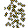

# { .sprite } Mushroom spores
*Ordinary* · Animal part · value 3 gold

## Dropped by

| Monster | Chance | Qty |
|---|---|---|
| [Creeping fungus](../monsters/waterwayamushroom.md) | 15% | 1-2 |
| [Death cob](../monsters/deathcob.md) | 15% | 1-2 |

Verified against v0.8.18 item data.

## Version history

| Version | Change |
|---|---|
| [v0.7.2](../versions/0.7.2.md) | Added |

Verified against v0.8.18 and every earlier release back to v0.7.0 (game data compared release by release).

<small>Item ID: `spore_mush` · Data from v0.8.18</small>
