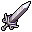

# { .sprite } A strange looking dagger

*Quest dagger.*

<div class="infobox" markdown>

<p class="ib-img">{ .sprite }</p>

| | |
|---|---|
| **Item ID** | `strange_dagger` |
| **Category** | Dagger |
| **Slot** | weapon |
| **Hands** | One-handed |
| **Proficiency** | [Dagger proficiency](../skills/weaponProficiencyDagger.md) |
| **Rarity** | Quest |
| **Base value** | 0 gold |
| **Quest item** | Yes |
| **Introduced** | [v0.7.11](../versions/0.7.11.md) |

</div>

> The dagger has an inscription etched into the metal "The Shadow shall bear no witness to the wielder of this blade".

## Statistics

### When equipped

| Stat | Value |
|---|---|
| Attack damage | 1 to 2 |
| Attack cost | +4 |

<p class="verified">Verified against v0.8.18 item data.</p>

## How to get it

### Dropped by

| Monster | Chance | Qty | Found in |
|---|---|---|---|
| [Pixtumn](../monsters/quiet_thief.md#v-quiet_thief_1) | 100% | 1 | Brimhaven |
| [Pixtumn](../monsters/quiet_thief.md#v-quiet_thief_2) | 100% | 1 | Brimhaven |

### Quest & dialogue rewards

- From [Pixtumn](../monsters/quiet_thief.md) ([Brimhaven inn east](../maps/brimhaven_inn_east.md)) during [Brimhaven dagger story flags (hidden flag)](../quests/brv_dagger_nondisplay.md#stage-30) (1×)


<p class="verified">Verified against v0.8.18 item, loot, map and dialogue data.</p>

## Uses

Where the game checks for this item in dialogue:

| With | Quest | What happens to it | Option |
|---|---|---|---|
| [Edrin](../monsters/brv_metalsmith.md) ([Brimhaven metalsmith](../maps/brimhaven_metalsmith.md)) | [A strange looking dagger](../quests/brv_dagger.md#stage-25) | must be carried (1×) | “If you have those skills I would like you to look at two items I purchased local” |
| [Edrin](../monsters/brv_metalsmith.md) ([Brimhaven metalsmith](../maps/brimhaven_metalsmith.md)) | [A strange looking dagger](../quests/brv_dagger.md#stage-10) | must be carried (1×) | “If you have those skills I would like you to look at something I purchased local” |
| [Edrin](../monsters/brv_metalsmith.md) ([Brimhaven metalsmith](../maps/brimhaven_metalsmith.md)) | [A strange looking dagger](../quests/brv_dagger.md#stage-50) | must be carried (1×) | “I have a gem. I think it's the right one for the dagger we discussed.” |
| [Edrin](../monsters/brv_metalsmith.md) ([Brimhaven metalsmith](../maps/brimhaven_metalsmith.md)) | [A strange looking dagger](../quests/brv_dagger.md#stage-50) | must be carried (1×) | “I have a dagger. I think it's the one that matches the gem we discussed. ” |
| [Edrin](../monsters/brv_metalsmith.md) ([Brimhaven metalsmith](../maps/brimhaven_metalsmith.md)) | [A strange looking dagger](../quests/brv_dagger.md#stage-80) | handed over (1×) | “OK. I agree. Here are the dagger and the gem.” |
| stepping on a trigger on [Brimhaven inn east](../maps/brimhaven_inn_east.md) | [Brimhaven dagger story flags (hidden flag)](../quests/brv_dagger_nondisplay.md#stage-20) | must be carried (1×) | “N” |

<p class="verified">Verified against v0.8.18 dialogue data.</p>


## Version history

| Version | Change |
|---|---|
| [v0.7.11](../versions/0.7.11.md) | Added |
| [v0.7.13](../versions/0.7.13.md) | Description text changed |

<p class="verified">Verified against v0.8.18 and every earlier release back to v0.7.0 (game data compared release by release).</p>


## Community notes

<small>Written by players, not generated from game data. **Strategy**: how and when to use it · **Lore**: the in-world story · **Trivia**: real-world facts, references, development history · **Theory / speculation**: unconfirmed ideas; may just be unfinished content</small>

### Strategy

*No notes yet. Contributions are welcome: [add a note](https://github.com/asdfghjkl628/Andor-s-Trail-Wikiiii/new/main/notes/items?filename=strange_dagger.md&value=%23%23%20Strategy%0A%0A%3C%21--%20how%20and%20when%20to%20use%20it%20--%3E%0A%0A%23%23%20Lore%0A%0A%3C%21--%20the%20in-world%20story%20--%3E%0A%0A%23%23%20Trivia%0A%0A%3C%21--%20real-world%20facts%2C%20references%2C%20development%20history%20--%3E%0A%0A%23%23%20Theory%20/%20speculation%0A%0A%3C%21--%20unconfirmed%20ideas%3B%20may%20just%20be%20unfinished%20content%20--%3E%0A).*

### Lore

*No notes yet. Contributions are welcome: [add a note](https://github.com/asdfghjkl628/Andor-s-Trail-Wikiiii/new/main/notes/items?filename=strange_dagger.md&value=%23%23%20Strategy%0A%0A%3C%21--%20how%20and%20when%20to%20use%20it%20--%3E%0A%0A%23%23%20Lore%0A%0A%3C%21--%20the%20in-world%20story%20--%3E%0A%0A%23%23%20Trivia%0A%0A%3C%21--%20real-world%20facts%2C%20references%2C%20development%20history%20--%3E%0A%0A%23%23%20Theory%20/%20speculation%0A%0A%3C%21--%20unconfirmed%20ideas%3B%20may%20just%20be%20unfinished%20content%20--%3E%0A).*

### Trivia

*No notes yet. Contributions are welcome: [add a note](https://github.com/asdfghjkl628/Andor-s-Trail-Wikiiii/new/main/notes/items?filename=strange_dagger.md&value=%23%23%20Strategy%0A%0A%3C%21--%20how%20and%20when%20to%20use%20it%20--%3E%0A%0A%23%23%20Lore%0A%0A%3C%21--%20the%20in-world%20story%20--%3E%0A%0A%23%23%20Trivia%0A%0A%3C%21--%20real-world%20facts%2C%20references%2C%20development%20history%20--%3E%0A%0A%23%23%20Theory%20/%20speculation%0A%0A%3C%21--%20unconfirmed%20ideas%3B%20may%20just%20be%20unfinished%20content%20--%3E%0A).*

### Theory / speculation

*No notes yet. Contributions are welcome: [add a note](https://github.com/asdfghjkl628/Andor-s-Trail-Wikiiii/new/main/notes/items?filename=strange_dagger.md&value=%23%23%20Strategy%0A%0A%3C%21--%20how%20and%20when%20to%20use%20it%20--%3E%0A%0A%23%23%20Lore%0A%0A%3C%21--%20the%20in-world%20story%20--%3E%0A%0A%23%23%20Trivia%0A%0A%3C%21--%20real-world%20facts%2C%20references%2C%20development%20history%20--%3E%0A%0A%23%23%20Theory%20/%20speculation%0A%0A%3C%21--%20unconfirmed%20ideas%3B%20may%20just%20be%20unfinished%20content%20--%3E%0A).*


??? info "Technical information"

    | | |
    |---|---|
    | Item ID | `strange_dagger` |
    | Category ID | `dagger` |
    | Icon | `items_reterski_1:13` |
    | Defined in | `res/raw/itemlist_brimhaven.json` |
    | Loot tables containing it | `quiet_thief_1`, `quiet_thief_2` |

    Raw data:

    ```json
    {
     "id": "strange_dagger",
     "iconID": "items_reterski_1:13",
     "name": "A strange looking dagger",
     "displaytype": "quest",
     "category": "dagger",
     "description": "The dagger has an inscription etched into the metal \"The Shadow shall bear no witness to the wielder of this blade\".",
     "equipEffect": {
      "increaseAttackDamage": {
       "min": 1,
       "max": 2
      },
      "increaseAttackCost": 4
     }
    }
    ```


<small>Data from v0.8.18</small>
