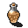

# { .sprite } Forest Ale
*Ordinary* · Drink · value 0 gold

> A medium colored brew with all the taste and no bitter aftertaste. Brewed by the Briwerra family.

## When used

| Stat | Value |
|---|---|
| Heal HP | 3 to 9 |
| On self | Sustenance (magnitude 2, 2 rounds, 100% chance); Intoxicated (magnitude 1, 3 rounds, 30% chance) |

## Dropped by

| Monster | Chance | Qty |
|---|---|---|
| [Oakleigh](../monsters/sullengard_bartender.md) | 100% | 6 |

Verified against v0.8.18 item data.

## Version history

| Version | Change |
|---|---|
| [v0.8.2](../versions/0.8.2.md) | Added |

Verified against v0.8.18 and every earlier release back to v0.7.0 (game data compared release by release).

<small>Item ID: `sullengard_forest_ale` · Data from v0.8.18</small>
