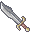

# { .sprite } Yatagan

*Extraordinary broadsword.*

<div class="infobox" markdown>

<p class="ib-img">{ .sprite }</p>

| | |
|---|---|
| **Item ID** | `sword_g03_crackshot` |
| **Category** | Broadsword |
| **Slot** | weapon |
| **Hands** | One-handed |
| **Proficiency** | One-handed sword |
| **Rarity** | Extraordinary |
| **Base value** | 0 gold |
| **Introduced** | [v0.7.8](../versions/0.7.8.md) |

</div>

> Crackshot's personal weapon

## Statistics

### When equipped

| Stat | Value |
|---|---|
| Attack damage | 4 to 12 |
| Max HP | 0 |
| Attack cost | +5 |
| Attack chance | +19 |
| Critical skill | +10 |
| Block chance | 0 |
| Damage resistance | 0 |
| Critical multiplier | 2.0 |
| setNonWeaponDamageModifier | +113 |

<p class="verified">Verified against v0.8.18 item data.</p>

## How to get it

### Dropped by

| Monster | Chance | Qty | Found in |
|---|---|---|---|
| [Crackshot](../monsters/g03_crackshot.md) | 100% | 1 | crackshot_hideout3 |


<p class="verified">Verified against v0.8.18 item, loot, map and dialogue data.</p>


## Version history

| Version | Change |
|---|---|
| [v0.7.8](../versions/0.7.8.md) | Added |
| [v0.7.10](../versions/0.7.10.md) | equipEffect: {"increaseAttackChance": 19, "increaseA… → {"increaseAttackChance": 19, "increaseA… |

<p class="verified">Verified against v0.8.18 and every earlier release back to v0.7.0 (game data compared release by release).</p>


## Community notes

<small>Written by players, not generated from game data. **Strategy**: how and when to use it · **Lore**: the in-world story · **Trivia**: real-world facts, references, development history · **Theory / speculation**: unconfirmed ideas; may just be unfinished content</small>

### Strategy

*Nothing here yet. Know something? [Add it](https://github.com/asdfghjkl628/Andor-s-Trail-Wikiiii/new/main/notes/items?filename=sword_g03_crackshot.md&value=%23%23%20Strategy%0A%0A%3C%21--%20how%20and%20when%20to%20use%20it%20--%3E%0A%0A%23%23%20Lore%0A%0A%3C%21--%20the%20in-world%20story%20--%3E%0A%0A%23%23%20Trivia%0A%0A%3C%21--%20real-world%20facts%2C%20references%2C%20development%20history%20--%3E%0A%0A%23%23%20Theory%20/%20speculation%0A%0A%3C%21--%20unconfirmed%20ideas%3B%20may%20just%20be%20unfinished%20content%20--%3E%0A).*

### Lore

*Nothing here yet. Know something? [Add it](https://github.com/asdfghjkl628/Andor-s-Trail-Wikiiii/new/main/notes/items?filename=sword_g03_crackshot.md&value=%23%23%20Strategy%0A%0A%3C%21--%20how%20and%20when%20to%20use%20it%20--%3E%0A%0A%23%23%20Lore%0A%0A%3C%21--%20the%20in-world%20story%20--%3E%0A%0A%23%23%20Trivia%0A%0A%3C%21--%20real-world%20facts%2C%20references%2C%20development%20history%20--%3E%0A%0A%23%23%20Theory%20/%20speculation%0A%0A%3C%21--%20unconfirmed%20ideas%3B%20may%20just%20be%20unfinished%20content%20--%3E%0A).*

### Trivia

*Nothing here yet. Know something? [Add it](https://github.com/asdfghjkl628/Andor-s-Trail-Wikiiii/new/main/notes/items?filename=sword_g03_crackshot.md&value=%23%23%20Strategy%0A%0A%3C%21--%20how%20and%20when%20to%20use%20it%20--%3E%0A%0A%23%23%20Lore%0A%0A%3C%21--%20the%20in-world%20story%20--%3E%0A%0A%23%23%20Trivia%0A%0A%3C%21--%20real-world%20facts%2C%20references%2C%20development%20history%20--%3E%0A%0A%23%23%20Theory%20/%20speculation%0A%0A%3C%21--%20unconfirmed%20ideas%3B%20may%20just%20be%20unfinished%20content%20--%3E%0A).*

### Theory / speculation

*Nothing here yet. Know something? [Add it](https://github.com/asdfghjkl628/Andor-s-Trail-Wikiiii/new/main/notes/items?filename=sword_g03_crackshot.md&value=%23%23%20Strategy%0A%0A%3C%21--%20how%20and%20when%20to%20use%20it%20--%3E%0A%0A%23%23%20Lore%0A%0A%3C%21--%20the%20in-world%20story%20--%3E%0A%0A%23%23%20Trivia%0A%0A%3C%21--%20real-world%20facts%2C%20references%2C%20development%20history%20--%3E%0A%0A%23%23%20Theory%20/%20speculation%0A%0A%3C%21--%20unconfirmed%20ideas%3B%20may%20just%20be%20unfinished%20content%20--%3E%0A).*


??? info "Technical information"

    | | |
    |---|---|
    | Item ID | `sword_g03_crackshot` |
    | Category ID | `bsword` |
    | Icon | `items_weapons_2:2` |
    | Defined in | `res/raw/itemlist_omicronrg9.json` |
    | Loot tables containing it | `drop_g03_crackshot` |

    Raw data:

    ```json
    {
     "id": "sword_g03_crackshot",
     "iconID": "items_weapons_2:2",
     "name": "Yatagan",
     "displaytype": "extraordinary",
     "category": "bsword",
     "description": "Crackshot's personal weapon",
     "equipEffect": {
      "increaseAttackDamage": {
       "min": 4,
       "max": 12
      },
      "increaseMaxHP": 0,
      "increaseAttackCost": 5,
      "increaseAttackChance": 19,
      "increaseCriticalSkill": 10,
      "increaseBlockChance": 0,
      "increaseDamageResistance": 0,
      "setCriticalMultiplier": 2.0,
      "setNonWeaponDamageModifier": 113
     }
    }
    ```


<small>Data from v0.8.18</small>
