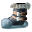

# { .sprite } Titanforge stompers

*Extraordinary footwear, metal (heavy).*

<div class="infobox" markdown>

<p class="ib-img">{ .sprite }</p>

| | |
|---|---|
| **Item ID** | `titanforge_stompers` |
| **Category** | Footwear, metal (heavy) |
| **Slot** | feet |
| **Proficiency** | [Heavy armor proficiency](../skills/armorProficiencyHeavy.md) |
| **Rarity** | Extraordinary |
| **Base value** | 0 gold |
| **Introduced** | [v0.8.8](../versions/0.8.8.md) |

</div>

> A heavy boot that boasts an imposing design forged with ancient craftsmanship, enhancing the wearer's strength and resilience with each resounding step.

## Statistics

### When equipped

| Stat | Value |
|---|---|
| Attack damage | 2 |
| Block chance | +20 |
| Damage resistance | +2 |

<p class="verified">Verified against v0.8.18 item data.</p>

## How to get it

### Dropped by

| Monster | Chance | Qty | Found in |
|---|---|---|---|
| [Grimmthorn marauder](../monsters/grimmthorn_marauder.md) | 0.1% | 1 | way_to_sullengard_west_1, way_to_sullengard_west_3 |
| [Dirty grimmthorn marauder](../monsters/dirty_grimmthorn_marauder.md) | 0.1% | 1 | way_to_sullengard_west_0, way_to_sullengard_west_1, way_to_sullengard_west_2 |


<p class="verified">Verified against v0.8.18 item, loot, map and dialogue data.</p>


## Version history

| Version | Change |
|---|---|
| [v0.8.8](../versions/0.8.8.md) | Added |
| [v0.8.18](../versions/0.8.18.md) | Description text changed |

<p class="verified">Verified against v0.8.18 and every earlier release back to v0.7.0 (game data compared release by release).</p>


## Community notes

<small>Written by players, not generated from game data. **Strategy**: how and when to use it · **Lore**: the in-world story · **Trivia**: real-world facts, references, development history · **Theory / speculation**: unconfirmed ideas; may just be unfinished content</small>

### Strategy

*No notes yet. Contributions are welcome: [add a note](https://github.com/asdfghjkl628/Andor-s-Trail-Wikiiii/new/main/notes/items?filename=titanforge_stompers.md&value=%23%23%20Strategy%0A%0A%3C%21--%20how%20and%20when%20to%20use%20it%20--%3E%0A%0A%23%23%20Lore%0A%0A%3C%21--%20the%20in-world%20story%20--%3E%0A%0A%23%23%20Trivia%0A%0A%3C%21--%20real-world%20facts%2C%20references%2C%20development%20history%20--%3E%0A%0A%23%23%20Theory%20/%20speculation%0A%0A%3C%21--%20unconfirmed%20ideas%3B%20may%20just%20be%20unfinished%20content%20--%3E%0A).*

### Lore

*No notes yet. Contributions are welcome: [add a note](https://github.com/asdfghjkl628/Andor-s-Trail-Wikiiii/new/main/notes/items?filename=titanforge_stompers.md&value=%23%23%20Strategy%0A%0A%3C%21--%20how%20and%20when%20to%20use%20it%20--%3E%0A%0A%23%23%20Lore%0A%0A%3C%21--%20the%20in-world%20story%20--%3E%0A%0A%23%23%20Trivia%0A%0A%3C%21--%20real-world%20facts%2C%20references%2C%20development%20history%20--%3E%0A%0A%23%23%20Theory%20/%20speculation%0A%0A%3C%21--%20unconfirmed%20ideas%3B%20may%20just%20be%20unfinished%20content%20--%3E%0A).*

### Trivia

*No notes yet. Contributions are welcome: [add a note](https://github.com/asdfghjkl628/Andor-s-Trail-Wikiiii/new/main/notes/items?filename=titanforge_stompers.md&value=%23%23%20Strategy%0A%0A%3C%21--%20how%20and%20when%20to%20use%20it%20--%3E%0A%0A%23%23%20Lore%0A%0A%3C%21--%20the%20in-world%20story%20--%3E%0A%0A%23%23%20Trivia%0A%0A%3C%21--%20real-world%20facts%2C%20references%2C%20development%20history%20--%3E%0A%0A%23%23%20Theory%20/%20speculation%0A%0A%3C%21--%20unconfirmed%20ideas%3B%20may%20just%20be%20unfinished%20content%20--%3E%0A).*

### Theory / speculation

*No notes yet. Contributions are welcome: [add a note](https://github.com/asdfghjkl628/Andor-s-Trail-Wikiiii/new/main/notes/items?filename=titanforge_stompers.md&value=%23%23%20Strategy%0A%0A%3C%21--%20how%20and%20when%20to%20use%20it%20--%3E%0A%0A%23%23%20Lore%0A%0A%3C%21--%20the%20in-world%20story%20--%3E%0A%0A%23%23%20Trivia%0A%0A%3C%21--%20real-world%20facts%2C%20references%2C%20development%20history%20--%3E%0A%0A%23%23%20Theory%20/%20speculation%0A%0A%3C%21--%20unconfirmed%20ideas%3B%20may%20just%20be%20unfinished%20content%20--%3E%0A).*


??? info "Technical information"

    | | |
    |---|---|
    | Item ID | `titanforge_stompers` |
    | Category ID | `feet_mtl_hv` |
    | Icon | `items_newb:49` |
    | Defined in | `res/raw/itemlist_mt_galmore.json` |
    | Loot tables containing it | `grimmthorn_marauder_dl`, `dirty_grimmthorn_marauder_dl` |

    Raw data:

    ```json
    {
     "id": "titanforge_stompers",
     "iconID": "items_newb:49",
     "name": "Titanforge stompers",
     "displaytype": "extraordinary",
     "hasManualPrice": 1,
     "baseMarketCost": 0,
     "category": "feet_mtl_hv",
     "description": "A heavy boot that boasts an imposing design forged with ancient craftsmanship, enhancing the wearer's strength and resilience with each resounding step.",
     "equipEffect": {
      "increaseAttackDamage": {
       "min": 2,
       "max": 2
      },
      "increaseBlockChance": 20,
      "increaseDamageResistance": 2
     }
    }
    ```


<small>Data from v0.8.18</small>
