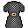

# { .sprite } Chainmail tunic
*Ordinary* · Chain mail · value 0 gold

**Slot:** body · **Size:** large

## When equipped

| Stat | Value |
|---|---|
| Attack chance | -4 |
| Block chance | +10 |
| Damage resistance | +1 |

## Sold by

- [Odirath](../monsters/stoutford_armorer.md)

Verified against v0.8.18 item data.

## Version history

| Version | Change |
|---|---|
| [v0.7.2](../versions/0.7.2.md) | Added |

Verified against v0.8.18 and every earlier release back to v0.7.0 (game data compared release by release).

<small>Item ID: `tunic_chainmail` · Data from v0.8.18</small>
