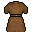

# { .sprite } Cloth tunic
*Ordinary* · Armor, cloth · value 0 gold

**Slot:** body

## When equipped

| Stat | Value |
|---|---|
| Attack chance | -2 |
| Block chance | +6 |

## Sold by

- [Quiet thief](../monsters/stoutford_thief.md)

Verified against v0.8.18 item data.

## Version history

| Version | Change |
|---|---|
| [v0.7.2](../versions/0.7.2.md) | Added |

Verified against v0.8.18 and every earlier release back to v0.7.0 (game data compared release by release).

<small>Item ID: `tunic_cloth` · Data from v0.8.18</small>
