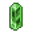

# { .sprite } Emerald
*Extraordinary* · Gem · value 12859 gold

> A flawless emerald prized by the noble houses of Feygard and Nor City, valued less for its rarity than for what its possession implies.

## Dropped by

| Monster | Chance | Qty |
|---|---|---|
| [Gilded dust](../monsters/gilded_dust.md) | 0.1% | 1 |

## Sold by

- [Shy Cora](../monsters/shy_cora.md)

Verified against v0.8.18 item data.

## Version history

| Version | Change |
|---|---|
| [v0.8.18](../versions/0.8.18.md) | Added |

Verified against v0.8.18 and every earlier release back to v0.7.0 (game data compared release by release).

<small>Item ID: `undertell_emerald` · Data from v0.8.18</small>
