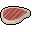

# { .sprite } Warg veal
*Ordinary* · Food · value 49 gold

> There's just something about meat from a young warg that makes it just a little bit better.

## When used

| Stat | Value |
|---|---|
| Heal HP | 1 to 2 |
| Restore AP | -1 to 1 |
| On self | Sustenance (magnitude 2, 8 rounds, 100% chance); Food-poisoning (magnitude 3, 6 rounds, 10% chance) |

## Dropped by

| Monster | Chance | Qty |
|---|---|---|
| [Orphaned warg pup](../monsters/orphaned_warg_pup.md) | 8% | 1 |
| [Galmore wolf's pup](../monsters/mg2_wolves_pup.md) | 8% | 1 |
| [Warg pup](../monsters/warg_pup.md) | 8% | 1 |

<small>Item ID: `warg_veal` · Data from v0.8.18</small>
