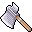

# { .sprite } Woodcutter's hatchet
*Ordinary* · Axe · value 0 gold

**Slot:** weapon · **Size:** std

## When equipped

| Stat | Value |
|---|---|
| Attack damage | 6 to 12 |
| Attack cost | +6 |
| Attack chance | +9 |
| setNonWeaponDamageModifier | +140 |

## Sold by

- [Hadracor](../monsters/hadracor.md)
- [Wood craftsman](../monsters/brv_woodcraftsman.md)

Verified against v0.8.18 item data.

## Version history

| Version | Change |
|---|---|
| [v0.7.0](../versions/0.7.0.md) | Present in v0.7.0 (earliest release tracked) |
| [v0.7.10](../versions/0.7.10.md) | equipEffect: {"increaseAttackChance": 9, "increaseAt… → {"increaseAttackChance": 9, "increaseAt… |

Verified against v0.8.18 and every earlier release back to v0.7.0 (game data compared release by release).

<small>Item ID: `woodcutter_hatchet` · Data from v0.8.18</small>
