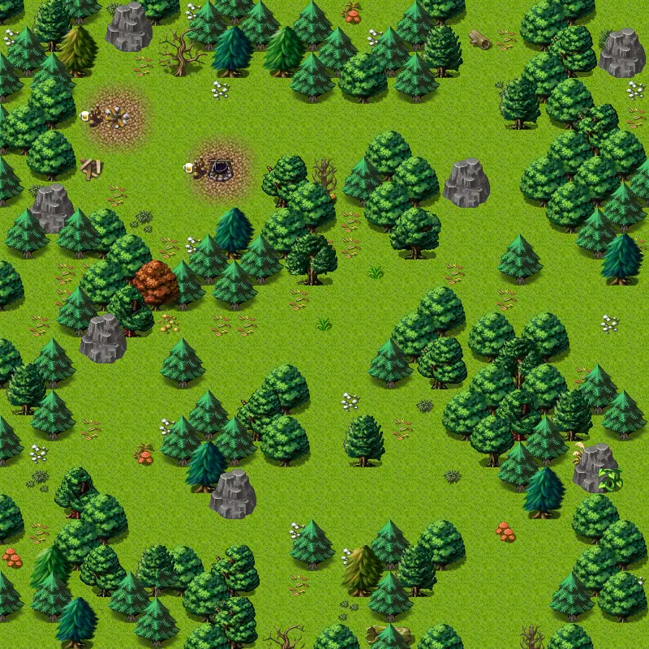

# Aidem camp

| | |
|---|---|
| **Map ID** | `aidem_camp` |
| **Type** | Indoors / underground |
| **Size** | 25×25 tiles |
| **World map** | [World 1](index.md) |
| **Introduced** | [v0.8.8](../versions/0.8.8.md) |
| **NPCs** | 5 |
| **Enemy types** | 3 |
| **Quests** | 1 |

**Aidem camp** is an indoor map. It has 5 NPCs and 3 kinds of enemy. Exits lead to Way to aidem camp 1.

## Map

<label class="lg"><input type="checkbox" data-t="spawn" checked><b>Red</b>&nbsp;Monsters / NPCs</label><label class="lg"><input type="checkbox" data-t="mapchange" checked><b>Blue</b>&nbsp;Exit to another map</label><label class="lg"><input type="checkbox" data-t="container" checked><b>Yellow</b>&nbsp;Container (click to see contents)</label><label class="lg"><input type="checkbox" data-t="sign" checked><b>Purple</b>&nbsp;Sign</label><label class="lg"><input type="checkbox" data-t="rest" checked><b>Green</b>&nbsp;Resting place</label><label class="lg"><input type="checkbox" data-t="key" checked><b>Orange dashed</b>&nbsp;Blocked until a quest step / item</label><label class="lg"><input type="checkbox" data-t="script"><b>Grey dotted</b>&nbsp;Scripted event</label><label class="lg"><input type="checkbox" data-t="replace"><b>White dotted</b>&nbsp;Changes during a quest</label><label class="lg"><input type="checkbox" data-t="pin" checked><b>Numbers</b>&nbsp;Numbered key points (see the key below the map)</label>

<a class="pin pin-exit" href="#key-1" style="left:76.000%;top:98.000%" title="Exit (south): to [Way to aidem camp 1](way_to_aidem_camp_1.md)">1</a><a id="pin-npc-aidem_camp_defy" class="pin pin-npc" href="#key-2" style="left:34.000%;top:18.000%" title="[Defy](../../monsters/g04_defy.md#v-aidem_camp_defy): 1 quest">2</a><a id="pin-npc-aidem_camp_grabby" class="pin pin-npc" href="#key-3" style="left:26.000%;top:30.000%" title="[Grabby](../../monsters/aidem_camp_grabby.md): NPC">3</a><a id="pin-npc-aidem_camp_greedy" class="pin pin-npc" href="#key-4" style="left:30.000%;top:30.000%" title="[Greedy](../../monsters/aidem_camp_greedy.md): NPC">4</a><a id="pin-npc-aidem_camp_lost_traveler" class="pin pin-npc" href="#key-5" style="left:30.000%;top:22.000%" title="[Lost Traveler](../../monsters/aidem_camp_lost_traveler.md): NPC">5</a><a id="pin-npc-aidem_camp_zachlanny" class="pin pin-npc" href="#key-6" style="left:38.000%;top:34.000%" title="[Zachlanny](../../monsters/aidem_camp_zachlanny.md): NPC">6</a><a class="pin pin-script" href="#key-7" style="left:12.000%;top:42.000%" title="Quest trigger: Scripted event: advances the quest: Wanted men to stage 10 (“Off the main road, southeast of Deebo&#x27;s Orchard, I&#x27;ve stumbled across a group of sketchy looking men with familiar voices.”)">7</a><a class="pin pin-script" href="#key-8" style="left:52.000%;top:36.000%" title="Quest trigger: Scripted event: advances the quest: Wanted men to stage 15 (“The sketchy looking men with familiar voices turned out to be the Aidem thieves from Sullengard. They were hiding-out in the woods.”)">8</a><a class="pin pin-script" href="#key-9" style="left:78.000%;top:34.000%" title="Quest trigger: Scripted event: advances the quest: hidden story flag “sullengard_hidden” to stage 41 (“the PC doesn&#x27;t have 39, so let them have access to the &quot;Aidem&quot; camp. Or the player does have 39 and has Wanted Men 15, then let them pass.”)">9</a><a class="pin pin-key" href="#key-10" style="left:78.000%;top:30.000%" title="Blocked passage: Unlocked during the quest: hidden story flag “sullengard_hidden” (stage 41: “the PC doesn&#x27;t have 39, so let them have access to the &quot;Aidem&quot; camp. Or the player does have 39 and has Wanted Men 15, then let them pass.”)">10</a>

??? abstract "Key to the numbers on the map"

    | # | What | Details |
    |---|---|---|
    | 1 | Exit (south) | to [Way to aidem camp 1](way_to_aidem_camp_1.md) |
    | 2 | [Defy](../monsters/g04_defy.md#v-aidem_camp_defy) | 1 quest |
    | 3 | [Grabby](../monsters/aidem_camp_grabby.md) | NPC |
    | 4 | [Greedy](../monsters/aidem_camp_greedy.md) | NPC |
    | 5 | [Lost Traveler](../monsters/aidem_camp_lost_traveler.md) | NPC |
    | 6 | [Zachlanny](../monsters/aidem_camp_zachlanny.md) | NPC |
    | 7 | Quest trigger | Scripted event: advances the quest: Wanted men to stage 10 (“Off the main road, southeast of Deebo's Orchard, I've stumbled across a group of sketchy looking men with familiar voices.”) |
    | 8 | Quest trigger | Scripted event: advances the quest: Wanted men to stage 15 (“The sketchy looking men with familiar voices turned out to be the Aidem thieves from Sullengard. They were hiding-out in the woods.”) |
    | 9 | Quest trigger | Scripted event: advances the quest: hidden story flag “sullengard_hidden” to stage 41 (“the PC doesn't have 39, so let them have access to the "Aidem" camp. Or the player does have 39 and has Wanted Men 15, then let them pass.”) |
    | 10 | Blocked passage | Unlocked during the quest: hidden story flag “sullengard_hidden” (stage 41: “the PC doesn't have 39, so let them have access to the "Aidem" camp. Or the player does have 39 and has Wanted Men 15, then let them pass.”) |

Verified against v0.8.18 map data.

## Connections

| Direction | Leads to | Region there | Map # |
|---|---|---|---|
| South | [Way to aidem camp 1](way_to_aidem_camp_1.md) | – | 1 |

## NPCs

- [Defy](../monsters/g04_defy.md#v-aidem_camp_defy) — quests: [Wanted men](../quests/wanted_men.md) (#2)
- [Grabby](../monsters/aidem_camp_grabby.md) (#3)
- [Greedy](../monsters/aidem_camp_greedy.md) (#4)
- [Lost Traveler](../monsters/aidem_camp_lost_traveler.md) (#5)
- [Zachlanny](../monsters/aidem_camp_zachlanny.md) (#6)

## Enemies

| Enemy | HP | Damage | Up to | Notes |
|---|---|---|---|---|
| [Preabola fly](../monsters/preabola_fly.md) | 109 | 9–11 | 2 | – |
| [Flying tree ant](../monsters/flying_tree_ant.md) | 119 | 9–15 | 4 | – |
| [Sullengard forest snake](../monsters/sullengard_venom_snake.md) | 148 | 15–22 | 2 | – |

<small>“Up to” is the most that can be alive at once from the spawn areas on this map.</small>

## Quests

- [Wanted men](../quests/wanted_men.md): [Defy](../monsters/g04_defy.md#v-aidem_camp_defy) is involved; a scripted event can trigger here from stage 15; something on this map advances it; stepping on a trigger here sets stage 10; stepping on a trigger here sets stage 15
- [Sullengard story flags (hidden flag)](../quests/sullengard_hidden.md): a scripted event can trigger here from stage 41; blocked passage opens at stage 41; something on this map advances it; stepping on a trigger here sets stage 41

## Points of interest

- **Quest trigger** (#7): Scripted event: advances the quest: Wanted men to stage 10 (“Off the main road, southeast of Deebo's Orchard, I've stumbled across a group of sketchy looking men with familiar voices.”)
- **Quest trigger** (#8): Scripted event: advances the quest: Wanted men to stage 15 (“The sketchy looking men with familiar voices turned out to be the Aidem thieves from Sullengard. They were hiding-out in the woods.”)
- **Quest trigger** (#9): Scripted event: advances the quest: hidden story flag “sullengard_hidden” to stage 41 (“the PC doesn't have 39, so let them have access to the "Aidem" camp. Or the player does have 39 and has Wanted Men 15, then let them pass.”)
- **Blocked passage** (#10): Unlocked during the quest: hidden story flag “sullengard_hidden” (stage 41: “the PC doesn't have 39, so let them have access to the "Aidem" camp. Or the player does have 39 and has Wanted Men 15, then let them pass.”)

## Version history

| Version | Change |
|---|---|
| [v0.8.8](../versions/0.8.8.md) | Added |

Verified against v0.8.18 and every earlier release back to v0.7.0 (game data compared release by release).

## Community notes

<small>Written by players, not generated from game data. **Observations**: what players notice in-game · **Lore**: the in-world story · **Trivia**: real-world facts, references, development history · **Theory / speculation**: unconfirmed ideas; may just be unfinished content</small>

### Observations

*No notes yet. Contributions are welcome: [add a note](https://github.com/asdfghjkl628/Andor-s-Trail-Wikiiii/new/main/notes/maps?filename=aidem_camp.md&value=%23%23%20Observations%0A%0A%3C%21--%20what%20players%20notice%20in-game%20--%3E%0A%0A%23%23%20Lore%0A%0A%3C%21--%20the%20in-world%20story%20--%3E%0A%0A%23%23%20Trivia%0A%0A%3C%21--%20real-world%20facts%2C%20references%2C%20development%20history%20--%3E%0A%0A%23%23%20Theory%20/%20speculation%0A%0A%3C%21--%20unconfirmed%20ideas%3B%20may%20just%20be%20unfinished%20content%20--%3E%0A).*

### Lore

*No notes yet. Contributions are welcome: [add a note](https://github.com/asdfghjkl628/Andor-s-Trail-Wikiiii/new/main/notes/maps?filename=aidem_camp.md&value=%23%23%20Observations%0A%0A%3C%21--%20what%20players%20notice%20in-game%20--%3E%0A%0A%23%23%20Lore%0A%0A%3C%21--%20the%20in-world%20story%20--%3E%0A%0A%23%23%20Trivia%0A%0A%3C%21--%20real-world%20facts%2C%20references%2C%20development%20history%20--%3E%0A%0A%23%23%20Theory%20/%20speculation%0A%0A%3C%21--%20unconfirmed%20ideas%3B%20may%20just%20be%20unfinished%20content%20--%3E%0A).*

### Trivia

*No notes yet. Contributions are welcome: [add a note](https://github.com/asdfghjkl628/Andor-s-Trail-Wikiiii/new/main/notes/maps?filename=aidem_camp.md&value=%23%23%20Observations%0A%0A%3C%21--%20what%20players%20notice%20in-game%20--%3E%0A%0A%23%23%20Lore%0A%0A%3C%21--%20the%20in-world%20story%20--%3E%0A%0A%23%23%20Trivia%0A%0A%3C%21--%20real-world%20facts%2C%20references%2C%20development%20history%20--%3E%0A%0A%23%23%20Theory%20/%20speculation%0A%0A%3C%21--%20unconfirmed%20ideas%3B%20may%20just%20be%20unfinished%20content%20--%3E%0A).*

### Theory / speculation

*No notes yet. Contributions are welcome: [add a note](https://github.com/asdfghjkl628/Andor-s-Trail-Wikiiii/new/main/notes/maps?filename=aidem_camp.md&value=%23%23%20Observations%0A%0A%3C%21--%20what%20players%20notice%20in-game%20--%3E%0A%0A%23%23%20Lore%0A%0A%3C%21--%20the%20in-world%20story%20--%3E%0A%0A%23%23%20Trivia%0A%0A%3C%21--%20real-world%20facts%2C%20references%2C%20development%20history%20--%3E%0A%0A%23%23%20Theory%20/%20speculation%0A%0A%3C%21--%20unconfirmed%20ideas%3B%20may%20just%20be%20unfinished%20content%20--%3E%0A).*

??? info "Technical information"

    | | |
    |---|---|
    | Map ID | `aidem_camp` |
    | File | `res/xml/aidem_camp.tmx` |
    | Size | 25×25 tiles (800×800 px) |
    | outdoors property | – |
    | Layers drawn | ground, objects, above, top |
    | Tilesets | map_bed_1, map_border_1, map_bridge_1, map_bridge_2, map_broken_1, map_cavewall_1, map_cavewall_2, map_cavewall_3, map_cavewall_4, map_chair_table_1, map_chair_table_2, map_crate_1, map_cupboard_1, map_curtain_1, map_entrance_1, map_entrance_2, map_fence_1, map_fence_2, map_fence_3, map_fence_4, map_ground_1, map_ground_2, map_ground_3, map_ground_4, map_ground_5, map_ground_6, map_ground_7, map_ground_8, map_house_1, map_house_2, map_indoor_1, map_indoor_2, map_kitchen_1, map_outdoor_1, map_pillar_1, map_pillar_2, map_plant_1, map_plant_2, map_rock_1, map_rock_2, map_roof_1, map_roof_2, map_roof_3, map_shop_1, map_sign_ladder_1, map_table_1, map_trail_1, map_transition_1, map_transition_2, map_transition_3, map_transition_4, map_transition_5, map_tree_1, map_tree_2, map_tree_3, map_wall_1, map_wall_2, map_wall_3, map_wall_4, map_window_1, map_window_2 |
    | Map objects | spawn: 8, script: 4, mapchange: 1, key: 1 |
    | World map position | segment `world1`, x 518, y 629 |

<small>Data from v0.8.18</small>
