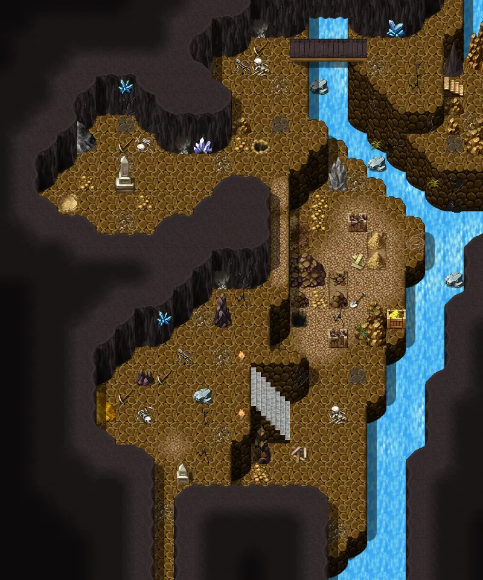

# Arulircave1

25×30 tiles · part of [Arulircave](index.md)

<label class="lg lg-spawn"><input type="checkbox" data-t="spawn" checked> Monsters / NPCs</label><label class="lg lg-mapchange"><input type="checkbox" data-t="mapchange" checked> Exit to another map</label><label class="lg lg-container"><input type="checkbox" data-t="container" checked> Container</label><label class="lg lg-sign"><input type="checkbox" data-t="sign" checked> Sign</label><label class="lg lg-rest"><input type="checkbox" data-t="rest" checked> Resting place</label><label class="lg lg-key"><input type="checkbox" data-t="key" checked> Blocked / needs key or quest</label><label class="lg lg-script"><input type="checkbox" data-t="script"> Scripted event</label><label class="lg lg-replace"><input type="checkbox" data-t="replace"> Changes after a quest</label>

## Exits

- [Arulircave2](arulircave2.md)
- [Arulircave3](arulircave3.md)
- [Arulirmountain1](arulirmountain1.md)

## Monsters & NPCs here

| Name | HP |
|---|---|
| [Cave Arulir](../monsters/arulir_3.md) | 365 |
| [Giant Cave Arulir](../monsters/arulir_4.md) | 380 |
| [Garnet Gornaud](../monsters/gornaud_5.md) | 385 |
| [Azurite Gornaud](../monsters/gornaud_4.md) | 390 |
| [Nephrite Gornaud](../monsters/gornaud_6.md) | 395 |

<small>Map ID: `arulircave1` · Data from v0.8.18</small>
