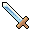

# Arulircave1

25×30 tiles · part of [Arulircave](index.md)

<label class="lg"><input type="checkbox" data-t="spawn" checked><b>Red</b>&nbsp;Monsters / NPCs</label><label class="lg"><input type="checkbox" data-t="mapchange" checked><b>Blue</b>&nbsp;Exit to another map</label><label class="lg"><input type="checkbox" data-t="container" checked><b>Yellow</b>&nbsp;Container (click to see contents)</label><label class="lg"><input type="checkbox" data-t="sign" checked><b>Purple</b>&nbsp;Sign</label><label class="lg"><input type="checkbox" data-t="rest" checked><b>Green</b>&nbsp;Resting place</label><label class="lg"><input type="checkbox" data-t="key" checked><b>Orange dashed</b>&nbsp;Blocked until a quest step / item</label><label class="lg"><input type="checkbox" data-t="script"><b>Grey dotted</b>&nbsp;Scripted event</label><label class="lg"><input type="checkbox" data-t="replace"><b>White dotted</b>&nbsp;Changes during a quest</label>

## Containers

<b>Container 1</b><ul><li><a href="../../items/gold/">Gold coins</a> <small>100% · ×100 to 300</small></li><li><a href="../../items/shirt1/">Cloth shirt</a> <small>100%</small></li><li><a href="../../items/ring1/">Mundane ring</a> <small>100%</small></li></ul>

<b>Container 2</b><ul><li><a href="../../items/rusted_iron_sword/">Rusted iron sword</a> <small>100% · ×1 to 3</small></li><li><a href="../../items/shield_cracked_wooden/">Cracked wooden buckler</a> <small>100% · ×1 to 2</small></li></ul>

## Exits

- [Arulircave2](arulircave2.md)
- [Arulircave3](arulircave3.md)
- [Arulirmountain1](arulirmountain1.md)

## Monsters & NPCs here

| Name | HP |
|---|---|
| [Cave Arulir](../monsters/arulir_3.md) | 365 |
| [Giant Cave Arulir](../monsters/arulir_4.md) | 380 |
| [Garnet Gornaud](../monsters/gornaud_5.md) | 385 |
| [Azurite Gornaud](../monsters/gornaud_4.md) | 390 |
| [Nephrite Gornaud](../monsters/gornaud_6.md) | 395 |

<small>Map ID: `arulircave1` · Data from v0.8.18</small>
