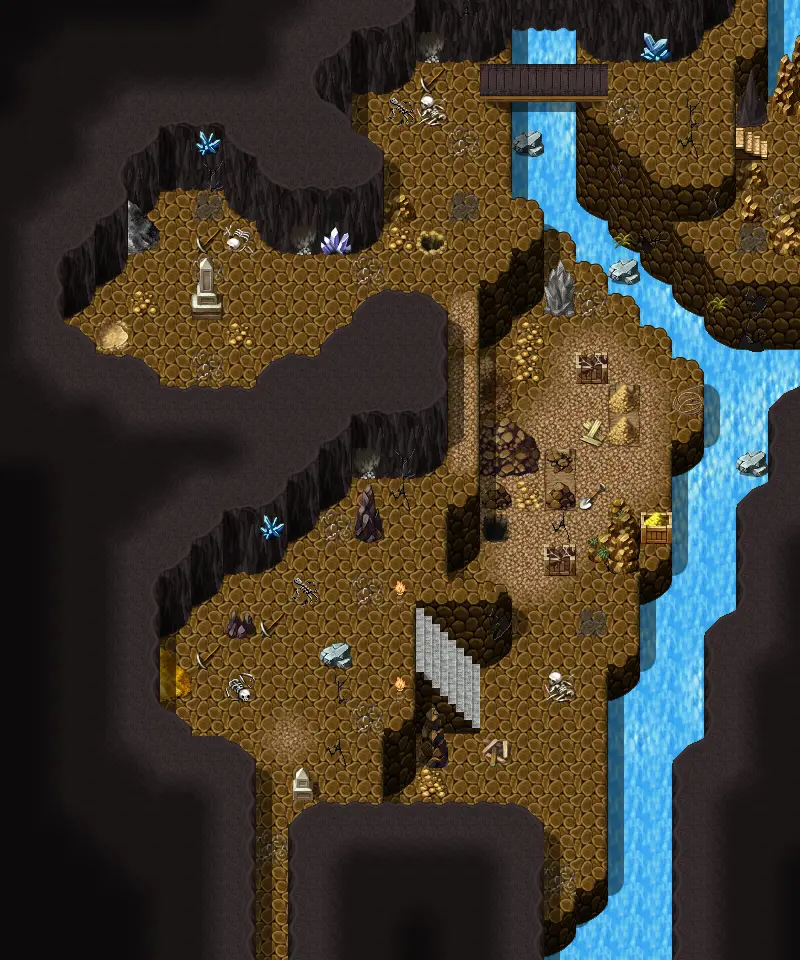

# Arulircave1

| | |
|---|---|
| **Map ID** | `arulircave1` |
| **Type** | Indoors / underground |
| **Size** | 25×30 tiles |
| **World map** | [Arulircave](index.md) |
| **Introduced** | [v0.7.8](../versions/0.7.8.md) |
| **Enemy types** | 5 |
| **Quests** | 0 |
| **Containers** | 2 |

**Arulircave1** is an indoor map. It has no NPCs and 5 kinds of enemy. Exits lead to Arulircave2, Arulircave3, Arulirmountain1.

## Map

<label class="lg"><input type="checkbox" data-t="spawn" checked><b>Red</b>&nbsp;Monsters / NPCs</label><label class="lg"><input type="checkbox" data-t="mapchange" checked><b>Blue</b>&nbsp;Exit to another map</label><label class="lg"><input type="checkbox" data-t="container" checked><b>Yellow</b>&nbsp;Container (click to see contents)</label><label class="lg"><input type="checkbox" data-t="sign" checked><b>Purple</b>&nbsp;Sign</label><label class="lg"><input type="checkbox" data-t="rest" checked><b>Green</b>&nbsp;Resting place</label><label class="lg"><input type="checkbox" data-t="key" checked><b>Orange dashed</b>&nbsp;Blocked until a quest step / item</label><label class="lg"><input type="checkbox" data-t="script"><b>Grey dotted</b>&nbsp;Scripted event</label><label class="lg"><input type="checkbox" data-t="replace"><b>White dotted</b>&nbsp;Changes during a quest</label><label class="lg"><input type="checkbox" data-t="pin" checked><b>Numbers</b>&nbsp;Numbered key points (see the key below the map)</label>

<a class="pin pin-exit" href="#key-1" style="left:94.000%;top:1.667%" title="Exit (northeast): to [Arulircave2](../arulircave2.md)">1</a><a class="pin pin-exit" href="#key-2" style="left:98.000%;top:16.667%" title="Exit (east): to [Arulircave3](../arulircave3.md)">2</a><a class="pin pin-exit" href="#key-3" style="left:34.000%;top:98.333%" title="Exit (south): to [Arulirmountain1](../arulirmountain1.md)">3</a><a class="pin pin-script" href="#key-4" style="left:42.000%;top:75.000%" title="Quest trigger: Scripted event: advances the quest: hidden story flag “arulircave_trap” to stage 1 (“01=Hole”)">4</a><a class="pin pin-script" href="#key-5" style="left:42.000%;top:31.667%" title="Quest trigger: Scripted event: advances the quest: hidden story flag “arulircave_trap” to stage 2 (“02=Rocks”)">5</a><a class="pin pin-script" href="#key-6" style="left:38.000%;top:35.000%" title="Quest trigger: Scripted event: advances the quest: hidden story flag “arulircave_trap” to stage 3 (“03=Rocks”)">6</a><a class="pin pin-script" href="#key-7" style="left:82.000%;top:15.000%" title="Quest trigger: Scripted event: advances the quest: hidden story flag “arulircave_trap” to stage 4 (“04=Hole”)">7</a><a class="pin pin-script" href="#key-8" style="left:18.000%;top:28.333%" title="Quest trigger: Scripted event: advances the quest: hidden story flag “arulircave_trap” to stage 5 (“05=Rocks”)">8</a><a class="pin pin-container" href="#key-9" style="left:82.000%;top:55.000%" title="Container 1: Gold coins, Cloth shirt, Mundane ring">9</a><a class="pin pin-container" href="#key-10" style="left:74.000%;top:38.333%" title="Container 2: Rusted iron sword, Cracked wooden buckler">10</a><a class="pin pin-script" href="#key-11" style="left:14.000%;top:31.667%" title="Quest trigger: Scripted event: advances the quest: hidden story flag “brightport_nondisplay” to stage 216 (“Remove rock for arulir cave 3”)">11</a><a class="pin pin-script" href="#key-12" style="left:78.000%;top:48.333%" title="Quest trigger: Scripted event: advances the quest: hidden story flag “brightport_nondisplay” to stage 215 (“Remove rock for arulir cave 2”)">12</a><a class="pin pin-script" href="#key-13" style="left:38.000%;top:68.333%" title="Quest trigger: Scripted event: advances the quest: hidden story flag “brightport_nondisplay” to stage 214 (“Remove rock for arulir cave 1”)">13</a><a class="pin pin-key" href="#key-14" style="left:42.263%;top:72.500%" title="Blocked passage: Closed off once you reach this point in the quest: hidden story flag “arulircave_trap” (stage 1: “01=Hole”)">14</a><a class="pin pin-key" href="#key-15" style="left:42.263%;top:29.167%" title="Blocked passage: Closed off once you reach this point in the quest: hidden story flag “arulircave_trap” (stage 2: “02=Rocks”)">15</a><a class="pin pin-key" href="#key-16" style="left:38.263%;top:32.500%" title="Blocked passage: Closed off once you reach this point in the quest: hidden story flag “arulircave_trap” (stage 3: “03=Rocks”)">16</a><a class="pin pin-key" href="#key-17" style="left:82.263%;top:12.500%" title="Blocked passage: Closed off once you reach this point in the quest: hidden story flag “arulircave_trap” (stage 4: “04=Hole”)">17</a><a class="pin pin-key" href="#key-18" style="left:18.263%;top:25.834%" title="Blocked passage: Closed off once you reach this point in the quest: hidden story flag “arulircave_trap” (stage 5: “05=Rocks”)">18</a><a class="pin pin-replace" href="#key-19" style="left:38.263%;top:65.834%" title="Changes during a quest: This area changes during the quest: hidden story flag “brightport_nondisplay” (stage 214: “Remove rock for arulir cave 1”)">19</a><a class="pin pin-replace" href="#key-20" style="left:78.263%;top:45.834%" title="Changes during a quest: This area changes during the quest: hidden story flag “brightport_nondisplay” (stage 215: “Remove rock for arulir cave 2”)">20</a><a class="pin pin-replace" href="#key-21" style="left:14.263%;top:29.167%" title="Changes during a quest: This area changes during the quest: hidden story flag “brightport_nondisplay” (stage 216: “Remove rock for arulir cave 3”)">21</a><a class="pin pin-replace" href="#key-22" style="left:40.018%;top:70.527%" title="Changes during a quest: This area changes during the quest: hidden story flag “brightport_nondisplay” (stage 176: “arulir1”)">22</a><a class="pin pin-replace" href="#key-23" style="left:80.018%;top:50.527%" title="Changes during a quest: This area changes during the quest: hidden story flag “brightport_nondisplay” (stage 177: “arulir2”)">23</a><a class="pin pin-replace" href="#key-24" style="left:16.018%;top:33.860%" title="Changes during a quest: This area changes during the quest: hidden story flag “brightport_nondisplay” (stage 178: “arulir3”)">24</a>

??? abstract "Key to the numbers on the map"

    | # | What | Details |
    |---|---|---|
    | 1 | Exit (northeast) | to [Arulircave2](../arulircave2.md) |
    | 2 | Exit (east) | to [Arulircave3](../arulircave3.md) |
    | 3 | Exit (south) | to [Arulirmountain1](../arulirmountain1.md) |
    | 4 | Quest trigger | Scripted event: advances the quest: hidden story flag “arulircave_trap” to stage 1 (“01=Hole”) |
    | 5 | Quest trigger | Scripted event: advances the quest: hidden story flag “arulircave_trap” to stage 2 (“02=Rocks”) |
    | 6 | Quest trigger | Scripted event: advances the quest: hidden story flag “arulircave_trap” to stage 3 (“03=Rocks”) |
    | 7 | Quest trigger | Scripted event: advances the quest: hidden story flag “arulircave_trap” to stage 4 (“04=Hole”) |
    | 8 | Quest trigger | Scripted event: advances the quest: hidden story flag “arulircave_trap” to stage 5 (“05=Rocks”) |
    | 9 | Container 1 | Gold coins, Cloth shirt, Mundane ring |
    | 10 | Container 2 | Rusted iron sword, Cracked wooden buckler |
    | 11 | Quest trigger | Scripted event: advances the quest: hidden story flag “brightport_nondisplay” to stage 216 (“Remove rock for arulir cave 3”) |
    | 12 | Quest trigger | Scripted event: advances the quest: hidden story flag “brightport_nondisplay” to stage 215 (“Remove rock for arulir cave 2”) |
    | 13 | Quest trigger | Scripted event: advances the quest: hidden story flag “brightport_nondisplay” to stage 214 (“Remove rock for arulir cave 1”) |
    | 14 | Blocked passage | Closed off once you reach this point in the quest: hidden story flag “arulircave_trap” (stage 1: “01=Hole”) |
    | 15 | Blocked passage | Closed off once you reach this point in the quest: hidden story flag “arulircave_trap” (stage 2: “02=Rocks”) |
    | 16 | Blocked passage | Closed off once you reach this point in the quest: hidden story flag “arulircave_trap” (stage 3: “03=Rocks”) |
    | 17 | Blocked passage | Closed off once you reach this point in the quest: hidden story flag “arulircave_trap” (stage 4: “04=Hole”) |
    | 18 | Blocked passage | Closed off once you reach this point in the quest: hidden story flag “arulircave_trap” (stage 5: “05=Rocks”) |
    | 19 | Changes during a quest | This area changes during the quest: hidden story flag “brightport_nondisplay” (stage 214: “Remove rock for arulir cave 1”) |
    | 20 | Changes during a quest | This area changes during the quest: hidden story flag “brightport_nondisplay” (stage 215: “Remove rock for arulir cave 2”) |
    | 21 | Changes during a quest | This area changes during the quest: hidden story flag “brightport_nondisplay” (stage 216: “Remove rock for arulir cave 3”) |
    | 22 | Changes during a quest | This area changes during the quest: hidden story flag “brightport_nondisplay” (stage 176: “arulir1”) |
    | 23 | Changes during a quest | This area changes during the quest: hidden story flag “brightport_nondisplay” (stage 177: “arulir2”) |
    | 24 | Changes during a quest | This area changes during the quest: hidden story flag “brightport_nondisplay” (stage 178: “arulir3”) |

Verified against v0.8.18 map data.

## Connections

| Direction | Leads to | Region there | Map # |
|---|---|---|---|
| Northeast | [Arulircave2](arulircave2.md) | – | 1 |
| East | [Arulircave3](arulircave3.md) | – | 2 |
| South | [Arulirmountain1](arulirmountain1.md) | – | 3 |

## Enemies

| Enemy | HP | Damage | Up to | Notes |
|---|---|---|---|---|
| [Cave Arulir](../monsters/arulir_3.md) | 365 | 3–22 | 18 | shares spawn with Giant Cave Arulir |
| [Giant Cave Arulir](../monsters/arulir_4.md) | 380 | 3–22 | 18 | shares spawn with Cave Arulir |
| [Garnet Gornaud](../monsters/gornaud_5.md) | 385 | 7–23 | 2 | shares spawn with Azurite Gornaud, Nephrite Gornaud |
| [Azurite Gornaud](../monsters/gornaud_4.md) | 390 | 7–23 | 2 | shares spawn with Garnet Gornaud, Nephrite Gornaud |
| [Nephrite Gornaud](../monsters/gornaud_6.md) | 395 | 7–23 | 2 | shares spawn with Azurite Gornaud, Garnet Gornaud |

<small>“Up to” is the most that can be alive at once from the spawn areas on this map.</small>

## Items & containers

<b>Container 1</b><ul><li><a href="../../items/gold/">Gold coins</a> <small>100% · ×100 to 300</small></li><li><a href="../../items/shirt1/">Cloth shirt</a> <small>100%</small></li><li><a href="../../items/ring1/">Mundane ring</a> <small>100%</small></li></ul>

<b>Container 2</b><ul><li><a href="../../items/rusted_iron_sword/">Rusted iron sword</a> <small>100% · ×1 to 3</small></li><li><a href="../../items/shield_cracked_wooden/">Cracked wooden buckler</a> <small>100% · ×1 to 2</small></li></ul>

## Quests

- [Arulir Cave Traps (hidden flag)](../quests/arulircave_trap.md): blocked passage closes at stage 1; blocked passage closes at stage 2; blocked passage closes at stage 3; blocked passage closes at stage 4; blocked passage closes at stage 5; something on this map advances it; stepping on a trigger here sets stage 1; stepping on a trigger here sets stage 2; stepping on a trigger here sets stage 3; stepping on a trigger here sets stage 4; stepping on a trigger here sets stage 5
- [brightport_nondisplay (hidden flag)](../quests/brightport_nondisplay.md): part of the map changes at stage 176; part of the map changes at stage 177; part of the map changes at stage 178; part of the map changes at stage 214; part of the map changes at stage 215; part of the map changes at stage 216; something on this map advances it; stepping on a trigger here sets stage 214; stepping on a trigger here sets stage 215; stepping on a trigger here sets stage 216

## Points of interest

- **Quest trigger** (#4): Scripted event: advances the quest: hidden story flag “arulircave_trap” to stage 1 (“01=Hole”)
- **Quest trigger** (#5): Scripted event: advances the quest: hidden story flag “arulircave_trap” to stage 2 (“02=Rocks”)
- **Quest trigger** (#6): Scripted event: advances the quest: hidden story flag “arulircave_trap” to stage 3 (“03=Rocks”)
- **Quest trigger** (#7): Scripted event: advances the quest: hidden story flag “arulircave_trap” to stage 4 (“04=Hole”)
- **Quest trigger** (#8): Scripted event: advances the quest: hidden story flag “arulircave_trap” to stage 5 (“05=Rocks”)
- **Quest trigger** (#11): Scripted event: advances the quest: hidden story flag “brightport_nondisplay” to stage 216 (“Remove rock for arulir cave 3”)
- **Quest trigger** (#12): Scripted event: advances the quest: hidden story flag “brightport_nondisplay” to stage 215 (“Remove rock for arulir cave 2”)
- **Quest trigger** (#13): Scripted event: advances the quest: hidden story flag “brightport_nondisplay” to stage 214 (“Remove rock for arulir cave 1”)
- **Blocked passage** (#14): Closed off once you reach this point in the quest: hidden story flag “arulircave_trap” (stage 1: “01=Hole”)
- **Blocked passage** (#15): Closed off once you reach this point in the quest: hidden story flag “arulircave_trap” (stage 2: “02=Rocks”)
- **Blocked passage** (#16): Closed off once you reach this point in the quest: hidden story flag “arulircave_trap” (stage 3: “03=Rocks”)
- **Blocked passage** (#17): Closed off once you reach this point in the quest: hidden story flag “arulircave_trap” (stage 4: “04=Hole”)
- **Blocked passage** (#18): Closed off once you reach this point in the quest: hidden story flag “arulircave_trap” (stage 5: “05=Rocks”)
- **Changes during a quest** (#19): This area changes during the quest: hidden story flag “brightport_nondisplay” (stage 214: “Remove rock for arulir cave 1”)
- **Changes during a quest** (#20): This area changes during the quest: hidden story flag “brightport_nondisplay” (stage 215: “Remove rock for arulir cave 2”)
- **Changes during a quest** (#21): This area changes during the quest: hidden story flag “brightport_nondisplay” (stage 216: “Remove rock for arulir cave 3”)
- **Changes during a quest** (#22): This area changes during the quest: hidden story flag “brightport_nondisplay” (stage 176: “arulir1”)
- **Changes during a quest** (#23): This area changes during the quest: hidden story flag “brightport_nondisplay” (stage 177: “arulir2”)
- **Changes during a quest** (#24): This area changes during the quest: hidden story flag “brightport_nondisplay” (stage 178: “arulir3”)

## Version history

| Version | Change |
|---|---|
| [v0.7.8](../versions/0.7.8.md) | Added |
| [v0.8.7](../versions/0.8.7.md) | map layout or objects changed |
| [v0.8.12.1](../versions/0.8.12.1.md) | map layout or objects changed |
| [v0.8.16.1](../versions/0.8.16.1.md) | map layout or objects changed |

Verified against v0.8.18 and every earlier release back to v0.7.0 (game data compared release by release).

## Community notes

<small>Written by players, not generated from game data. **Observations**: what players notice in-game · **Lore**: the in-world story · **Trivia**: real-world facts, references, development history · **Theory / speculation**: unconfirmed ideas; may just be unfinished content</small>

### Observations

*Nothing here yet. Know something? [Add it](https://github.com/asdfghjkl628/Andor-s-Trail-Wikiiii/new/main/notes/maps?filename=arulircave1.md&value=%23%23%20Observations%0A%0A%3C%21--%20what%20players%20notice%20in-game%20--%3E%0A%0A%23%23%20Lore%0A%0A%3C%21--%20the%20in-world%20story%20--%3E%0A%0A%23%23%20Trivia%0A%0A%3C%21--%20real-world%20facts%2C%20references%2C%20development%20history%20--%3E%0A%0A%23%23%20Theory%20/%20speculation%0A%0A%3C%21--%20unconfirmed%20ideas%3B%20may%20just%20be%20unfinished%20content%20--%3E%0A).*

### Lore

*Nothing here yet. Know something? [Add it](https://github.com/asdfghjkl628/Andor-s-Trail-Wikiiii/new/main/notes/maps?filename=arulircave1.md&value=%23%23%20Observations%0A%0A%3C%21--%20what%20players%20notice%20in-game%20--%3E%0A%0A%23%23%20Lore%0A%0A%3C%21--%20the%20in-world%20story%20--%3E%0A%0A%23%23%20Trivia%0A%0A%3C%21--%20real-world%20facts%2C%20references%2C%20development%20history%20--%3E%0A%0A%23%23%20Theory%20/%20speculation%0A%0A%3C%21--%20unconfirmed%20ideas%3B%20may%20just%20be%20unfinished%20content%20--%3E%0A).*

### Trivia

*Nothing here yet. Know something? [Add it](https://github.com/asdfghjkl628/Andor-s-Trail-Wikiiii/new/main/notes/maps?filename=arulircave1.md&value=%23%23%20Observations%0A%0A%3C%21--%20what%20players%20notice%20in-game%20--%3E%0A%0A%23%23%20Lore%0A%0A%3C%21--%20the%20in-world%20story%20--%3E%0A%0A%23%23%20Trivia%0A%0A%3C%21--%20real-world%20facts%2C%20references%2C%20development%20history%20--%3E%0A%0A%23%23%20Theory%20/%20speculation%0A%0A%3C%21--%20unconfirmed%20ideas%3B%20may%20just%20be%20unfinished%20content%20--%3E%0A).*

### Theory / speculation

*Nothing here yet. Know something? [Add it](https://github.com/asdfghjkl628/Andor-s-Trail-Wikiiii/new/main/notes/maps?filename=arulircave1.md&value=%23%23%20Observations%0A%0A%3C%21--%20what%20players%20notice%20in-game%20--%3E%0A%0A%23%23%20Lore%0A%0A%3C%21--%20the%20in-world%20story%20--%3E%0A%0A%23%23%20Trivia%0A%0A%3C%21--%20real-world%20facts%2C%20references%2C%20development%20history%20--%3E%0A%0A%23%23%20Theory%20/%20speculation%0A%0A%3C%21--%20unconfirmed%20ideas%3B%20may%20just%20be%20unfinished%20content%20--%3E%0A).*

??? info "Technical information"

    | | |
    |---|---|
    | Map ID | `arulircave1` |
    | File | `res/xml/arulircave1.tmx` |
    | Size | 25×30 tiles (800×960 px) |
    | outdoors property | – |
    | Layers drawn | ground, objects, above, top |
    | Tilesets | map_bed_1, map_border_1, map_bridge_1, map_bridge_2, map_broken_1, map_cavewall_1, map_cavewall_2, map_cavewall_3, map_cavewall_4, map_chair_table_1, map_chair_table_2, map_crate_1, map_cupboard_1, map_curtain_1, map_entrance_1, map_entrance_2, map_fence_1, map_fence_2, map_fence_3, map_fence_4, map_ground_1, map_ground_2, map_ground_3, map_ground_4, map_ground_5, map_ground_6, map_ground_7, map_ground_8, map_house_1, map_house_2, map_indoor_1, map_indoor_2, map_kitchen_1, map_outdoor_1, map_pillar_1, map_pillar_2, map_plant_1, map_plant_2, map_rock_1, map_rock_2, map_roof_1, map_roof_2, map_roof_3, map_shop_1, map_sign_ladder_1, map_table_1, map_trail_1, map_transition_1, map_transition_2, map_transition_3, map_transition_4, map_transition_5, map_tree_1, map_tree_2, map_wall_1, map_wall_2, map_wall_3, map_wall_4, map_window_1, map_window_2 |
    | Map objects | spawn: 12, replace: 11, script: 8, key: 5, mapchange: 3, container: 2 |
    | World map position | segment `arulircave`, x 2, y 45 |

<small>Data from v0.8.18</small>
