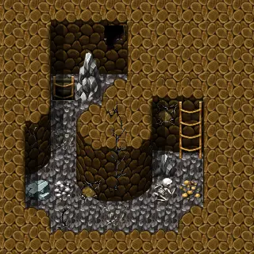

# Arulircave4

| | |
|---|---|
| **Map ID** | `arulircave4` |
| **Type** | Indoors / underground |
| **Size** | 10×10 tiles |
| **World map** | [Arulircave](index.md) |
| **Introduced** | [v0.7.8](../versions/0.7.8.md) |
| **Enemy types** | 2 |
| **Quests** | 0 |

**Arulircave4** is an indoor map. It has no NPCs and 2 kinds of enemy. Exits lead to Arulircave3, Arulircave5.

## Map

<label class="lg"><input type="checkbox" data-t="spawn" checked><b>Red</b>&nbsp;Monsters / NPCs</label><label class="lg"><input type="checkbox" data-t="mapchange" checked><b>Blue</b>&nbsp;Exit to another map</label><label class="lg"><input type="checkbox" data-t="container" checked><b>Yellow</b>&nbsp;Container (click to see contents)</label><label class="lg"><input type="checkbox" data-t="sign" checked><b>Purple</b>&nbsp;Sign</label><label class="lg"><input type="checkbox" data-t="rest" checked><b>Green</b>&nbsp;Resting place</label><label class="lg"><input type="checkbox" data-t="key" checked><b>Orange dashed</b>&nbsp;Blocked until a quest step / item</label><label class="lg"><input type="checkbox" data-t="script"><b>Grey dotted</b>&nbsp;Scripted event</label><label class="lg"><input type="checkbox" data-t="replace"><b>White dotted</b>&nbsp;Changes during a quest</label><label class="lg"><input type="checkbox" data-t="pin" checked><b>Numbers</b>&nbsp;Numbered key points (see the key below the map)</label>

<a class="pin pin-exit" href="#key-1" style="left:75.000%;top:45.000%" title="Exit (stairs / passage): to [Arulircave3](arulircave3.md)">1</a><a class="pin pin-exit" href="#key-2" style="left:25.000%;top:35.000%" title="Exit (stairs / passage): to [Arulircave5](arulircave5.md)">2</a><a class="pin pin-script" href="#key-3" style="left:25.000%;top:65.000%" title="Quest trigger: Scripted event: advances the quest: hidden story flag “brightport_nondisplay” to stage 219 (“Remove rock for arulir cave 6”)">3</a><a class="pin pin-replace" href="#key-4" style="left:25.658%;top:57.501%" title="Changes during a quest: This area changes during the quest: hidden story flag “brightport_nondisplay” (stage 181: “arulir6”)">4</a><a class="pin pin-replace" href="#key-5" style="left:30.046%;top:71.581%" title="Changes during a quest: This area changes during the quest: hidden story flag “brightport_nondisplay” (stage 219: “Remove rock for arulir cave 6”)">5</a>

??? abstract "Key to the numbers on the map"

    | # | What | Details |
    |---|---|---|
    | 1 | Exit (stairs / passage) | to [Arulircave3](arulircave3.md) |
    | 2 | Exit (stairs / passage) | to [Arulircave5](arulircave5.md) |
    | 3 | Quest trigger | Scripted event: advances the quest: hidden story flag “brightport_nondisplay” to stage 219 (“Remove rock for arulir cave 6”) |
    | 4 | Changes during a quest | This area changes during the quest: hidden story flag “brightport_nondisplay” (stage 181: “arulir6”) |
    | 5 | Changes during a quest | This area changes during the quest: hidden story flag “brightport_nondisplay” (stage 219: “Remove rock for arulir cave 6”) |

Verified against v0.8.18 map data.

## Connections

| Direction | Leads to | Region there | Map # |
|---|---|---|---|
| Stairs / passage | [Arulircave3](arulircave3.md) | – | 1 |
| Stairs / passage | [Arulircave5](arulircave5.md) | – | 2 |

## Enemies

| Enemy | HP | Damage | Up to | Notes |
|---|---|---|---|---|
| [Golden Arulir](../monsters/arulir_5.md) | 403 | 4–25 | 4 | shares spawn with Giant Golden Arulir |
| [Giant Golden Arulir](../monsters/arulir_6.md) | 501 | 4–27 | 4 | shares spawn with Golden Arulir |

<small>“Up to” is the most that can be alive at once from the spawn areas on this map.</small>

## Quests

- [brightport_nondisplay (hidden flag)](../quests/brightport_nondisplay.md): part of the map changes at stage 181; part of the map changes at stage 219; something on this map advances it; stepping on a trigger here sets stage 219

## Points of interest

- **Quest trigger** (#3): Scripted event: advances the quest: hidden story flag “brightport_nondisplay” to stage 219 (“Remove rock for arulir cave 6”)
- **Changes during a quest** (#4): This area changes during the quest: hidden story flag “brightport_nondisplay” (stage 181: “arulir6”)
- **Changes during a quest** (#5): This area changes during the quest: hidden story flag “brightport_nondisplay” (stage 219: “Remove rock for arulir cave 6”)

## Version history

| Version | Change |
|---|---|
| [v0.7.8](../versions/0.7.8.md) | Added |
| [v0.8.16.1](../versions/0.8.16.1.md) | map layout or objects changed |

Verified against v0.8.18 and every earlier release back to v0.7.0 (game data compared release by release).

## Community notes

<small>Written by players, not generated from game data. **Observations**: what players notice in-game · **Lore**: the in-world story · **Trivia**: real-world facts, references, development history · **Theory / speculation**: unconfirmed ideas; may just be unfinished content</small>

### Observations

*No notes yet. Contributions are welcome: [add a note](https://github.com/asdfghjkl628/Andor-s-Trail-Wikiiii/new/main/notes/maps?filename=arulircave4.md&value=%23%23%20Observations%0A%0A%3C%21--%20what%20players%20notice%20in-game%20--%3E%0A%0A%23%23%20Lore%0A%0A%3C%21--%20the%20in-world%20story%20--%3E%0A%0A%23%23%20Trivia%0A%0A%3C%21--%20real-world%20facts%2C%20references%2C%20development%20history%20--%3E%0A%0A%23%23%20Theory%20/%20speculation%0A%0A%3C%21--%20unconfirmed%20ideas%3B%20may%20just%20be%20unfinished%20content%20--%3E%0A).*

### Lore

*No notes yet. Contributions are welcome: [add a note](https://github.com/asdfghjkl628/Andor-s-Trail-Wikiiii/new/main/notes/maps?filename=arulircave4.md&value=%23%23%20Observations%0A%0A%3C%21--%20what%20players%20notice%20in-game%20--%3E%0A%0A%23%23%20Lore%0A%0A%3C%21--%20the%20in-world%20story%20--%3E%0A%0A%23%23%20Trivia%0A%0A%3C%21--%20real-world%20facts%2C%20references%2C%20development%20history%20--%3E%0A%0A%23%23%20Theory%20/%20speculation%0A%0A%3C%21--%20unconfirmed%20ideas%3B%20may%20just%20be%20unfinished%20content%20--%3E%0A).*

### Trivia

*No notes yet. Contributions are welcome: [add a note](https://github.com/asdfghjkl628/Andor-s-Trail-Wikiiii/new/main/notes/maps?filename=arulircave4.md&value=%23%23%20Observations%0A%0A%3C%21--%20what%20players%20notice%20in-game%20--%3E%0A%0A%23%23%20Lore%0A%0A%3C%21--%20the%20in-world%20story%20--%3E%0A%0A%23%23%20Trivia%0A%0A%3C%21--%20real-world%20facts%2C%20references%2C%20development%20history%20--%3E%0A%0A%23%23%20Theory%20/%20speculation%0A%0A%3C%21--%20unconfirmed%20ideas%3B%20may%20just%20be%20unfinished%20content%20--%3E%0A).*

### Theory / speculation

*No notes yet. Contributions are welcome: [add a note](https://github.com/asdfghjkl628/Andor-s-Trail-Wikiiii/new/main/notes/maps?filename=arulircave4.md&value=%23%23%20Observations%0A%0A%3C%21--%20what%20players%20notice%20in-game%20--%3E%0A%0A%23%23%20Lore%0A%0A%3C%21--%20the%20in-world%20story%20--%3E%0A%0A%23%23%20Trivia%0A%0A%3C%21--%20real-world%20facts%2C%20references%2C%20development%20history%20--%3E%0A%0A%23%23%20Theory%20/%20speculation%0A%0A%3C%21--%20unconfirmed%20ideas%3B%20may%20just%20be%20unfinished%20content%20--%3E%0A).*

??? info "Technical information"

    | | |
    |---|---|
    | Map ID | `arulircave4` |
    | File | `res/xml/arulircave4.tmx` |
    | Size | 10×10 tiles (320×320 px) |
    | outdoors property | – |
    | Layers drawn | ground, objects, above |
    | Tilesets | map_bed_1, map_border_1, map_bridge_1, map_bridge_2, map_broken_1, map_cavewall_1, map_cavewall_2, map_cavewall_3, map_cavewall_4, map_chair_table_1, map_chair_table_2, map_crate_1, map_cupboard_1, map_curtain_1, map_entrance_1, map_entrance_2, map_fence_1, map_fence_2, map_fence_3, map_fence_4, map_ground_1, map_ground_2, map_ground_3, map_ground_4, map_ground_5, map_ground_6, map_ground_7, map_ground_8, map_house_1, map_house_2, map_indoor_1, map_indoor_2, map_kitchen_1, map_outdoor_1, map_pillar_1, map_pillar_2, map_plant_1, map_plant_2, map_rock_1, map_rock_2, map_roof_1, map_roof_2, map_roof_3, map_shop_1, map_sign_ladder_1, map_table_1, map_trail_1, map_transition_1, map_transition_2, map_transition_3, map_transition_4, map_tree_1, map_tree_2, map_wall_1, map_wall_2, map_wall_3, map_wall_4, map_window_1, map_window_2 |
    | Map objects | spawn: 3, mapchange: 2, replace: 2, script: 1 |
    | World map position | segment `arulircave`, x 32, y 61 |

<small>Data from v0.8.18</small>
