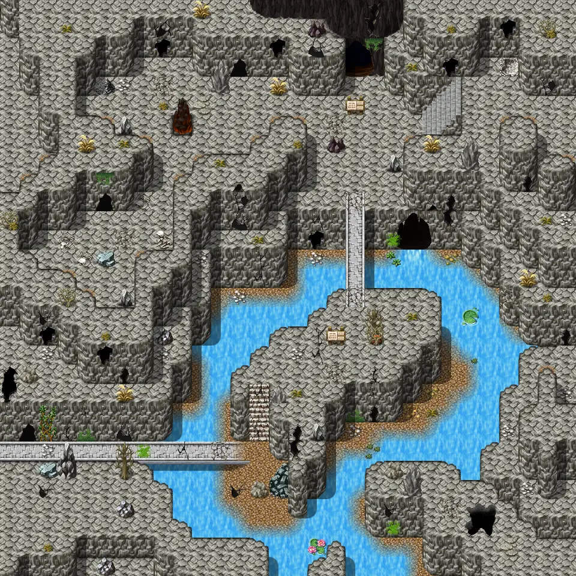

# Arulirmountain1

30×30 tiles · outdoors · part of [World1](index.md)

<label class="lg lg-spawn"><input type="checkbox" data-t="spawn" checked> Monsters / NPCs</label><label class="lg lg-mapchange"><input type="checkbox" data-t="mapchange" checked> Exit to another map</label><label class="lg lg-container"><input type="checkbox" data-t="container" checked> Container</label><label class="lg lg-sign"><input type="checkbox" data-t="sign" checked> Sign</label><label class="lg lg-rest"><input type="checkbox" data-t="rest" checked> Resting place</label><label class="lg lg-key"><input type="checkbox" data-t="key" checked> Blocked / needs key or quest</label><label class="lg lg-script"><input type="checkbox" data-t="script"> Scripted event</label><label class="lg lg-replace"><input type="checkbox" data-t="replace"> Changes after a quest</label>

## Exits

- [Arulircave1](arulircave1.md)
- [Arulirmountain2](arulirmountain2.md)
- [Mountainlake5](mountainlake5.md)

## Monsters & NPCs here

| Name | HP |
|---|---|
| [Bernhar](../monsters/bernhar.md) | 0 |
| [Arulir](../monsters/arulir_1.md) | 325 |
| [Giant arulir](../monsters/arulir_2.md) | 330 |
| [Cave Arulir](../monsters/arulir_3.md) | 365 |
| [Giant Cave Arulir](../monsters/arulir_4.md) | 380 |
| [Garnet Gornaud](../monsters/gornaud_5.md) | 385 |
| [Azurite Gornaud](../monsters/gornaud_4.md) | 390 |
| [Nephrite Gornaud](../monsters/gornaud_6.md) | 395 |

<small>Map ID: `arulirmountain1` · Data from v0.8.18</small>
