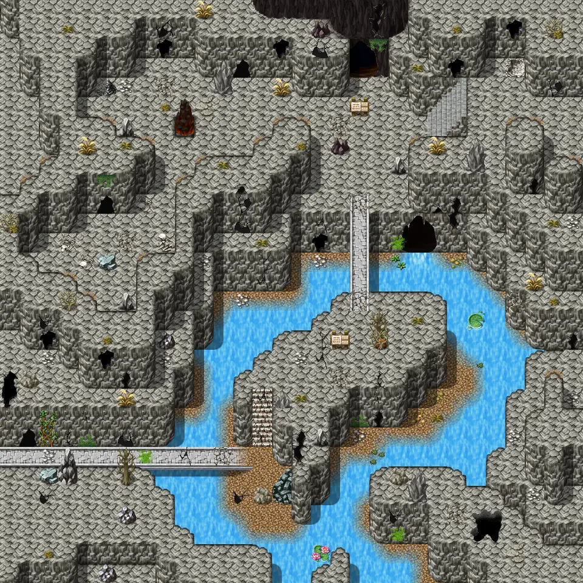

# Arulirmountain1

| | |
|---|---|
| **Map ID** | `arulirmountain1` |
| **Type** | Outdoors |
| **Size** | 30×30 tiles |
| **World map** | [World1](index.md) |
| **Introduced** | [v0.7.8](../versions/0.7.8.md) |
| **NPCs** | 1 |
| **Enemy types** | 7 |
| **Quests** | 3 |
| **Containers** | 2 |

**Arulirmountain1** is an outdoor map. It has 1 NPC and 7 kinds of enemy. Exits lead to Arulirmountain2, Mountainlake5, Arulircave1.

## Map

<label class="lg"><input type="checkbox" data-t="spawn" checked><b>Red</b>&nbsp;Monsters / NPCs</label><label class="lg"><input type="checkbox" data-t="mapchange" checked><b>Blue</b>&nbsp;Exit to another map</label><label class="lg"><input type="checkbox" data-t="container" checked><b>Yellow</b>&nbsp;Container (click to see contents)</label><label class="lg"><input type="checkbox" data-t="sign" checked><b>Purple</b>&nbsp;Sign</label><label class="lg"><input type="checkbox" data-t="rest" checked><b>Green</b>&nbsp;Resting place</label><label class="lg"><input type="checkbox" data-t="key" checked><b>Orange dashed</b>&nbsp;Blocked until a quest step / item</label><label class="lg"><input type="checkbox" data-t="script"><b>Grey dotted</b>&nbsp;Scripted event</label><label class="lg"><input type="checkbox" data-t="replace"><b>White dotted</b>&nbsp;Changes during a quest</label><label class="lg"><input type="checkbox" data-t="pin" checked><b>Numbers</b>&nbsp;Numbered key points (see the key below the map)</label>

<a class="pin pin-exit" href="#key-1" style="left:98.333%;top:21.667%" title="Exit (east): to [Arulirmountain2](arulirmountain2.md)">1</a><a class="pin pin-exit" href="#key-2" style="left:1.667%;top:60.000%" title="Exit (west): to [Mountainlake5](mountainlake5.md)">2</a><a class="pin pin-exit" href="#key-2" style="left:1.667%;top:78.333%" title="Exit (west): to [Mountainlake5](mountainlake5.md)">2</a><a class="pin pin-exit" href="#key-3" style="left:61.667%;top:11.667%" title="Exit (cave entrance): to [Arulircave1](arulircave1.md)">3</a><a id="pin-npc-bernhar" class="pin pin-npc" href="#key-4" style="left:45.000%;top:88.333%" title="[Bernhar](../../monsters/bernhar.md): shopkeeper">4</a><a class="pin pin-script" href="#key-5" style="left:28.333%;top:15.000%" title="Quest trigger: Scripted event: advances the quest: hidden story flag “arulirmountain_trap” to stage 3 (“03=Hole”)">5</a><a class="pin pin-script" href="#key-6" style="left:68.333%;top:31.667%" title="Quest trigger: Scripted event: advances the quest: hidden story flag “arulirmountain_trap” to stage 4 (“04=Hole”)">6</a><a class="pin pin-script" href="#key-7" style="left:28.333%;top:38.333%" title="Quest trigger: Scripted event: advances the quest: hidden story flag “arulirmountain_trap” to stage 5 (“05=Rocks”)">7</a><a class="pin pin-script" href="#key-8" style="left:61.667%;top:38.333%" title="Quest trigger: Scripted event: advances the quest: hidden story flag “arulircave_non_display” to stage 20 (“Bernhar left”)">8</a><a class="pin pin-container" href="#key-9" style="left:15.000%;top:18.333%" title="Container 1: Polished gem">9</a><a class="pin pin-container" href="#key-10" style="left:18.333%;top:51.667%" title="Container 2: Polished gem">10</a><a class="pin pin-script" href="#key-11" style="left:41.667%;top:81.667%" title="Quest trigger: Scripted event: advances the quest: Unusual experiences and achievements to stage 80 (“Tough luck: I must have fallen for every trap in the Arulir mountain. Ouch ...”)">11</a><a class="pin pin-script" href="#key-12" style="left:63.333%;top:18.333%" title="Quest trigger: Scripted event: advances the quest: hidden story flag “brightport_nondisplay” to stage 176 (“arulir1”)">12</a><a class="pin pin-key" href="#key-13" style="left:28.553%;top:12.500%" title="Blocked passage: Closed off once you reach this point in the quest: hidden story flag “arulirmountain_trap” (stage 3: “03=Hole”)">13</a><a class="pin pin-key" href="#key-14" style="left:68.553%;top:29.167%" title="Blocked passage: Closed off once you reach this point in the quest: hidden story flag “arulirmountain_trap” (stage 4: “04=Hole”)">14</a><a class="pin pin-key" href="#key-15" style="left:28.553%;top:35.834%" title="Blocked passage: Closed off once you reach this point in the quest: hidden story flag “arulirmountain_trap” (stage 5: “05=Rocks”)">15</a><a class="pin pin-key" href="#key-16" style="left:5.000%;top:61.667%" title="Blocked passage: Unlocked during the quest: Search for Andor (stage 1: “My father Mikhail says that Andor has not been home since yesterday. I should go look for him in the village.”)">16</a><a class="pin pin-key" href="#key-17" style="left:60.061%;top:19.804%" title="Blocked passage: Unlocked during the quest: base_nondisplay (stage 2: “2=This stage is never set”)">17</a><a class="pin pin-key" href="#key-17" style="left:58.333%;top:58.333%" title="Blocked passage: Unlocked during the quest: base_nondisplay (stage 2: “2=This stage is never set”)">17</a>

??? abstract "Key to the numbers on the map"

    | # | What | Details |
    |---|---|---|
    | 1 | Exit (east) | to [Arulirmountain2](arulirmountain2.md) |
    | 2 | Exit (west) | to [Mountainlake5](mountainlake5.md) |
    | 3 | Exit (cave entrance) | to [Arulircave1](arulircave1.md) |
    | 4 | [Bernhar](../monsters/bernhar.md) | shopkeeper |
    | 5 | Quest trigger | Scripted event: advances the quest: hidden story flag “arulirmountain_trap” to stage 3 (“03=Hole”) |
    | 6 | Quest trigger | Scripted event: advances the quest: hidden story flag “arulirmountain_trap” to stage 4 (“04=Hole”) |
    | 7 | Quest trigger | Scripted event: advances the quest: hidden story flag “arulirmountain_trap” to stage 5 (“05=Rocks”) |
    | 8 | Quest trigger | Scripted event: advances the quest: hidden story flag “arulircave_non_display” to stage 20 (“Bernhar left”) |
    | 9 | Container 1 | Polished gem |
    | 10 | Container 2 | Polished gem |
    | 11 | Quest trigger | Scripted event: advances the quest: Unusual experiences and achievements to stage 80 (“Tough luck: I must have fallen for every trap in the Arulir mountain. Ouch ...”) |
    | 12 | Quest trigger | Scripted event: advances the quest: hidden story flag “brightport_nondisplay” to stage 176 (“arulir1”) |
    | 13 | Blocked passage | Closed off once you reach this point in the quest: hidden story flag “arulirmountain_trap” (stage 3: “03=Hole”) |
    | 14 | Blocked passage | Closed off once you reach this point in the quest: hidden story flag “arulirmountain_trap” (stage 4: “04=Hole”) |
    | 15 | Blocked passage | Closed off once you reach this point in the quest: hidden story flag “arulirmountain_trap” (stage 5: “05=Rocks”) |
    | 16 | Blocked passage | Unlocked during the quest: Search for Andor (stage 1: “My father Mikhail says that Andor has not been home since yesterday. I should go look for him in the village.”) |
    | 17 | Blocked passage | Unlocked during the quest: base_nondisplay (stage 2: “2=This stage is never set”) |

Verified against v0.8.18 map data.

## Connections

| Direction | Leads to | Region there | Map # |
|---|---|---|---|
| East | [Arulirmountain2](arulirmountain2.md) | – | 1 |
| West | [Mountainlake5](mountainlake5.md) | – | 2 |
| Cave entrance | [Arulircave1](arulircave1.md) | – | 3 |

## NPCs

- [Bernhar](../monsters/bernhar.md) — shopkeeper (#4)

## Enemies

| Enemy | HP | Damage | Up to | Notes |
|---|---|---|---|---|
| [Arulir](../monsters/arulir_1.md) | 325 | 1–20 | 20 | shares spawn with Giant arulir |
| [Giant arulir](../monsters/arulir_2.md) | 330 | 1–20 | 20 | shares spawn with Arulir |
| [Cave Arulir](../monsters/arulir_3.md) | 365 | 3–22 | 1 | shares spawn with Giant Cave Arulir |
| [Giant Cave Arulir](../monsters/arulir_4.md) | 380 | 3–22 | 1 | shares spawn with Cave Arulir |
| [Garnet Gornaud](../monsters/gornaud_5.md) | 385 | 7–23 | 1 | shares spawn with Azurite Gornaud, Nephrite Gornaud |
| [Azurite Gornaud](../monsters/gornaud_4.md) | 390 | 7–23 | 1 | shares spawn with Garnet Gornaud, Nephrite Gornaud |
| [Nephrite Gornaud](../monsters/gornaud_6.md) | 395 | 7–23 | 1 | shares spawn with Azurite Gornaud, Garnet Gornaud |

<small>“Up to” is the most that can be alive at once from the spawn areas on this map.</small>

## Items & containers

**Shops:** [Bernhar](../monsters/bernhar.md)

<b>Container 1</b><ul><li><a href="../../items/gem3/">Polished gem</a> <small>100% · ×1 to 2</small></li></ul>

<b>Container 2</b><ul><li><a href="../../items/gem3/">Polished gem</a> <small>100% · ×1 to 2</small></li></ul>

## Quests

- [base_nondisplay](../quests/base_nondisplay.md): blocked passage opens at stage 2
- [Search for Andor](../quests/andor.md): blocked passage opens at stage 1
- [Unusual experiences and achievements](../quests/achievements.md): something on this map advances it; stepping on a trigger here sets stage 80
- [Arulir Mountain Trap (hidden flag)](../quests/arulirmountain_trap.md): blocked passage closes at stage 3; blocked passage closes at stage 4; blocked passage closes at stage 5; something on this map advances it; stepping on a trigger here sets stage 3; stepping on a trigger here sets stage 4; stepping on a trigger here sets stage 5
- [arulircave_non_display (hidden flag)](../quests/arulircave_non_display.md): [Bernhar](../monsters/bernhar.md) is involved; something on this map advances it; stepping on a trigger here sets stage 20
- [brightport_nondisplay (hidden flag)](../quests/brightport_nondisplay.md): something on this map advances it; stepping on a trigger here sets stage 175; stepping on a trigger here sets stage 176; stepping on a trigger here sets stage 177; stepping on a trigger here sets stage 178; stepping on a trigger here sets stage 179; stepping on a trigger here sets stage 180; stepping on a trigger here sets stage 181

## Points of interest

- **Quest trigger** (#5): Scripted event: advances the quest: hidden story flag “arulirmountain_trap” to stage 3 (“03=Hole”)
- **Quest trigger** (#6): Scripted event: advances the quest: hidden story flag “arulirmountain_trap” to stage 4 (“04=Hole”)
- **Quest trigger** (#7): Scripted event: advances the quest: hidden story flag “arulirmountain_trap” to stage 5 (“05=Rocks”)
- **Quest trigger** (#8): Scripted event: advances the quest: hidden story flag “arulircave_non_display” to stage 20 (“Bernhar left”)
- **Quest trigger** (#11): Scripted event: advances the quest: Unusual experiences and achievements to stage 80 (“Tough luck: I must have fallen for every trap in the Arulir mountain. Ouch ...”)
- **Quest trigger** (#12): Scripted event: advances the quest: hidden story flag “brightport_nondisplay” to stage 176 (“arulir1”)
- **Blocked passage** (#13): Closed off once you reach this point in the quest: hidden story flag “arulirmountain_trap” (stage 3: “03=Hole”)
- **Blocked passage** (#14): Closed off once you reach this point in the quest: hidden story flag “arulirmountain_trap” (stage 4: “04=Hole”)
- **Blocked passage** (#15): Closed off once you reach this point in the quest: hidden story flag “arulirmountain_trap” (stage 5: “05=Rocks”)
- **Blocked passage** (#16): Unlocked during the quest: Search for Andor (stage 1: “My father Mikhail says that Andor has not been home since yesterday. I should go look for him in the village.”)
- **Blocked passage** (#17): Unlocked during the quest: base_nondisplay (stage 2: “2=This stage is never set”)

## Version history

| Version | Change |
|---|---|
| [v0.7.8](../versions/0.7.8.md) | Added |
| [v0.7.9](../versions/0.7.9.md) | map layout or objects changed |
| [v0.7.12](../versions/0.7.12.md) | map layout or objects changed |
| [v0.7.13](../versions/0.7.13.md) | map layout or objects changed |
| [v0.7.15](../versions/0.7.15.md) | map layout or objects changed |
| [v0.8.12.1](../versions/0.8.12.1.md) | map layout or objects changed |
| [v0.8.16.1](../versions/0.8.16.1.md) | map layout or objects changed |

Verified against v0.8.18 and every earlier release back to v0.7.0 (game data compared release by release).

## Community notes

<small>Written by players, not generated from game data. **Observations**: what players notice in-game · **Lore**: the in-world story · **Trivia**: real-world facts, references, development history · **Theory / speculation**: unconfirmed ideas; may just be unfinished content</small>

### Observations

*No notes yet. Contributions are welcome: [add a note](https://github.com/asdfghjkl628/Andor-s-Trail-Wikiiii/new/main/notes/maps?filename=arulirmountain1.md&value=%23%23%20Observations%0A%0A%3C%21--%20what%20players%20notice%20in-game%20--%3E%0A%0A%23%23%20Lore%0A%0A%3C%21--%20the%20in-world%20story%20--%3E%0A%0A%23%23%20Trivia%0A%0A%3C%21--%20real-world%20facts%2C%20references%2C%20development%20history%20--%3E%0A%0A%23%23%20Theory%20/%20speculation%0A%0A%3C%21--%20unconfirmed%20ideas%3B%20may%20just%20be%20unfinished%20content%20--%3E%0A).*

### Lore

*No notes yet. Contributions are welcome: [add a note](https://github.com/asdfghjkl628/Andor-s-Trail-Wikiiii/new/main/notes/maps?filename=arulirmountain1.md&value=%23%23%20Observations%0A%0A%3C%21--%20what%20players%20notice%20in-game%20--%3E%0A%0A%23%23%20Lore%0A%0A%3C%21--%20the%20in-world%20story%20--%3E%0A%0A%23%23%20Trivia%0A%0A%3C%21--%20real-world%20facts%2C%20references%2C%20development%20history%20--%3E%0A%0A%23%23%20Theory%20/%20speculation%0A%0A%3C%21--%20unconfirmed%20ideas%3B%20may%20just%20be%20unfinished%20content%20--%3E%0A).*

### Trivia

*No notes yet. Contributions are welcome: [add a note](https://github.com/asdfghjkl628/Andor-s-Trail-Wikiiii/new/main/notes/maps?filename=arulirmountain1.md&value=%23%23%20Observations%0A%0A%3C%21--%20what%20players%20notice%20in-game%20--%3E%0A%0A%23%23%20Lore%0A%0A%3C%21--%20the%20in-world%20story%20--%3E%0A%0A%23%23%20Trivia%0A%0A%3C%21--%20real-world%20facts%2C%20references%2C%20development%20history%20--%3E%0A%0A%23%23%20Theory%20/%20speculation%0A%0A%3C%21--%20unconfirmed%20ideas%3B%20may%20just%20be%20unfinished%20content%20--%3E%0A).*

### Theory / speculation

*No notes yet. Contributions are welcome: [add a note](https://github.com/asdfghjkl628/Andor-s-Trail-Wikiiii/new/main/notes/maps?filename=arulirmountain1.md&value=%23%23%20Observations%0A%0A%3C%21--%20what%20players%20notice%20in-game%20--%3E%0A%0A%23%23%20Lore%0A%0A%3C%21--%20the%20in-world%20story%20--%3E%0A%0A%23%23%20Trivia%0A%0A%3C%21--%20real-world%20facts%2C%20references%2C%20development%20history%20--%3E%0A%0A%23%23%20Theory%20/%20speculation%0A%0A%3C%21--%20unconfirmed%20ideas%3B%20may%20just%20be%20unfinished%20content%20--%3E%0A).*

??? info "Technical information"

    | | |
    |---|---|
    | Map ID | `arulirmountain1` |
    | File | `res/xml/arulirmountain1.tmx` |
    | Size | 30×30 tiles (960×960 px) |
    | outdoors property | 1 |
    | Layers drawn | ground, objects, above |
    | Tilesets | map_bed_1, map_border_1, map_bridge_1, map_bridge_2, map_broken_1, map_cavewall_1, map_cavewall_2, map_cavewall_3, map_cavewall_4, map_chair_table_1, map_chair_table_2, map_crate_1, map_cupboard_1, map_curtain_1, map_entrance_1, map_entrance_2, map_fence_1, map_fence_2, map_fence_3, map_fence_4, map_ground_1, map_ground_2, map_ground_3, map_ground_4, map_ground_5, map_ground_6, map_ground_7, map_ground_8, map_house_1, map_house_2, map_indoor_1, map_indoor_2, map_kitchen_1, map_outdoor_1, map_pillar_1, map_pillar_2, map_plant_1, map_plant_2, map_rock_1, map_rock_2, map_roof_1, map_roof_2, map_roof_3, map_shop_1, map_sign_ladder_1, map_table_1, map_trail_1, map_transition_1, map_transition_2, map_transition_3, map_transition_4, map_tree_1, map_tree_2, map_wall_1, map_wall_2, map_wall_3, map_wall_4, map_window_1, map_window_2 |
    | Map objects | spawn: 15, script: 7, key: 6, mapchange: 4, replace: 3, container: 2 |
    | World map position | segment `world1`, x 817, y 94 |

<small>Data from v0.8.18</small>
