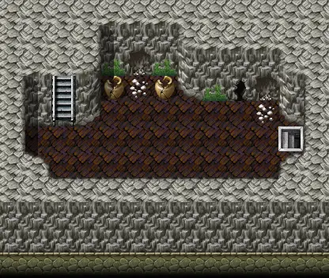

# Basiliskcave1

13×11 tiles

<label class="lg"><input type="checkbox" data-t="spawn" checked><b>Red</b>&nbsp;Monsters / NPCs</label><label class="lg"><input type="checkbox" data-t="mapchange" checked><b>Blue</b>&nbsp;Exit to another map</label><label class="lg"><input type="checkbox" data-t="container" checked><b>Yellow</b>&nbsp;Container (click to see contents)</label><label class="lg"><input type="checkbox" data-t="sign" checked><b>Purple</b>&nbsp;Sign</label><label class="lg"><input type="checkbox" data-t="rest" checked><b>Green</b>&nbsp;Resting place</label><label class="lg"><input type="checkbox" data-t="key" checked><b>Orange dashed</b>&nbsp;Blocked until a quest step / item</label><label class="lg"><input type="checkbox" data-t="script"><b>Grey dotted</b>&nbsp;Scripted event</label><label class="lg"><input type="checkbox" data-t="replace"><b>White dotted</b>&nbsp;Changes during a quest</label>

## Exits

- [Basiliskcave1 1 1](basiliskcave1_1_1.md)
- [Brimhaven7](brimhaven7.md)

## Monsters & NPCs here

| Name | HP |
|---|---|
| [Venomous cave snake](../monsters/venomous_cave_snake.md) | 15 |
| [Tough cave snake](../monsters/tough_cave_snake.md) | 21 |

<small>Map ID: `basiliskcave1` · Data from v0.8.18</small>
