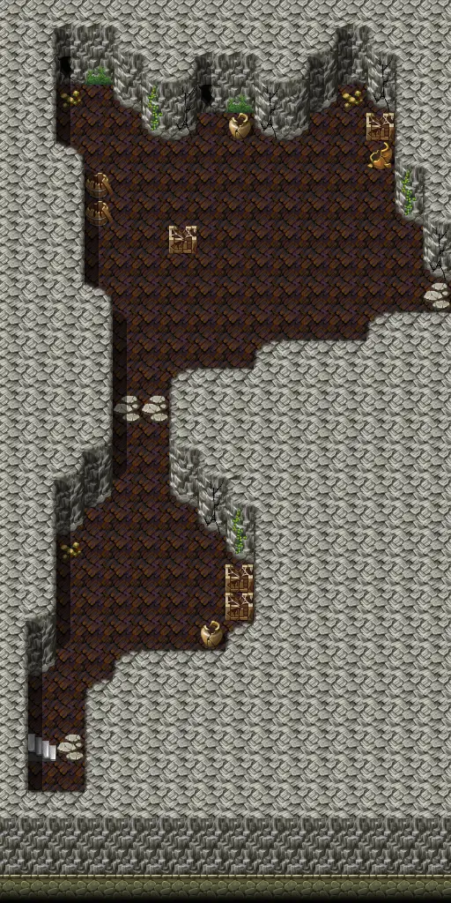

# Basiliskcave1 1 1

16×32 tiles · part of [Basiliskcave](index.md)

<label class="lg lg-spawn"><input type="checkbox" data-t="spawn" checked> Monsters / NPCs</label><label class="lg lg-mapchange"><input type="checkbox" data-t="mapchange" checked> Exit to another map</label><label class="lg lg-container"><input type="checkbox" data-t="container" checked> Container</label><label class="lg lg-sign"><input type="checkbox" data-t="sign" checked> Sign</label><label class="lg lg-rest"><input type="checkbox" data-t="rest" checked> Resting place</label><label class="lg lg-key"><input type="checkbox" data-t="key" checked> Blocked / needs key or quest</label><label class="lg lg-script"><input type="checkbox" data-t="script"> Scripted event</label><label class="lg lg-replace"><input type="checkbox" data-t="replace"> Changes after a quest</label>

## Exits

- [Basiliskcave1](basiliskcave1.md)
- [Basiliskcave1 1 2](basiliskcave1_1_2.md)

## Monsters & NPCs here

| Name | HP |
|---|---|
| [Young cave serpent](../monsters/young_cave_serpent.md) | 18 |
| [Cave serpent](../monsters/cave_serpent.md) | 24 |

<small>Map ID: `basiliskcave1_1_1` · Data from v0.8.18</small>
