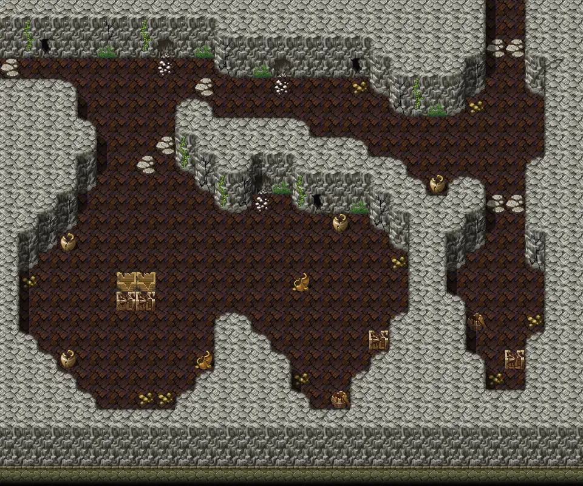

# Basiliskcave1 1 2

| | |
|---|---|
| **Map ID** | `basiliskcave1_1_2` |
| **Type** | Indoors / underground |
| **Size** | 30×25 tiles |
| **World map** | [Basiliskcave](index.md) |
| **Introduced** | [v0.7.11](../versions/0.7.11.md) |
| **Enemy types** | 6 |
| **Quests** | 0 |
| **Containers** | 4 |

**Basiliskcave1 1 2** is an indoor map. It has no NPCs and 6 kinds of enemy. Exits lead to Basiliskcave1 1 3, Basiliskcave1 1 1.

## Map

<label class="lg"><input type="checkbox" data-t="spawn" checked><b>Red</b>&nbsp;Monsters / NPCs</label><label class="lg"><input type="checkbox" data-t="mapchange" checked><b>Blue</b>&nbsp;Exit to another map</label><label class="lg"><input type="checkbox" data-t="container" checked><b>Yellow</b>&nbsp;Container (click to see contents)</label><label class="lg"><input type="checkbox" data-t="sign" checked><b>Purple</b>&nbsp;Sign</label><label class="lg"><input type="checkbox" data-t="rest" checked><b>Green</b>&nbsp;Resting place</label><label class="lg"><input type="checkbox" data-t="key" checked><b>Orange dashed</b>&nbsp;Blocked until a quest step / item</label><label class="lg"><input type="checkbox" data-t="script"><b>Grey dotted</b>&nbsp;Scripted event</label><label class="lg"><input type="checkbox" data-t="replace"><b>White dotted</b>&nbsp;Changes during a quest</label><label class="lg"><input type="checkbox" data-t="pin" checked><b>Numbers</b>&nbsp;Numbered key points (see the key below the map)</label>

<a class="pin pin-exit" href="#key-1" style="left:86.667%;top:2.000%" title="Exit (north): to [Basiliskcave1 1 3](basiliskcave1_1_3.md)">1</a><a class="pin pin-exit" href="#key-2" style="left:1.667%;top:14.000%" title="Exit (west): to [Basiliskcave1 1 1](basiliskcave1_1_1.md)">2</a><a class="pin pin-container" href="#key-3" style="left:51.667%;top:78.000%" title="Container 1: Gold coins">3</a><a class="pin pin-container" href="#key-4" style="left:28.333%;top:82.000%" title="Container 2: Gold coins">4</a><a class="pin pin-container" href="#key-5" style="left:68.333%;top:54.000%" title="Container 3: Gold coins">5</a><a class="pin pin-container" href="#key-6" style="left:85.000%;top:78.000%" title="Container 4: Gold coins">6</a>

??? abstract "Key to the numbers on the map"

    | # | What | Details |
    |---|---|---|
    | 1 | Exit (north) | to [Basiliskcave1 1 3](basiliskcave1_1_3.md) |
    | 2 | Exit (west) | to [Basiliskcave1 1 1](basiliskcave1_1_1.md) |
    | 3 | Container 1 | Gold coins |
    | 4 | Container 2 | Gold coins |
    | 5 | Container 3 | Gold coins |
    | 6 | Container 4 | Gold coins |

Verified against v0.8.18 map data.

## Connections

| Direction | Leads to | Region there | Map # |
|---|---|---|---|
| North | [Basiliskcave1 1 3](basiliskcave1_1_3.md) | – | 1 |
| West | [Basiliskcave1 1 1](basiliskcave1_1_1.md) | – | 2 |

## Enemies

| Enemy | HP | Damage | Up to | Notes |
|---|---|---|---|---|
| [Young cave snake](../monsters/young_cave_snake.md) | 8 | 2–2 | 3 | shares spawn with Cave snake |
| [Cave snake](../monsters/cave_snake.md) | 12 | 2–2 | 3 | shares spawn with Young cave snake |
| [Venomous cave snake](../monsters/venomous_cave_snake.md) | 15 | 2–2 | 4 | shares spawn with Tough cave snake |
| [Young cave serpent](../monsters/young_cave_serpent.md) | 18 | 2–4 | 6 | shares spawn with Cave serpent |
| [Tough cave snake](../monsters/tough_cave_snake.md) | 21 | 2–2 | 4 | shares spawn with Venomous cave snake |
| [Cave serpent](../monsters/cave_serpent.md) | 24 | 2–5 | 6 | shares spawn with Young cave serpent |

<small>“Up to” is the most that can be alive at once from the spawn areas on this map.</small>

## Items & containers

<b>Container 1</b><ul><li><a href="../../items/gold/">Gold coins</a> <small>100% · ×2 to 20</small></li></ul>

<b>Container 2</b><ul><li><a href="../../items/gold/">Gold coins</a> <small>100% · ×2 to 20</small></li></ul>

<b>Container 3</b><ul><li><a href="../../items/gold/">Gold coins</a> <small>100% · ×2 to 20</small></li></ul>

<b>Container 4</b><ul><li><a href="../../items/gold/">Gold coins</a> <small>100% · ×2 to 20</small></li></ul>

## Version history

| Version | Change |
|---|---|
| [v0.7.11](../versions/0.7.11.md) | Added |
| [v0.8.2](../versions/0.8.2.md) | Map layout or objects changed |

Verified against v0.8.18 and every earlier release back to v0.7.0 (game data compared release by release).

## Community notes

<small>Written by players, not generated from game data. **Observations**: what players notice in-game · **Lore**: the in-world story · **Trivia**: real-world facts, references, development history · **Theory / speculation**: unconfirmed ideas; may just be unfinished content</small>

### Observations

*No notes yet. Contributions are welcome: [add a note](https://github.com/asdfghjkl628/Andor-s-Trail-Wikiiii/new/main/notes/maps?filename=basiliskcave1_1_2.md&value=%23%23%20Observations%0A%0A%3C%21--%20what%20players%20notice%20in-game%20--%3E%0A%0A%23%23%20Lore%0A%0A%3C%21--%20the%20in-world%20story%20--%3E%0A%0A%23%23%20Trivia%0A%0A%3C%21--%20real-world%20facts%2C%20references%2C%20development%20history%20--%3E%0A%0A%23%23%20Theory%20/%20speculation%0A%0A%3C%21--%20unconfirmed%20ideas%3B%20may%20just%20be%20unfinished%20content%20--%3E%0A).*

### Lore

*No notes yet. Contributions are welcome: [add a note](https://github.com/asdfghjkl628/Andor-s-Trail-Wikiiii/new/main/notes/maps?filename=basiliskcave1_1_2.md&value=%23%23%20Observations%0A%0A%3C%21--%20what%20players%20notice%20in-game%20--%3E%0A%0A%23%23%20Lore%0A%0A%3C%21--%20the%20in-world%20story%20--%3E%0A%0A%23%23%20Trivia%0A%0A%3C%21--%20real-world%20facts%2C%20references%2C%20development%20history%20--%3E%0A%0A%23%23%20Theory%20/%20speculation%0A%0A%3C%21--%20unconfirmed%20ideas%3B%20may%20just%20be%20unfinished%20content%20--%3E%0A).*

### Trivia

*No notes yet. Contributions are welcome: [add a note](https://github.com/asdfghjkl628/Andor-s-Trail-Wikiiii/new/main/notes/maps?filename=basiliskcave1_1_2.md&value=%23%23%20Observations%0A%0A%3C%21--%20what%20players%20notice%20in-game%20--%3E%0A%0A%23%23%20Lore%0A%0A%3C%21--%20the%20in-world%20story%20--%3E%0A%0A%23%23%20Trivia%0A%0A%3C%21--%20real-world%20facts%2C%20references%2C%20development%20history%20--%3E%0A%0A%23%23%20Theory%20/%20speculation%0A%0A%3C%21--%20unconfirmed%20ideas%3B%20may%20just%20be%20unfinished%20content%20--%3E%0A).*

### Theory / speculation

*No notes yet. Contributions are welcome: [add a note](https://github.com/asdfghjkl628/Andor-s-Trail-Wikiiii/new/main/notes/maps?filename=basiliskcave1_1_2.md&value=%23%23%20Observations%0A%0A%3C%21--%20what%20players%20notice%20in-game%20--%3E%0A%0A%23%23%20Lore%0A%0A%3C%21--%20the%20in-world%20story%20--%3E%0A%0A%23%23%20Trivia%0A%0A%3C%21--%20real-world%20facts%2C%20references%2C%20development%20history%20--%3E%0A%0A%23%23%20Theory%20/%20speculation%0A%0A%3C%21--%20unconfirmed%20ideas%3B%20may%20just%20be%20unfinished%20content%20--%3E%0A).*

??? info "Technical information"

    | | |
    |---|---|
    | Map ID | `basiliskcave1_1_2` |
    | File | `res/xml/basiliskcave1_1_2.tmx` |
    | Size | 30×25 tiles (960×800 px) |
    | outdoors property | – |
    | Layers drawn | ground, objects, above |
    | Tilesets | map_bed_1, map_border_1, map_bridge_1, map_bridge_2, map_broken_1, map_cavewall_1, map_cavewall_2, map_cavewall_3, map_cavewall_4, map_chair_table_1, map_chair_table_2, map_crate_1, map_cupboard_1, map_curtain_1, map_entrance_1, map_entrance_2, map_fence_1, map_fence_2, map_fence_3, map_fence_4, map_ground_1, map_ground_2, map_ground_3, map_ground_4, map_ground_5, map_ground_6, map_ground_7, map_ground_8, map_house_1, map_house_2, map_indoor_1, map_indoor_2, map_kitchen_1, map_outdoor_1, map_pillar_1, map_pillar_2, map_plant_1, map_plant_2, map_rock_1, map_rock_2, map_roof_1, map_roof_2, map_roof_3, map_shop_1, map_sign_ladder_1, map_table_1, map_trail_1, map_transition_1, map_transition_2, map_transition_3, map_transition_4, map_transition_5, map_tree_1, map_tree_2, map_wall_1, map_wall_2, map_wall_3, map_wall_4, map_window_1, map_window_2 |
    | Map objects | container: 4, spawn: 4, mapchange: 2 |
    | World map position | segment `basiliskcave`, x 11, y -5 |

<small>Data from v0.8.18</small>
