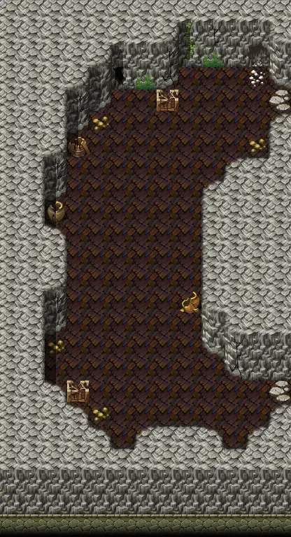

# Basiliskcave1 1 4

13×24 tiles · part of [Basiliskcave](index.md)

<label class="lg"><input type="checkbox" data-t="spawn" checked><b>Red</b>&nbsp;Monsters / NPCs</label><label class="lg"><input type="checkbox" data-t="mapchange" checked><b>Blue</b>&nbsp;Exit to another map</label><label class="lg"><input type="checkbox" data-t="container" checked><b>Yellow</b>&nbsp;Container (click to see contents)</label><label class="lg"><input type="checkbox" data-t="sign" checked><b>Purple</b>&nbsp;Sign</label><label class="lg"><input type="checkbox" data-t="rest" checked><b>Green</b>&nbsp;Resting place</label><label class="lg"><input type="checkbox" data-t="key" checked><b>Orange dashed</b>&nbsp;Blocked until a quest step / item</label><label class="lg"><input type="checkbox" data-t="script"><b>Grey dotted</b>&nbsp;Scripted event</label><label class="lg"><input type="checkbox" data-t="replace"><b>White dotted</b>&nbsp;Changes during a quest</label>

## Containers

<b>Container 1</b><ul><li><a href="../../items/gold/">Gold coins</a> <small>100% · ×2 to 20</small></li></ul>

## Exits

- [Basiliskcave1 1 3](basiliskcave1_1_3.md)
- [Basiliskcave1 1 5](basiliskcave1_1_5.md)

## Monsters & NPCs here

| Name | HP |
|---|---|
| [Venomous cave serpent](../monsters/venomous_cave_serpent.md) | 30 |
| [Tough cave serpent](../monsters/tough_cave_serpent.md) | 40 |
| [Erumen lizard](../monsters/erumen_3.md) | 45 |
| [Strong erumen lizard](../monsters/erumen_4.md) | 79 |

<small>Map ID: `basiliskcave1_1_4` · Data from v0.8.18</small>
